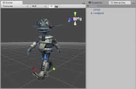
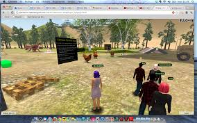
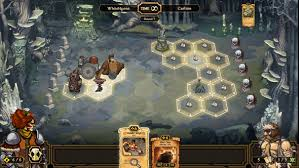
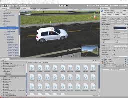

 
# Unity User Manual (5.6) 
 [https://www.google.com](https://www.google.com)  
 
 Use the Unity Editor to create 2D and 3D games, apps and experiences. (Download the Editor at [unity3d.com](http://unity3d.com/unity).) 
 The Unity User Manual helps you learn how to use the Unity Editor and its associated services. You can read it from start to finish, or use it as a reference. 
 
 __Test:1__ 
 
  
 
 [5bc71bed1bbab51bc02550b5](Examples/GitHub_5bc71bed1bbab51bc02550b5.cs) 
 
 [DeployingUnityOffline.md](DeployingUnityOffline.md) 
 
 
 __New__ 

*  Features introduced in 5.6: [What's New in 5.6](http://docs.google.com/WhatsNew56) 

*  Upgrading Unity projects from older versions of Unity: [Upgrade Guide](http://docs.google.com/UpgradeGuides) 
 
 __Best practice and expert guides__ 

*  Best practices from Unity Support engineers: [Best Practice Guides](http://docs.google.com/BestPracticeGuides) 

*  Expert guides from Unity developers, in their own words: [Expert Guides](http://docs.google.com/ExpertGuides) 
### Unity User Manual sections 
  ###[Working in Unity](UnityOverview)### A complete introduction to the Unity Editor. 
  ###[Unity 2D](Unity2D)### All of the Unity Editor's 2D-specific features including gameplay, sprites and physics. 
  ###[Graphics](Graphics)### The visual aspects of the Unity Editor including cameras and lighting. 
  ###[Physics](PhysicsSection)### Physics in the Unity Editor, including Rigidbody components and manipulating them in 3D space. 
  ###[Networking](UNet)### How to implement Multiplayer and networking. 
  ###[Scripting](ScriptingSection)### Programming your games by using scripting in the Unity Editor. 
 
 
 
  ###[Audio](Audio)### Audio in the Unity Editor, including clips, sources, listeners, importing and sound settings. 
  ###[Animation](AnimationSection)### Animation in the Unity Editor. 
  ###[UI](UISystem)### The Unity Editor's UI system. 
  ###[Navigation](Navigation)### Navigation in the Unity Editor, including AI and pathfinding. 
  ###[Unity services](UnityServices)### 
  ###[Virtual reality](VROverview)### 
  ###[Contributing to Unity](ContributingToUnity)### Suggest modifications to some of the Unity Editor's source code. 
  ###[Platform specific](PlatformSpecific)### Specific information for the many non-desktop and web platforms you can make projects for with the Unity Editor. 
  ###[Legacy topics](LegacyTopics)### Useful if you are maintaining legacy projects. 
 
 
### Further sources of information 

*  [Unity Answers](http://answers.unity3d.com/) or [Unity Forums](http://forum.unity3d.com/) - here you can ask questions and search answers. 

*  [The Unity Knowledge Base](https://support.unity3d.com) - a collection of answers to questions posed to Unity's Support teams. 

*  [Tutorials](http://unity3d.com/learn/tutorials) - step by step video and written guides to using the Unity Editor. 

*  [Unity Ads Knowledge Base](http://unityads.unity3d.com/help/index) - a guide to including ads in your game. 

*  [Everyplay documentation](https://developers.everyplay.com/documentation) - a guide to the Everyplay mobile game replay platform. 

*  [Asset Store help](http://unity3d.com/asset-store/help) - help on Asset Store content sharing. 
### Known issues 
 Is a feature not working as you expect it to? It might be an existing Known Issue. Please check using the __Issue Tracker__ at [issuetracker.unity3d.com](https://issuetracker.unity3d.com). 
 
 __Test:2__ 
 
 [DeployingUnityOffline.md](DeployingUnityOffline.md) 
  
 [5bc73fca1bbab51bc02556a2](Examples/github3codeblock_5bc73fca1bbab51bc02556a2.cs) 
 
 
# Unity User Manual (5.6) 
 Use the Unity Editor to create 2D and 3D games, apps and experiences. (Download the Editor at [unity3d.com](http://unity3d.com/unity).) 
 The Unity User Manual helps you learn how to use the Unity Editor and its associated services. You can read it from start to finish, or use it as a reference. 
 
 __New__ 

*  Features introduced in 5.6: [What's New in 5.6](http://docs.google.com/WhatsNew56) 

*  Upgrading Unity projects from older versions of Unity: [Upgrade Guide](http://docs.google.com/UpgradeGuides) 
 
 __Best practice and expert guides__ 

*  Best practices from Unity Support engineers: [Best Practice Guides](http://docs.google.com/BestPracticeGuides) 

*  Expert guides from Unity developers, in their own words: [Expert Guides](http://docs.google.com/ExpertGuides) 
### Unity User Manual sections 
  ###[Working in Unity](UnityOverview)### A complete introduction to the Unity Editor. 
  ###[Unity 2D](Unity2D)### All of the Unity Editor's 2D-specific features including gameplay, sprites and physics. 
  ###[Graphics](Graphics)### The visual aspects of the Unity Editor including cameras and lighting. 
  ###[Physics](PhysicsSection)### Physics in the Unity Editor, including Rigidbody components and manipulating them in 3D space. 
  ###[Networking](UNet)### How to implement Multiplayer and networking. 
  ###[Scripting](ScriptingSection)### Programming your games by using scripting in the Unity Editor. 
  ###[Audio](Audio)### Audio in the Unity Editor, including clips, sources, listeners, importing and sound settings. 
  ###[Animation](AnimationSection)### Animation in the Unity Editor. 
  ###[UI](UISystem)### The Unity Editor's UI system. 
  ###[Navigation](Navigation)### Navigation in the Unity Editor, including AI and pathfinding. 
  ###[Unity services](UnityServices)### 
  ###[Virtual reality](VROverview)### 
  ###[Contributing to Unity](ContributingToUnity)### Suggest modifications to some of the Unity Editor's source code. 
  ###[Platform specific](PlatformSpecific)### Specific information for the many non-desktop and web platforms you can make projects for with the Unity Editor. 
  ###[Legacy topics](LegacyTopics)### Useful if you are maintaining legacy projects. 
 
 
### Further sources of information 

*  [Unity Answers](http://answers.unity3d.com/) or [Unity Forums](http://forum.unity3d.com/) - here you can ask questions and search answers. 

*  [The Unity Knowledge Base](https://support.unity3d.com) - a collection of answers to questions posed to Unity's Support teams. 

*  [Tutorials](http://unity3d.com/learn/tutorials) - step by step video and written guides to using the Unity Editor. 

*  [Unity Ads Knowledge Base](http://unityads.unity3d.com/help/index) - a guide to including ads in your game. 

*  [Everyplay documentation](https://developers.everyplay.com/documentation) - a guide to the Everyplay mobile game replay platform. 

*  [Asset Store help](http://unity3d.com/asset-store/help) - help on Asset Store content sharing. 
### Known issues 
 Is a feature not working as you expect it to? It might be an existing Known Issue. Please check using the __Issue Tracker__ at [issuetracker.unity3d.com](https://issuetracker.unity3d.com). 
 
 __Test:3__ 
 
 [DeployingUnityOffline.md](DeployingUnityOffline.md) 
 
 [5bc734f41bbab51bc0255498](Examples/manualgithub_5bc734f41bbab51bc0255498.cs) 
  
 
# Unity User Manual (5.6) 
 Use the Unity Editor to create 2D and 3D games, apps and experiences. (Download the Editor at [unity3d.com](http://unity3d.com/unity).) 
 The Unity User Manual helps you learn how to use the Unity Editor and its associated services. You can read it from start to finish, or use it as a reference. 
 
 __New__ 

*  Features introduced in 5.6: [What's New in 5.6](http://docs.google.com/WhatsNew56) 

*  Upgrading Unity projects from older versions of Unity: [Upgrade Guide](http://docs.google.com/UpgradeGuides) 
 
 __Best practice and expert guides__ 

*  Best practices from Unity Support engineers: [Best Practice Guides](http://docs.google.com/BestPracticeGuides) 

*  Expert guides from Unity developers, in their own words: [Expert Guides](http://docs.google.com/ExpertGuides) 
### Unity User Manual sections 
  ###[Working in Unity](UnityOverview)### A complete introduction to the Unity Editor. 
  ###[Unity 2D](Unity2D)### All of the Unity Editor's 2D-specific features including gameplay, sprites and physics. 
  ###[Graphics](Graphics)### The visual aspects of the Unity Editor including cameras and lighting. 
  ###[Physics](PhysicsSection)### Physics in the Unity Editor, including Rigidbody components and manipulating them in 3D space. 
  ###[Networking](UNet)### How to implement Multiplayer and networking. 
  ###[Scripting](ScriptingSection)### Programming your games by using scripting in the Unity Editor. 
  ###[Audio](Audio)### Audio in the Unity Editor, including clips, sources, listeners, importing and sound settings. 
  ###[Animation](AnimationSection)### Animation in the Unity Editor. 
  ###[UI](UISystem)### The Unity Editor's UI system. 
  ###[Navigation](Navigation)### Navigation in the Unity Editor, including AI and pathfinding. 
  ###[Unity services](UnityServices)### 
  ###[Virtual reality](VROverview)### 
  ###[Contributing to Unity](ContributingToUnity)### Suggest modifications to some of the Unity Editor's source code. 
  ###[Platform specific](PlatformSpecific)### Specific information for the many non-desktop and web platforms you can make projects for with the Unity Editor. 
  ###[Legacy topics](LegacyTopics)### Useful if you are maintaining legacy projects. 
 
 
### Further sources of information 

*  [Unity Answers](http://answers.unity3d.com/) or [Unity Forums](http://forum.unity3d.com/) - here you can ask questions and search answers. 

*  [The Unity Knowledge Base](https://support.unity3d.com) - a collection of answers to questions posed to Unity's Support teams. 

*  [Tutorials](http://unity3d.com/learn/tutorials) - step by step video and written guides to using the Unity Editor. 

*  [Unity Ads Knowledge Base](http://unityads.unity3d.com/help/index) - a guide to including ads in your game. 

*  [Everyplay documentation](https://developers.everyplay.com/documentation) - a guide to the Everyplay mobile game replay platform. 

*  [Asset Store help](http://unity3d.com/asset-store/help) - help on Asset Store content sharing. 
### Known issues 
 Is a feature not working as you expect it to? It might be an existing Known Issue. Please check using the __Issue Tracker__ at [issuetracker.unity3d.com](https://issuetracker.unity3d.com). 
 
 __Test:4__ 
 
  
 
 [DeployingUnityOffline.md](DeployingUnityOffline.md) 
# Unity User Manual (5.6) 
 Use the Unity Editor to create 2D and 3D games, apps and experiences. (Download the Editor at [unity3d.com](http://unity3d.com/unity).) 
 The Unity User Manual helps you learn how to use the Unity Editor and its associated services. You can read it from start to finish, or use it as a reference. 
 
 __New__ 

*  Features introduced in 5.6: [What's New in 5.6](http://docs.google.com/WhatsNew56) 

*  Upgrading Unity projects from older versions of Unity: [Upgrade Guide](http://docs.google.com/UpgradeGuides) 
 
 __Best practice and expert guides__ 

*  Best practices from Unity Support engineers: [Best Practice Guides](http://docs.google.com/BestPracticeGuides) 

*  Expert guides from Unity developers, in their own words: [Expert Guides](http://docs.google.com/ExpertGuides) 
### Unity User Manual sections 
  ###[Working in Unity](UnityOverview)### A complete introduction to the Unity Editor. 
  ###[Unity 2D](Unity2D)### All of the Unity Editor's 2D-specific features including gameplay, sprites and physics. 
  ###[Graphics](Graphics)### The visual aspects of the Unity Editor including cameras and lighting. 
  ###[Physics](PhysicsSection)### Physics in the Unity Editor, including Rigidbody components and manipulating them in 3D space. 
  ###[Networking](UNet)### How to implement Multiplayer and networking. 
  ###[Scripting](ScriptingSection)### Programming your games by using scripting in the Unity Editor. 
  ###[Audio](Audio)### Audio in the Unity Editor, including clips, sources, listeners, importing and sound settings. 
  ###[Animation](AnimationSection)### Animation in the Unity Editor. 
  ###[UI](UISystem)### The Unity Editor's UI system. 
  ###[Navigation](Navigation)### Navigation in the Unity Editor, including AI and pathfinding. 
  ###[Unity services](UnityServices)### 
  ###[Virtual reality](VROverview)### 
  ###[Contributing to Unity](ContributingToUnity)### Suggest modifications to some of the Unity Editor's source code. 
  ###[Platform specific](PlatformSpecific)### Specific information for the many non-desktop and web platforms you can make projects for with the Unity Editor. 
  ###[Legacy topics](LegacyTopics)### Useful if you are maintaining legacy projects. 
 
 
### Further sources of information 

*  [Unity Answers](http://answers.unity3d.com/) or [Unity Forums](http://forum.unity3d.com/) - here you can ask questions and search answers. 

*  [The Unity Knowledge Base](https://support.unity3d.com) - a collection of answers to questions posed to Unity's Support teams. 

*  [Tutorials](http://unity3d.com/learn/tutorials) - step by step video and written guides to using the Unity Editor. 

*  [Unity Ads Knowledge Base](http://unityads.unity3d.com/help/index) - a guide to including ads in your game. 

*  [Everyplay documentation](https://developers.everyplay.com/documentation) - a guide to the Everyplay mobile game replay platform. 

*  [Asset Store help](http://unity3d.com/asset-store/help) - help on Asset Store content sharing. 
### Known issues 
 Is a feature not working as you expect it to? It might be an existing Known Issue. Please check using the __Issue Tracker__ at [issuetracker.unity3d.com](https://issuetracker.unity3d.com). 
 
 __Test:5__ 
 
  
 [DeployingUnityOffline.md](DeployingUnityOffline.md) 
# Unity User Manual (5.6) 
 Use the Unity Editor to create 2D and 3D games, apps and experiences. (Download the Editor at [unity3d.com](http://unity3d.com/unity).) 
 The Unity User Manual helps you learn how to use the Unity Editor and its associated services. You can read it from start to finish, or use it as a reference. 
 
 __New__ 

*  Features introduced in 5.6: [What's New in 5.6](http://docs.google.com/WhatsNew56) 

*  Upgrading Unity projects from older versions of Unity: [Upgrade Guide](http://docs.google.com/UpgradeGuides) 
 
 __Best practice and expert guides__ 

*  Best practices from Unity Support engineers: [Best Practice Guides](http://docs.google.com/BestPracticeGuides) 

*  Expert guides from Unity developers, in their own words: [Expert Guides](http://docs.google.com/ExpertGuides) 
### Unity User Manual sections 
  ###[Working in Unity](UnityOverview)### A complete introduction to the Unity Editor. 
  ###[Unity 2D](Unity2D)### All of the Unity Editor's 2D-specific features including gameplay, sprites and physics. 
  ###[Graphics](Graphics)### The visual aspects of the Unity Editor including cameras and lighting. 
  ###[Physics](PhysicsSection)### Physics in the Unity Editor, including Rigidbody components and manipulating them in 3D space. 
  ###[Networking](UNet)### How to implement Multiplayer and networking. 
  ###[Scripting](ScriptingSection)### Programming your games by using scripting in the Unity Editor. 
 
 __Test:6__ 
 
 [DeployingUnityOffline.md](DeployingUnityOffline.md) 
 
  ###[Audio](Audio)### Audio in the Unity Editor, including clips, sources, listeners, importing and sound settings. 
  ###[Animation](AnimationSection)### Animation in the Unity Editor. 
  ###[UI](UISystem)### The Unity Editor's UI system. 
  ###[Navigation](Navigation)### Navigation in the Unity Editor, including AI and pathfinding. 
  ###[Unity services](UnityServices)### 
  ###[Virtual reality](VROverview)### 
  ###[Contributing to Unity](ContributingToUnity)### Suggest modifications to some of the Unity Editor's source code. 
  ###[Platform specific](PlatformSpecific)### Specific information for the many non-desktop and web platforms you can make projects for with the Unity Editor. 
  ###[Legacy topics](LegacyTopics)### Useful if you are maintaining legacy projects. 
 
 __Test:7__ 
 
 [DeployingUnityOffline.md](DeployingUnityOffline.md) 
### Further sources of information 

*  [Unity Answers](http://answers.unity3d.com/) or [Unity Forums](http://forum.unity3d.com/) - here you can ask questions and search answers. 

*  [The Unity Knowledge Base](https://support.unity3d.com) - a collection of answers to questions posed to Unity's Support teams. 

*  [Tutorials](http://unity3d.com/learn/tutorials) - step by step video and written guides to using the Unity Editor. 

*  [Unity Ads Knowledge Base](http://unityads.unity3d.com/help/index) - a guide to including ads in your game. 

*  [Everyplay documentation](https://developers.everyplay.com/documentation) - a guide to the Everyplay mobile game replay platform. 

*  [Asset Store help](http://unity3d.com/asset-store/help) - help on Asset Store content sharing. 
### Known issues 
 Is a feature not working as you expect it to? It might be an existing Known Issue. Please check using the __Issue Tracker__ at [issuetracker.unity3d.com](https://issuetracker.unity3d.com). 
 
 
 
 
 __Test:8__ 
 
  
 
# Unity User Manual (5.6) 
 Use the Unity Editor to create 2D and 3D games, apps and experiences. (Download the Editor at [unity3d.com](http://unity3d.com/unity).) 
 The Unity User Manual helps you learn how to use the Unity Editor and its associated services. You can read it from start to finish, or use it as a reference. 
 
 __New__ 

*  Features introduced in 5.6: [What's New in 5.6](http://docs.google.com/WhatsNew56) 

*  Upgrading Unity projects from older versions of Unity: [Upgrade Guide](http://docs.google.com/UpgradeGuides) 
 
 __Best practice and expert guides__ 

*  Best practices from Unity Support engineers: [Best Practice Guides](http://docs.google.com/BestPracticeGuides) 

*  Expert guides from Unity developers, in their own words: [Expert Guides](http://docs.google.com/ExpertGuides) 
### Unity User Manual sections 
  ###[Working in Unity](UnityOverview)### A complete introduction to the Unity Editor. 
  ###[Unity 2D](Unity2D)### All of the Unity Editor's 2D-specific features including gameplay, sprites and physics. 
  ###[Graphics](Graphics)### The visual aspects of the Unity Editor including cameras and lighting. 
  ###[Physics](PhysicsSection)### Physics in the Unity Editor, including Rigidbody components and manipulating them in 3D space. 
  ###[Networking](UNet)### How to implement Multiplayer and networking. 
  ###[Scripting](ScriptingSection)### Programming your games by using scripting in the Unity Editor. 
  ###[Audio](Audio)### Audio in the Unity Editor, including clips, sources, listeners, importing and sound settings. 
  ###[Animation](AnimationSection)### Animation in the Unity Editor. 
  ###[UI](UISystem)### The Unity Editor's UI system. 
  ###[Navigation](Navigation)### Navigation in the Unity Editor, including AI and pathfinding. 
  ###[Unity services](UnityServices)### 
  ###[Virtual reality](VROverview)### 
  ###[Contributing to Unity](ContributingToUnity)### Suggest modifications to some of the Unity Editor's source code. 
  ###[Platform specific](PlatformSpecific)### Specific information for the many non-desktop and web platforms you can make projects for with the Unity Editor. 
  ###[Legacy topics](LegacyTopics)### Useful if you are maintaining legacy projects. 
 
 
### Further sources of information 

*  [Unity Answers](http://answers.unity3d.com/) or [Unity Forums](http://forum.unity3d.com/) - here you can ask questions and search answers. 

*  [The Unity Knowledge Base](https://support.unity3d.com) - a collection of answers to questions posed to Unity's Support teams. 

*  [Tutorials](http://unity3d.com/learn/tutorials) - step by step video and written guides to using the Unity Editor. 

*  [Unity Ads Knowledge Base](http://unityads.unity3d.com/help/index) - a guide to including ads in your game. 

*  [Everyplay documentation](https://developers.everyplay.com/documentation) - a guide to the Everyplay mobile game replay platform. 

*  [Asset Store help](http://unity3d.com/asset-store/help) - help on Asset Store content sharing. 
### Known issues 
 Is a feature not working as you expect it to? It might be an existing Known Issue. Please check using the __Issue Tracker__ at [issuetracker.unity3d.com](https://issuetracker.unity3d.com). 
 
 __Test:9__ 
 
  
 [5bc73cdd1bbab51bc0255665](Examples/github2codeblock_5bc73cdd1bbab51bc0255665.cs) 
 
 [UnityManual.md](UnityManual.md) 
# Unity User Manual (5.6) 
 Use the Unity Editor to create 2D and 3D games, apps and experiences. (Download the Editor at [unity3d.com](http://unity3d.com/unity).) 
 The Unity User Manual helps you learn how to use the Unity Editor and its associated services. You can read it from start to finish, or use it as a reference. 
 
 __New__ 

*  Features introduced in 5.6: [What's New in 5.6](http://docs.google.com/WhatsNew56) 

*  Upgrading Unity projects from older versions of Unity: [Upgrade Guide](http://docs.google.com/UpgradeGuides) 
 
 __Best practice and expert guides__ 

*  Best practices from Unity Support engineers: [Best Practice Guides](http://docs.google.com/BestPracticeGuides) 

*  Expert guides from Unity developers, in their own words: [Expert Guides](http://docs.google.com/ExpertGuides) 
### Unity User Manual sections 
  ###[Working in Unity](UnityOverview)### A complete introduction to the Unity Editor. 
  ###[Unity 2D](Unity2D)### All of the Unity Editor's 2D-specific features including gameplay, sprites and physics. 
  ###[Graphics](Graphics)### The visual aspects of the Unity Editor including cameras and lighting. 
  ###[Physics](PhysicsSection)### Physics in the Unity Editor, including Rigidbody components and manipulating them in 3D space. 
  ###[Networking](UNet)### How to implement Multiplayer and networking. 
  ###[Scripting](ScriptingSection)### Programming your games by using scripting in the Unity Editor. 
  ###[Audio](Audio)### Audio in the Unity Editor, including clips, sources, listeners, importing and sound settings. 
  ###[Animation](AnimationSection)### Animation in the Unity Editor. 
  ###[UI](UISystem)### The Unity Editor's UI system. 
  ###[Navigation](Navigation)### Navigation in the Unity Editor, including AI and pathfinding. 
  ###[Unity services](UnityServices)### 
  ###[Virtual reality](VROverview)### 
  ###[Contributing to Unity](ContributingToUnity)### Suggest modifications to some of the Unity Editor's source code. 
  ###[Platform specific](PlatformSpecific)### Specific information for the many non-desktop and web platforms you can make projects for with the Unity Editor. 
  ###[Legacy topics](LegacyTopics)### Useful if you are maintaining legacy projects. 
 
 
### Further sources of information 

*  [Unity Answers](http://answers.unity3d.com/) or [Unity Forums](http://forum.unity3d.com/) - here you can ask questions and search answers. 

*  [The Unity Knowledge Base](https://support.unity3d.com) - a collection of answers to questions posed to Unity's Support teams. 

*  [Tutorials](http://unity3d.com/learn/tutorials) - step by step video and written guides to using the Unity Editor. 

*  [Unity Ads Knowledge Base](http://unityads.unity3d.com/help/index) - a guide to including ads in your game. 

*  [Everyplay documentation](https://developers.everyplay.com/documentation) - a guide to the Everyplay mobile game replay platform. 

*  [Asset Store help](http://unity3d.com/asset-store/help) - help on Asset Store content sharing. 
### Known issues 
 Is a feature not working as you expect it to? It might be an existing Known Issue. Please check using the __Issue Tracker__ at [issuetracker.unity3d.com](https://issuetracker.unity3d.com). 
 
 __Test:10__ 
 
  
 [5bc73cdd1bbab51bc0255665](Examples/github2codeblock_5bc73cdd1bbab51bc0255665.cs) 
# Unity User Manual (5.6) 
 Use the Unity Editor to create 2D and 3D games, apps and experiences. (Download the Editor at [unity3d.com](http://unity3d.com/unity).) 
 The Unity User Manual helps you learn how to use the Unity Editor and its associated services. You can read it from start to finish, or use it as a reference. 
 
 __New__ 

*  Features introduced in 5.6: [What's New in 5.6](http://docs.google.com/WhatsNew56) 

*  Upgrading Unity projects from older versions of Unity: [Upgrade Guide](http://docs.google.com/UpgradeGuides) 
 
 __Best practice and expert guides__ 

*  Best practices from Unity Support engineers: [Best Practice Guides](http://docs.google.com/BestPracticeGuides) 

*  Expert guides from Unity developers, in their own words: [Expert Guides](http://docs.google.com/ExpertGuides) 
### Unity User Manual sections 
  ###[Working in Unity](UnityOverview)### A complete introduction to the Unity Editor. 
  ###[Unity 2D](Unity2D)### All of the Unity Editor's 2D-specific features including gameplay, sprites and physics. 
  ###[Graphics](Graphics)### The visual aspects of the Unity Editor including cameras and lighting. 
  ###[Physics](PhysicsSection)### Physics in the Unity Editor, including Rigidbody components and manipulating them in 3D space. 
  ###[Networking](UNet)### How to implement Multiplayer and networking. 
  ###[Scripting](ScriptingSection)### Programming your games by using scripting in the Unity Editor. 
  ###[Audio](Audio)### Audio in the Unity Editor, including clips, sources, listeners, importing and sound settings. 
  ###[Animation](AnimationSection)### Animation in the Unity Editor. 
  ###[UI](UISystem)### The Unity Editor's UI system. 
  ###[Navigation](Navigation)### Navigation in the Unity Editor, including AI and pathfinding. 
  ###[Unity services](UnityServices)### 
  ###[Virtual reality](VROverview)### 
  ###[Contributing to Unity](ContributingToUnity)### Suggest modifications to some of the Unity Editor's source code. 
  ###[Platform specific](PlatformSpecific)### Specific information for the many non-desktop and web platforms you can make projects for with the Unity Editor. 
  ###[Legacy topics](LegacyTopics)### Useful if you are maintaining legacy projects. 
 
 
### Further sources of information 

*  [Unity Answers](http://answers.unity3d.com/) or [Unity Forums](http://forum.unity3d.com/) - here you can ask questions and search answers. 

*  [The Unity Knowledge Base](https://support.unity3d.com) - a collection of answers to questions posed to Unity's Support teams. 

*  [Tutorials](http://unity3d.com/learn/tutorials) - step by step video and written guides to using the Unity Editor. 

*  [Unity Ads Knowledge Base](http://unityads.unity3d.com/help/index) - a guide to including ads in your game. 

*  [Everyplay documentation](https://developers.everyplay.com/documentation) - a guide to the Everyplay mobile game replay platform. 

*  [Asset Store help](http://unity3d.com/asset-store/help) - help on Asset Store content sharing. 
### Known issues 
 Is a feature not working as you expect it to? It might be an existing Known Issue. Please check using the __Issue Tracker__ at [issuetracker.unity3d.com](https://issuetracker.unity3d.com). 
 
 __Test:11__ 
 [5bc73cdd1bbab51bc0255665](Examples/github2codeblock_5bc73cdd1bbab51bc0255665.cs) 
  
# Unity User Manual (5.6) 
 Use the Unity Editor to create 2D and 3D games, apps and experiences. (Download the Editor at [unity3d.com](http://unity3d.com/unity).) 
 The Unity User Manual helps you learn how to use the Unity Editor and its associated services. You can read it from start to finish, or use it as a reference. 
 
 __New__ 

*  Features introduced in 5.6: [What's New in 5.6](http://docs.google.com/WhatsNew56) 

*  Upgrading Unity projects from older versions of Unity: [Upgrade Guide](http://docs.google.com/UpgradeGuides) 
 
 __Best practice and expert guides__ 

*  Best practices from Unity Support engineers: [Best Practice Guides](http://docs.google.com/BestPracticeGuides) 

*  Expert guides from Unity developers, in their own words: [Expert Guides](http://docs.google.com/ExpertGuides) 
### Unity User Manual sections 
  ###[Working in Unity](UnityOverview)### A complete introduction to the Unity Editor. 
  ###[Unity 2D](Unity2D)### All of the Unity Editor's 2D-specific features including gameplay, sprites and physics. 
  ###[Graphics](Graphics)### The visual aspects of the Unity Editor including cameras and lighting. 
  ###[Physics](PhysicsSection)### Physics in the Unity Editor, including Rigidbody components and manipulating them in 3D space. 
  ###[Networking](UNet)### How to implement Multiplayer and networking. 
  ###[Scripting](ScriptingSection)### Programming your games by using scripting in the Unity Editor. 
  ###[Audio](Audio)### Audio in the Unity Editor, including clips, sources, listeners, importing and sound settings. 
  ###[Animation](AnimationSection)### Animation in the Unity Editor. 
  ###[UI](UISystem)### The Unity Editor's UI system. 
  ###[Navigation](Navigation)### Navigation in the Unity Editor, including AI and pathfinding. 
  ###[Unity services](UnityServices)### 
  ###[Virtual reality](VROverview)### 
  ###[Contributing to Unity](ContributingToUnity)### Suggest modifications to some of the Unity Editor's source code. 
  ###[Platform specific](PlatformSpecific)### Specific information for the many non-desktop and web platforms you can make projects for with the Unity Editor. 
  ###[Legacy topics](LegacyTopics)### Useful if you are maintaining legacy projects. 
 
 
### Further sources of information 

*  [Unity Answers](http://answers.unity3d.com/) or [Unity Forums](http://forum.unity3d.com/) - here you can ask questions and search answers. 

*  [The Unity Knowledge Base](https://support.unity3d.com) - a collection of answers to questions posed to Unity's Support teams. 

*  [Tutorials](http://unity3d.com/learn/tutorials) - step by step video and written guides to using the Unity Editor. 

*  [Unity Ads Knowledge Base](http://unityads.unity3d.com/help/index) - a guide to including ads in your game. 

*  [Everyplay documentation](https://developers.everyplay.com/documentation) - a guide to the Everyplay mobile game replay platform. 

*  [Asset Store help](http://unity3d.com/asset-store/help) - help on Asset Store content sharing. 
### Known issues 
 Is a feature not working as you expect it to? It might be an existing Known Issue. Please check using the __Issue Tracker__ at [issuetracker.unity3d.com](https://issuetracker.unity3d.com). 
 
 __Test:12__ 
 
 [5bc9740724dae111d047a87b](Examples/QA Test -Merc_5bc9740724dae111d047a87b.cs) 
  
# Unity User Manual (5.6) 
 Use the Unity Editor to create 2D and 3D games, apps and experiences. (Download the Editor at [unity3d.com](http://unity3d.com/unity).) 
 The Unity User Manual helps you learn how to use the Unity Editor and its associated services. You can read it from start to finish, or use it as a reference. 
 
 __New__ 

*  Features introduced in 5.6: [What's New in 5.6](http://docs.google.com/WhatsNew56) 

*  Upgrading Unity projects from older versions of Unity: [Upgrade Guide](http://docs.google.com/UpgradeGuides) 
 
 __Best practice and expert guides__ 

*  Best practices from Unity Support engineers: [Best Practice Guides](http://docs.google.com/BestPracticeGuides) 

*  Expert guides from Unity developers, in their own words: [Expert Guides](http://docs.google.com/ExpertGuides) 
### Unity User Manual sections 
  ###[Working in Unity](UnityOverview)### A complete introduction to the Unity Editor. 
  ###[Unity 2D](Unity2D)### All of the Unity Editor's 2D-specific features including gameplay, sprites and physics. 
  ###[Graphics](Graphics)### The visual aspects of the Unity Editor including cameras and lighting. 
  ###[Physics](PhysicsSection)### Physics in the Unity Editor, including Rigidbody components and manipulating them in 3D space. 
  ###[Networking](UNet)### How to implement Multiplayer and networking. 
  ###[Scripting](ScriptingSection)### Programming your games by using scripting in the Unity Editor. 
  ###[Audio](Audio)### Audio in the Unity Editor, including clips, sources, listeners, importing and sound settings. 
  ###[Animation](AnimationSection)### Animation in the Unity Editor. 
  ###[UI](UISystem)### The Unity Editor's UI system. 
  ###[Navigation](Navigation)### Navigation in the Unity Editor, including AI and pathfinding. 
  ###[Unity services](UnityServices)### 
  ###[Virtual reality](VROverview)### 
  ###[Contributing to Unity](ContributingToUnity)### Suggest modifications to some of the Unity Editor's source code. 
  ###[Platform specific](PlatformSpecific)### Specific information for the many non-desktop and web platforms you can make projects for with the Unity Editor. 
  ###[Legacy topics](LegacyTopics)### Useful if you are maintaining legacy projects. 
 
 
### Further sources of information 

*  [Unity Answers](http://answers.unity3d.com/) or [Unity Forums](http://forum.unity3d.com/) - here you can ask questions and search answers. 

*  [The Unity Knowledge Base](https://support.unity3d.com) - a collection of answers to questions posed to Unity's Support teams. 

*  [Tutorials](http://unity3d.com/learn/tutorials) - step by step video and written guides to using the Unity Editor. 

*  [Unity Ads Knowledge Base](http://unityads.unity3d.com/help/index) - a guide to including ads in your game. 

*  [Everyplay documentation](https://developers.everyplay.com/documentation) - a guide to the Everyplay mobile game replay platform. 

*  [Asset Store help](http://unity3d.com/asset-store/help) - help on Asset Store content sharing. 
### Known issues 
 Is a feature not working as you expect it to? It might be an existing Known Issue. Please check using the __Issue Tracker__ at [issuetracker.unity3d.com](https://issuetracker.unity3d.com). 
 
 __Test:13__ 
 [5bc743921bbab51bc02556d1](Examples/github4codeblock_5bc743921bbab51bc02556d1.cs) 
  
# Unity User Manual (5.6) 
 Use the Unity Editor to create 2D and 3D games, apps and experiences. (Download the Editor at [unity3d.com](http://unity3d.com/unity).) 
 The Unity User Manual helps you learn how to use the Unity Editor and its associated services. You can read it from start to finish, or use it as a reference. 
 
 __New__ 

*  Features introduced in 5.6: [What's New in 5.6](http://docs.google.com/WhatsNew56) 

*  Upgrading Unity projects from older versions of Unity: [Upgrade Guide](http://docs.google.com/UpgradeGuides) 
 
 __Best practice and expert guides__ 

*  Best practices from Unity Support engineers: [Best Practice Guides](http://docs.google.com/BestPracticeGuides) 

*  Expert guides from Unity developers, in their own words: [Expert Guides](http://docs.google.com/ExpertGuides) 
### Unity User Manual sections 
  ###[Working in Unity](UnityOverview)### A complete introduction to the Unity Editor. 
  ###[Unity 2D](Unity2D)### All of the Unity Editor's 2D-specific features including gameplay, sprites and physics. 
  ###[Graphics](Graphics)### The visual aspects of the Unity Editor including cameras and lighting. 
  ###[Physics](PhysicsSection)### Physics in the Unity Editor, including Rigidbody components and manipulating them in 3D space. 
  ###[Networking](UNet)### How to implement Multiplayer and networking. 
  ###[Scripting](ScriptingSection)### Programming your games by using scripting in the Unity Editor. 
  ###[Audio](Audio)### Audio in the Unity Editor, including clips, sources, listeners, importing and sound settings. 
  ###[Animation](AnimationSection)### Animation in the Unity Editor. 
  ###[UI](UISystem)### The Unity Editor's UI system. 
  ###[Navigation](Navigation)### Navigation in the Unity Editor, including AI and pathfinding. 
  ###[Unity services](UnityServices)### 
  ###[Virtual reality](VROverview)### 
  ###[Contributing to Unity](ContributingToUnity)### Suggest modifications to some of the Unity Editor's source code. 
  ###[Platform specific](PlatformSpecific)### Specific information for the many non-desktop and web platforms you can make projects for with the Unity Editor. 
  ###[Legacy topics](LegacyTopics)### Useful if you are maintaining legacy projects. 
 
 
### Further sources of information 

*  [Unity Answers](http://answers.unity3d.com/) or [Unity Forums](http://forum.unity3d.com/) - here you can ask questions and search answers. 

*  [The Unity Knowledge Base](https://support.unity3d.com) - a collection of answers to questions posed to Unity's Support teams. 

*  [Tutorials](http://unity3d.com/learn/tutorials) - step by step video and written guides to using the Unity Editor. 

*  [Unity Ads Knowledge Base](http://unityads.unity3d.com/help/index) - a guide to including ads in your game. 

*  [Everyplay documentation](https://developers.everyplay.com/documentation) - a guide to the Everyplay mobile game replay platform. 

*  [Asset Store help](http://unity3d.com/asset-store/help) - help on Asset Store content sharing. 
### Known issues 
 Is a feature not working as you expect it to? It might be an existing Known Issue. Please check using the __Issue Tracker__ at [issuetracker.unity3d.com](https://issuetracker.unity3d.com). 
 __Test:14__ 
 
  
 [5bc73fca1bbab51bc02556a2](Examples/github3codeblock_5bc73fca1bbab51bc02556a2.cs) 
# Unity User Manual (5.6) 
 Use the Unity Editor to create 2D and 3D games, apps and experiences. (Download the Editor at [unity3d.com](http://unity3d.com/unity).) 
 The Unity User Manual helps you learn how to use the Unity Editor and its associated services. You can read it from start to finish, or use it as a reference. 
 
 __New__ 

*  Features introduced in 5.6: [What's New in 5.6](http://docs.google.com/WhatsNew56) 

*  Upgrading Unity projects from older versions of Unity: [Upgrade Guide](http://docs.google.com/UpgradeGuides) 
 
 __Best practice and expert guides__ 

*  Best practices from Unity Support engineers: [Best Practice Guides](http://docs.google.com/BestPracticeGuides) 

*  Expert guides from Unity developers, in their own words: [Expert Guides](http://docs.google.com/ExpertGuides) 
### Unity User Manual sections 
  ###[Working in Unity](UnityOverview)### A complete introduction to the Unity Editor. 
  ###[Unity 2D](Unity2D)### All of the Unity Editor's 2D-specific features including gameplay, sprites and physics. 
  ###[Graphics](Graphics)### The visual aspects of the Unity Editor including cameras and lighting. 
  ###[Physics](PhysicsSection)### Physics in the Unity Editor, including Rigidbody components and manipulating them in 3D space. 
  ###[Networking](UNet)### How to implement Multiplayer and networking. 
  ###[Scripting](ScriptingSection)### Programming your games by using scripting in the Unity Editor. 
  ###[Audio](Audio)### Audio in the Unity Editor, including clips, sources, listeners, importing and sound settings. 
  ###[Animation](AnimationSection)### Animation in the Unity Editor. 
  ###[UI](UISystem)### The Unity Editor's UI system. 
  ###[Navigation](Navigation)### Navigation in the Unity Editor, including AI and pathfinding. 
  ###[Unity services](UnityServices)### 
  ###[Virtual reality](VROverview)### 
  ###[Contributing to Unity](ContributingToUnity)### Suggest modifications to some of the Unity Editor's source code. 
  ###[Platform specific](PlatformSpecific)### Specific information for the many non-desktop and web platforms you can make projects for with the Unity Editor. 
  ###[Legacy topics](LegacyTopics)### Useful if you are maintaining legacy projects. 
 
 
### Further sources of information 

*  [Unity Answers](http://answers.unity3d.com/) or [Unity Forums](http://forum.unity3d.com/) - here you can ask questions and search answers. 

*  [The Unity Knowledge Base](https://support.unity3d.com) - a collection of answers to questions posed to Unity's Support teams. 

*  [Tutorials](http://unity3d.com/learn/tutorials) - step by step video and written guides to using the Unity Editor. 

*  [Unity Ads Knowledge Base](http://unityads.unity3d.com/help/index) - a guide to including ads in your game. 

*  [Everyplay documentation](https://developers.everyplay.com/documentation) - a guide to the Everyplay mobile game replay platform. 

*  [Asset Store help](http://unity3d.com/asset-store/help) - help on Asset Store content sharing. 
### Known issues 
 Is a feature not working as you expect it to? It might be an existing Known Issue. Please check using the __Issue Tracker__ at [issuetracker.unity3d.com](https://issuetracker.unity3d.com). 
 
 __Test:15__ 
 [5bc734f41bbab51bc0255498](Examples/manualgithub_5bc734f41bbab51bc0255498.cs) 
  
# Unity User Manual (5.6) 
 Use the Unity Editor to create 2D and 3D games, apps and experiences. (Download the Editor at [unity3d.com](http://unity3d.com/unity).) 
 The Unity User Manual helps you learn how to use the Unity Editor and its associated services. You can read it from start to finish, or use it as a reference. 
 
 __New__ 

*  Features introduced in 5.6: [What's New in 5.6](http://docs.google.com/WhatsNew56) 

*  Upgrading Unity projects from older versions of Unity: [Upgrade Guide](http://docs.google.com/UpgradeGuides) 
 
 __Best practice and expert guides__ 

*  Best practices from Unity Support engineers: [Best Practice Guides](http://docs.google.com/BestPracticeGuides) 

*  Expert guides from Unity developers, in their own words: [Expert Guides](http://docs.google.com/ExpertGuides) 
### Unity User Manual sections 
  ###[Working in Unity](UnityOverview)### A complete introduction to the Unity Editor. 
  ###[Unity 2D](Unity2D)### All of the Unity Editor's 2D-specific features including gameplay, sprites and physics. 
  ###[Graphics](Graphics)### The visual aspects of the Unity Editor including cameras and lighting. 
  ###[Physics](PhysicsSection)### Physics in the Unity Editor, including Rigidbody components and manipulating them in 3D space. 
  ###[Networking](UNet)### How to implement Multiplayer and networking. 
  ###[Scripting](ScriptingSection)### Programming your games by using scripting in the Unity Editor. 
  ###[Audio](Audio)### Audio in the Unity Editor, including clips, sources, listeners, importing and sound settings. 
  ###[Animation](AnimationSection)### Animation in the Unity Editor. 
  ###[UI](UISystem)### The Unity Editor's UI system. 
  ###[Navigation](Navigation)### Navigation in the Unity Editor, including AI and pathfinding. 
  ###[Unity services](UnityServices)### 
  ###[Virtual reality](VROverview)### 
  ###[Contributing to Unity](ContributingToUnity)### Suggest modifications to some of the Unity Editor's source code. 
  ###[Platform specific](PlatformSpecific)### Specific information for the many non-desktop and web platforms you can make projects for with the Unity Editor. 
  ###[Legacy topics](LegacyTopics)### Useful if you are maintaining legacy projects. 
 
 
### Further sources of information 

*  [Unity Answers](http://answers.unity3d.com/) or [Unity Forums](http://forum.unity3d.com/) - here you can ask questions and search answers. 

*  [The Unity Knowledge Base](https://support.unity3d.com) - a collection of answers to questions posed to Unity's Support teams. 

*  [Tutorials](http://unity3d.com/learn/tutorials) - step by step video and written guides to using the Unity Editor. 

*  [Unity Ads Knowledge Base](http://unityads.unity3d.com/help/index) - a guide to including ads in your game. 

*  [Everyplay documentation](https://developers.everyplay.com/documentation) - a guide to the Everyplay mobile game replay platform. 

*  [Asset Store help](http://unity3d.com/asset-store/help) - help on Asset Store content sharing. 
### Known issues 
 Is a feature not working as you expect it to? It might be an existing Known Issue. Please check using the __Issue Tracker__ at [issuetracker.unity3d.com](https://issuetracker.unity3d.com). 
 
 __Test:16__ 
  
 [5bc73cdd1bbab51bc0255665](Examples/github2codeblock_5bc73cdd1bbab51bc0255665.cs) 
 
# Unity User Manual (5.6) 
 Use the Unity Editor to create 2D and 3D games, apps and experiences. (Download the Editor at [unity3d.com](http://unity3d.com/unity).) 
 The Unity User Manual helps you learn how to use the Unity Editor and its associated services. You can read it from start to finish, or use it as a reference. 
 
 __New__ 

*  Features introduced in 5.6: [What's New in 5.6](http://docs.google.com/WhatsNew56) 

*  Upgrading Unity projects from older versions of Unity: [Upgrade Guide](http://docs.google.com/UpgradeGuides) 
 
 __Best practice and expert guides__ 

*  Best practices from Unity Support engineers: [Best Practice Guides](http://docs.google.com/BestPracticeGuides) 

*  Expert guides from Unity developers, in their own words: [Expert Guides](http://docs.google.com/ExpertGuides) 
### Unity User Manual sections 
  ###[Working in Unity](UnityOverview)### A complete introduction to the Unity Editor. 
  ###[Unity 2D](Unity2D)### All of the Unity Editor's 2D-specific features including gameplay, sprites and physics. 
  ###[Graphics](Graphics)### The visual aspects of the Unity Editor including cameras and lighting. 
  ###[Physics](PhysicsSection)### Physics in the Unity Editor, including Rigidbody components and manipulating them in 3D space. 
  ###[Networking](UNet)### How to implement Multiplayer and networking. 
  ###[Scripting](ScriptingSection)### Programming your games by using scripting in the Unity Editor. 
  ###[Audio](Audio)### Audio in the Unity Editor, including clips, sources, listeners, importing and sound settings. 
  ###[Animation](AnimationSection)### Animation in the Unity Editor. 
  ###[UI](UISystem)### The Unity Editor's UI system. 
  ###[Navigation](Navigation)### Navigation in the Unity Editor, including AI and pathfinding. 
  ###[Unity services](UnityServices)### 
  ###[Virtual reality](VROverview)### 
  ###[Contributing to Unity](ContributingToUnity)### Suggest modifications to some of the Unity Editor's source code. 
  ###[Platform specific](PlatformSpecific)### Specific information for the many non-desktop and web platforms you can make projects for with the Unity Editor. 
  ###[Legacy topics](LegacyTopics)### Useful if you are maintaining legacy projects. 
 
 
### Further sources of information 

*  [Unity Answers](http://answers.unity3d.com/) or [Unity Forums](http://forum.unity3d.com/) - here you can ask questions and search answers. 

*  [The Unity Knowledge Base](https://support.unity3d.com) - a collection of answers to questions posed to Unity's Support teams. 

*  [Tutorials](http://unity3d.com/learn/tutorials) - step by step video and written guides to using the Unity Editor. 

*  [Unity Ads Knowledge Base](http://unityads.unity3d.com/help/index) - a guide to including ads in your game. 

*  [Everyplay documentation](https://developers.everyplay.com/documentation) - a guide to the Everyplay mobile game replay platform. 

*  [Asset Store help](http://unity3d.com/asset-store/help) - help on Asset Store content sharing. 
### Known issues 
 Is a feature not working as you expect it to? It might be an existing Known Issue. Please check using the __Issue Tracker__ at [issuetracker.unity3d.com](https://issuetracker.unity3d.com). 
 
 __Test:17__ 
  
 [5bc71bed1bbab51bc02550b5](Examples/GitHub_5bc71bed1bbab51bc02550b5.cs) 
# Unity User Manual (5.6) 
 Use the Unity Editor to create 2D and 3D games, apps and experiences. (Download the Editor at [unity3d.com](http://unity3d.com/unity).) 
 The Unity User Manual helps you learn how to use the Unity Editor and its associated services. You can read it from start to finish, or use it as a reference. 
 
 __New__ 

*  Features introduced in 5.6: [What's New in 5.6](http://docs.google.com/WhatsNew56) 

*  Upgrading Unity projects from older versions of Unity: [Upgrade Guide](http://docs.google.com/UpgradeGuides) 
 
 __Best practice and expert guides__ 

*  Best practices from Unity Support engineers: [Best Practice Guides](http://docs.google.com/BestPracticeGuides) 

*  Expert guides from Unity developers, in their own words: [Expert Guides](http://docs.google.com/ExpertGuides) 
### Unity User Manual sections 
  ###[Working in Unity](UnityOverview)### A complete introduction to the Unity Editor. 
  ###[Unity 2D](Unity2D)### All of the Unity Editor's 2D-specific features including gameplay, sprites and physics. 
  ###[Graphics](Graphics)### The visual aspects of the Unity Editor including cameras and lighting. 
  ###[Physics](PhysicsSection)### Physics in the Unity Editor, including Rigidbody components and manipulating them in 3D space. 
  ###[Networking](UNet)### How to implement Multiplayer and networking. 
  ###[Scripting](ScriptingSection)### Programming your games by using scripting in the Unity Editor. 
  ###[Audio](Audio)### Audio in the Unity Editor, including clips, sources, listeners, importing and sound settings. 
  ###[Animation](AnimationSection)### Animation in the Unity Editor. 
  ###[UI](UISystem)### The Unity Editor's UI system. 
  ###[Navigation](Navigation)### Navigation in the Unity Editor, including AI and pathfinding. 
  ###[Unity services](UnityServices)### 
  ###[Virtual reality](VROverview)### 
  ###[Contributing to Unity](ContributingToUnity)### Suggest modifications to some of the Unity Editor's source code. 
  ###[Platform specific](PlatformSpecific)### Specific information for the many non-desktop and web platforms you can make projects for with the Unity Editor. 
  ###[Legacy topics](LegacyTopics)### Useful if you are maintaining legacy projects. 
 
 
### Further sources of information 

*  [Unity Answers](http://answers.unity3d.com/) or [Unity Forums](http://forum.unity3d.com/) - here you can ask questions and search answers. 

*  [The Unity Knowledge Base](https://support.unity3d.com) - a collection of answers to questions posed to Unity's Support teams. 

*  [Tutorials](http://unity3d.com/learn/tutorials) - step by step video and written guides to using the Unity Editor. 

*  [Unity Ads Knowledge Base](http://unityads.unity3d.com/help/index) - a guide to including ads in your game. 

*  [Everyplay documentation](https://developers.everyplay.com/documentation) - a guide to the Everyplay mobile game replay platform. 

*  [Asset Store help](http://unity3d.com/asset-store/help) - help on Asset Store content sharing. 
### Known issues 
 Is a feature not working as you expect it to? It might be an existing Known Issue. Please check using the __Issue Tracker__ at [issuetracker.unity3d.com](https://issuetracker.unity3d.com). 
 __Test:18__ 
  
 [5bc713481bbab51bc0254efe](Examples/hello_5bc713481bbab51bc0254efe.cs) 
 
# Unity User Manual (5.6) 
 Use the Unity Editor to create 2D and 3D games, apps and experiences. (Download the Editor at [unity3d.com](http://unity3d.com/unity).) 
 The Unity User Manual helps you learn how to use the Unity Editor and its associated services. You can read it from start to finish, or use it as a reference. 
 
 __New__ 

*  Features introduced in 5.6: [What's New in 5.6](http://docs.google.com/WhatsNew56) 

*  Upgrading Unity projects from older versions of Unity: [Upgrade Guide](http://docs.google.com/UpgradeGuides) 
 
 __Best practice and expert guides__ 

*  Best practices from Unity Support engineers: [Best Practice Guides](http://docs.google.com/BestPracticeGuides) 

*  Expert guides from Unity developers, in their own words: [Expert Guides](http://docs.google.com/ExpertGuides) 
### Unity User Manual sections 
  ###[Working in Unity](UnityOverview)### A complete introduction to the Unity Editor. 
  ###[Unity 2D](Unity2D)### All of the Unity Editor's 2D-specific features including gameplay, sprites and physics. 
  ###[Graphics](Graphics)### The visual aspects of the Unity Editor including cameras and lighting. 
  ###[Physics](PhysicsSection)### Physics in the Unity Editor, including Rigidbody components and manipulating them in 3D space. 
  ###[Networking](UNet)### How to implement Multiplayer and networking. 
  ###[Scripting](ScriptingSection)### Programming your games by using scripting in the Unity Editor. 
  ###[Audio](Audio)### Audio in the Unity Editor, including clips, sources, listeners, importing and sound settings. 
  ###[Animation](AnimationSection)### Animation in the Unity Editor. 
  ###[UI](UISystem)### The Unity Editor's UI system. 
  ###[Navigation](Navigation)### Navigation in the Unity Editor, including AI and pathfinding. 
  ###[Unity services](UnityServices)### 
  ###[Virtual reality](VROverview)### 
  ###[Contributing to Unity](ContributingToUnity)### Suggest modifications to some of the Unity Editor's source code. 
  ###[Platform specific](PlatformSpecific)### Specific information for the many non-desktop and web platforms you can make projects for with the Unity Editor. 
  ###[Legacy topics](LegacyTopics)### Useful if you are maintaining legacy projects. 
 
 
### Further sources of information 

*  [Unity Answers](http://answers.unity3d.com/) or [Unity Forums](http://forum.unity3d.com/) - here you can ask questions and search answers. 

*  [The Unity Knowledge Base](https://support.unity3d.com) - a collection of answers to questions posed to Unity's Support teams. 

*  [Tutorials](http://unity3d.com/learn/tutorials) - step by step video and written guides to using the Unity Editor. 

*  [Unity Ads Knowledge Base](http://unityads.unity3d.com/help/index) - a guide to including ads in your game. 

*  [Everyplay documentation](https://developers.everyplay.com/documentation) - a guide to the Everyplay mobile game replay platform. 

*  [Asset Store help](http://unity3d.com/asset-store/help) - help on Asset Store content sharing. 
### Known issues 
 Is a feature not working as you expect it to? It might be an existing Known Issue. Please check using the __Issue Tracker__ at [issuetracker.unity3d.com](https://issuetracker.unity3d.com). 
 
 
 
# Unity User Manual (5.6) 
 Use the Unity Editor to create 2D and 3D games, apps and experiences. (Download the Editor at [unity3d.com](http://unity3d.com/unity).) 
 The Unity User Manual helps you learn how to use the Unity Editor and its associated services. You can read it from start to finish, or use it as a reference. 
 
 __New__ 

*  Features introduced in 5.6: [What's New in 5.6](http://docs.google.com/WhatsNew56) 

*  Upgrading Unity projects from older versions of Unity: [Upgrade Guide](http://docs.google.com/UpgradeGuides) 
 
 __Best practice and expert guides__ 

*  Best practices from Unity Support engineers: [Best Practice Guides](http://docs.google.com/BestPracticeGuides) 

*  Expert guides from Unity developers, in their own words: [Expert Guides](http://docs.google.com/ExpertGuides) 
### Unity User Manual sections 
  ###[Working in Unity](UnityOverview)### A complete introduction to the Unity Editor. 
  ###[Unity 2D](Unity2D)### All of the Unity Editor's 2D-specific features including gameplay, sprites and physics. 
  ###[Graphics](Graphics)### The visual aspects of the Unity Editor including cameras and lighting. 
  ###[Physics](PhysicsSection)### Physics in the Unity Editor, including Rigidbody components and manipulating them in 3D space. 
  ###[Networking](UNet)### How to implement Multiplayer and networking. 
  ###[Scripting](ScriptingSection)### Programming your games by using scripting in the Unity Editor. 
  ###[Audio](Audio)### Audio in the Unity Editor, including clips, sources, listeners, importing and sound settings. 
  ###[Animation](AnimationSection)### Animation in the Unity Editor. 
  ###[UI](UISystem)### The Unity Editor's UI system. 
  ###[Navigation](Navigation)### Navigation in the Unity Editor, including AI and pathfinding. 
  ###[Unity services](UnityServices)### 
  ###[Virtual reality](VROverview)### 
  ###[Contributing to Unity](ContributingToUnity)### Suggest modifications to some of the Unity Editor's source code. 
  ###[Platform specific](PlatformSpecific)### Specific information for the many non-desktop and web platforms you can make projects for with the Unity Editor. 
  ###[Legacy topics](LegacyTopics)### Useful if you are maintaining legacy projects. 
 
 
### Further sources of information 

*  [Unity Answers](http://answers.unity3d.com/) or [Unity Forums](http://forum.unity3d.com/) - here you can ask questions and search answers. 

*  [The Unity Knowledge Base](https://support.unity3d.com) - a collection of answers to questions posed to Unity's Support teams. 

*  [Tutorials](http://unity3d.com/learn/tutorials) - step by step video and written guides to using the Unity Editor. 

*  [Unity Ads Knowledge Base](http://unityads.unity3d.com/help/index) - a guide to including ads in your game. 

*  [Everyplay documentation](https://developers.everyplay.com/documentation) - a guide to the Everyplay mobile game replay platform. 

*  [Asset Store help](http://unity3d.com/asset-store/help) - help on Asset Store content sharing. 
### Known issues 
 Is a feature not working as you expect it to? It might be an existing Known Issue. Please check using the __Issue Tracker__ at [issuetracker.unity3d.com](https://issuetracker.unity3d.com). 
 
 __Test:19__ 
 [5bc70e8ddf3e9e1530c0a62e](Examples/DW5a96364cb125ec3c70150c47_5bc70e8ddf3e9e1530c0a62e.cs) 
  
 
# Unity User Manual (5.6) 
 Use the Unity Editor to create 2D and 3D games, apps and experiences. (Download the Editor at [unity3d.com](http://unity3d.com/unity).) 
 The Unity User Manual helps you learn how to use the Unity Editor and its associated services. You can read it from start to finish, or use it as a reference. 
 
 __New__ 

*  Features introduced in 5.6: [What's New in 5.6](http://docs.google.com/WhatsNew56) 

*  Upgrading Unity projects from older versions of Unity: [Upgrade Guide](http://docs.google.com/UpgradeGuides) 
 
 __Best practice and expert guides__ 

*  Best practices from Unity Support engineers: [Best Practice Guides](http://docs.google.com/BestPracticeGuides) 

*  Expert guides from Unity developers, in their own words: [Expert Guides](http://docs.google.com/ExpertGuides) 
### Unity User Manual sections 
  ###[Working in Unity](UnityOverview)### A complete introduction to the Unity Editor. 
  ###[Unity 2D](Unity2D)### All of the Unity Editor's 2D-specific features including gameplay, sprites and physics. 
  ###[Graphics](Graphics)### The visual aspects of the Unity Editor including cameras and lighting. 
  ###[Physics](PhysicsSection)### Physics in the Unity Editor, including Rigidbody components and manipulating them in 3D space. 
  ###[Networking](UNet)### How to implement Multiplayer and networking. 
  ###[Scripting](ScriptingSection)### Programming your games by using scripting in the Unity Editor. 
  ###[Audio](Audio)### Audio in the Unity Editor, including clips, sources, listeners, importing and sound settings. 
  ###[Animation](AnimationSection)### Animation in the Unity Editor. 
  ###[UI](UISystem)### The Unity Editor's UI system. 
  ###[Navigation](Navigation)### Navigation in the Unity Editor, including AI and pathfinding. 
  ###[Unity services](UnityServices)### 
  ###[Virtual reality](VROverview)### 
  ###[Contributing to Unity](ContributingToUnity)### Suggest modifications to some of the Unity Editor's source code. 
  ###[Platform specific](PlatformSpecific)### Specific information for the many non-desktop and web platforms you can make projects for with the Unity Editor. 
  ###[Legacy topics](LegacyTopics)### Useful if you are maintaining legacy projects. 
 
 
### Further sources of information 

*  [Unity Answers](http://answers.unity3d.com/) or [Unity Forums](http://forum.unity3d.com/) - here you can ask questions and search answers. 

*  [The Unity Knowledge Base](https://support.unity3d.com) - a collection of answers to questions posed to Unity's Support teams. 

*  [Tutorials](http://unity3d.com/learn/tutorials) - step by step video and written guides to using the Unity Editor. 

*  [Unity Ads Knowledge Base](http://unityads.unity3d.com/help/index) - a guide to including ads in your game. 

*  [Everyplay documentation](https://developers.everyplay.com/documentation) - a guide to the Everyplay mobile game replay platform. 

*  [Asset Store help](http://unity3d.com/asset-store/help) - help on Asset Store content sharing. 
### Known issues 
 Is a feature not working as you expect it to? It might be an existing Known Issue. Please check using the __Issue Tracker__ at [issuetracker.unity3d.com](https://issuetracker.unity3d.com). 
 
 __Test:20__ 
 
  
 [5bc72ca1927b0c0ae076653f](Examples/TestExample_5a96364cb125ec3c70150c47_5bc72ca1927b0c0ae076653f.cs) 
 
# Unity User Manual (5.6) 
 Use the Unity Editor to create 2D and 3D games, apps and experiences. (Download the Editor at [unity3d.com](http://unity3d.com/unity).) 
 The Unity User Manual helps you learn how to use the Unity Editor and its associated services. You can read it from start to finish, or use it as a reference. 
 
 __New__ 

*  Features introduced in 5.6: [What's New in 5.6](http://docs.google.com/WhatsNew56) 

*  Upgrading Unity projects from older versions of Unity: [Upgrade Guide](http://docs.google.com/UpgradeGuides) 
 
 __Best practice and expert guides__ 

*  Best practices from Unity Support engineers: [Best Practice Guides](http://docs.google.com/BestPracticeGuides) 

*  Expert guides from Unity developers, in their own words: [Expert Guides](http://docs.google.com/ExpertGuides) 
### Unity User Manual sections 
  ###[Working in Unity](UnityOverview)### A complete introduction to the Unity Editor. 
  ###[Unity 2D](Unity2D)### All of the Unity Editor's 2D-specific features including gameplay, sprites and physics. 
  ###[Graphics](Graphics)### The visual aspects of the Unity Editor including cameras and lighting. 
  ###[Physics](PhysicsSection)### Physics in the Unity Editor, including Rigidbody components and manipulating them in 3D space. 
  ###[Networking](UNet)### How to implement Multiplayer and networking. 
  ###[Scripting](ScriptingSection)### Programming your games by using scripting in the Unity Editor. 
  ###[Audio](Audio)### Audio in the Unity Editor, including clips, sources, listeners, importing and sound settings. 
  ###[Animation](AnimationSection)### Animation in the Unity Editor. 
  ###[UI](UISystem)### The Unity Editor's UI system. 
  ###[Navigation](Navigation)### Navigation in the Unity Editor, including AI and pathfinding. 
  ###[Unity services](UnityServices)### 
  ###[Virtual reality](VROverview)### 
  ###[Contributing to Unity](ContributingToUnity)### Suggest modifications to some of the Unity Editor's source code. 
  ###[Platform specific](PlatformSpecific)### Specific information for the many non-desktop and web platforms you can make projects for with the Unity Editor. 
  ###[Legacy topics](LegacyTopics)### Useful if you are maintaining legacy projects. 
 
 
### Further sources of information 

*  [Unity Answers](http://answers.unity3d.com/) or [Unity Forums](http://forum.unity3d.com/) - here you can ask questions and search answers. 

*  [The Unity Knowledge Base](https://support.unity3d.com) - a collection of answers to questions posed to Unity's Support teams. 

*  [Tutorials](http://unity3d.com/learn/tutorials) - step by step video and written guides to using the Unity Editor. 

*  [Unity Ads Knowledge Base](http://unityads.unity3d.com/help/index) - a guide to including ads in your game. 

*  [Everyplay documentation](https://developers.everyplay.com/documentation) - a guide to the Everyplay mobile game replay platform. 

*  [Asset Store help](http://unity3d.com/asset-store/help) - help on Asset Store content sharing. 
### Known issues 
 Is a feature not working as you expect it to? It might be an existing Known Issue. Please check using the __Issue Tracker__ at [issuetracker.unity3d.com](https://issuetracker.unity3d.com). 
 
 
 
 
# Unity User Manual (5.6) 
 Use the Unity Editor to create 2D and 3D games, apps and experiences. (Download the Editor at [unity3d.com](http://unity3d.com/unity).) 
 The Unity User Manual helps you learn how to use the Unity Editor and its associated services. You can read it from start to finish, or use it as a reference. 
 
 __New__ 

*  Features introduced in 5.6: [What's New in 5.6](http://docs.google.com/WhatsNew56) 

*  Upgrading Unity projects from older versions of Unity: [Upgrade Guide](http://docs.google.com/UpgradeGuides) 
 
 __Best practice and expert guides__ 

*  Best practices from Unity Support engineers: [Best Practice Guides](http://docs.google.com/BestPracticeGuides) 

*  Expert guides from Unity developers, in their own words: [Expert Guides](http://docs.google.com/ExpertGuides) 
### Unity User Manual sections 
  ###[Working in Unity](UnityOverview)### A complete introduction to the Unity Editor. 
  ###[Unity 2D](Unity2D)### All of the Unity Editor's 2D-specific features including gameplay, sprites and physics. 
  ###[Graphics](Graphics)### The visual aspects of the Unity Editor including cameras and lighting. 
  ###[Physics](PhysicsSection)### Physics in the Unity Editor, including Rigidbody components and manipulating them in 3D space. 
  ###[Networking](UNet)### How to implement Multiplayer and networking. 
  ###[Scripting](ScriptingSection)### Programming your games by using scripting in the Unity Editor. 
  ###[Audio](Audio)### Audio in the Unity Editor, including clips, sources, listeners, importing and sound settings. 
  ###[Animation](AnimationSection)### Animation in the Unity Editor. 
  ###[UI](UISystem)### The Unity Editor's UI system. 
  ###[Navigation](Navigation)### Navigation in the Unity Editor, including AI and pathfinding. 
  ###[Unity services](UnityServices)### 
  ###[Virtual reality](VROverview)### 
  ###[Contributing to Unity](ContributingToUnity)### Suggest modifications to some of the Unity Editor's source code. 
  ###[Platform specific](PlatformSpecific)### Specific information for the many non-desktop and web platforms you can make projects for with the Unity Editor. 
  ###[Legacy topics](LegacyTopics)### Useful if you are maintaining legacy projects. 
 
 
### Further sources of information 

*  [Unity Answers](http://answers.unity3d.com/) or [Unity Forums](http://forum.unity3d.com/) - here you can ask questions and search answers. 

*  [The Unity Knowledge Base](https://support.unity3d.com) - a collection of answers to questions posed to Unity's Support teams. 

*  [Tutorials](http://unity3d.com/learn/tutorials) - step by step video and written guides to using the Unity Editor. 

*  [Unity Ads Knowledge Base](http://unityads.unity3d.com/help/index) - a guide to including ads in your game. 

*  [Everyplay documentation](https://developers.everyplay.com/documentation) - a guide to the Everyplay mobile game replay platform. 

*  [Asset Store help](http://unity3d.com/asset-store/help) - help on Asset Store content sharing. 
### Known issues 
 Is a feature not working as you expect it to? It might be an existing Known Issue. Please check using the __Issue Tracker__ at [issuetracker.unity3d.com](https://issuetracker.unity3d.com). 
 
 
 
 
 
# Unity User Manual (5.6) 
 Use the Unity Editor to create 2D and 3D games, apps and experiences. (Download the Editor at [unity3d.com](http://unity3d.com/unity).) 
 The Unity User Manual helps you learn how to use the Unity Editor and its associated services. You can read it from start to finish, or use it as a reference. 
 
 __New__ 

*  Features introduced in 5.6: [What's New in 5.6](http://docs.google.com/WhatsNew56) 

*  Upgrading Unity projects from older versions of Unity: [Upgrade Guide](http://docs.google.com/UpgradeGuides) 
 
 __Best practice and expert guides__ 

*  Best practices from Unity Support engineers: [Best Practice Guides](http://docs.google.com/BestPracticeGuides) 

*  Expert guides from Unity developers, in their own words: [Expert Guides](http://docs.google.com/ExpertGuides) 
### Unity User Manual sections 
  ###[Working in Unity](UnityOverview)### A complete introduction to the Unity Editor. 
  ###[Unity 2D](Unity2D)### All of the Unity Editor's 2D-specific features including gameplay, sprites and physics. 
  ###[Graphics](Graphics)### The visual aspects of the Unity Editor including cameras and lighting. 
  ###[Physics](PhysicsSection)### Physics in the Unity Editor, including Rigidbody components and manipulating them in 3D space. 
  ###[Networking](UNet)### How to implement Multiplayer and networking. 
  ###[Scripting](ScriptingSection)### Programming your games by using scripting in the Unity Editor. 
  ###[Audio](Audio)### Audio in the Unity Editor, including clips, sources, listeners, importing and sound settings. 
  ###[Animation](AnimationSection)### Animation in the Unity Editor. 
  ###[UI](UISystem)### The Unity Editor's UI system. 
  ###[Navigation](Navigation)### Navigation in the Unity Editor, including AI and pathfinding. 
  ###[Unity services](UnityServices)### 
  ###[Virtual reality](VROverview)### 
  ###[Contributing to Unity](ContributingToUnity)### Suggest modifications to some of the Unity Editor's source code. 
  ###[Platform specific](PlatformSpecific)### Specific information for the many non-desktop and web platforms you can make projects for with the Unity Editor. 
  ###[Legacy topics](LegacyTopics)### Useful if you are maintaining legacy projects. 
 
 
### Further sources of information 

*  [Unity Answers](http://answers.unity3d.com/) or [Unity Forums](http://forum.unity3d.com/) - here you can ask questions and search answers. 

*  [The Unity Knowledge Base](https://support.unity3d.com) - a collection of answers to questions posed to Unity's Support teams. 

*  [Tutorials](http://unity3d.com/learn/tutorials) - step by step video and written guides to using the Unity Editor. 

*  [Unity Ads Knowledge Base](http://unityads.unity3d.com/help/index) - a guide to including ads in your game. 

*  [Everyplay documentation](https://developers.everyplay.com/documentation) - a guide to the Everyplay mobile game replay platform. 

*  [Asset Store help](http://unity3d.com/asset-store/help) - help on Asset Store content sharing. 
### Known issues 
 Is a feature not working as you expect it to? It might be an existing Known Issue. Please check using the __Issue Tracker__ at [issuetracker.unity3d.com](https://issuetracker.unity3d.com). 
 
 
 
# Unity User Manual (5.6) 
 Use the Unity Editor to create 2D and 3D games, apps and experiences. (Download the Editor at [unity3d.com](http://unity3d.com/unity).) 
 The Unity User Manual helps you learn how to use the Unity Editor and its associated services. You can read it from start to finish, or use it as a reference. 
 
 __New__ 

*  Features introduced in 5.6: [What's New in 5.6](http://docs.google.com/WhatsNew56) 

*  Upgrading Unity projects from older versions of Unity: [Upgrade Guide](http://docs.google.com/UpgradeGuides) 
 
 __Best practice and expert guides__ 

*  Best practices from Unity Support engineers: [Best Practice Guides](http://docs.google.com/BestPracticeGuides) 

*  Expert guides from Unity developers, in their own words: [Expert Guides](http://docs.google.com/ExpertGuides) 
### Unity User Manual sections 
  ###[Working in Unity](UnityOverview)### A complete introduction to the Unity Editor. 
  ###[Unity 2D](Unity2D)### All of the Unity Editor's 2D-specific features including gameplay, sprites and physics. 
  ###[Graphics](Graphics)### The visual aspects of the Unity Editor including cameras and lighting. 
  ###[Physics](PhysicsSection)### Physics in the Unity Editor, including Rigidbody components and manipulating them in 3D space. 
  ###[Networking](UNet)### How to implement Multiplayer and networking. 
  ###[Scripting](ScriptingSection)### Programming your games by using scripting in the Unity Editor. 
  ###[Audio](Audio)### Audio in the Unity Editor, including clips, sources, listeners, importing and sound settings. 
  ###[Animation](AnimationSection)### Animation in the Unity Editor. 
  ###[UI](UISystem)### The Unity Editor's UI system. 
  ###[Navigation](Navigation)### Navigation in the Unity Editor, including AI and pathfinding. 
  ###[Unity services](UnityServices)### 
  ###[Virtual reality](VROverview)### 
  ###[Contributing to Unity](ContributingToUnity)### Suggest modifications to some of the Unity Editor's source code. 
  ###[Platform specific](PlatformSpecific)### Specific information for the many non-desktop and web platforms you can make projects for with the Unity Editor. 
  ###[Legacy topics](LegacyTopics)### Useful if you are maintaining legacy projects. 
 
 
### Further sources of information 

*  [Unity Answers](http://answers.unity3d.com/) or [Unity Forums](http://forum.unity3d.com/) - here you can ask questions and search answers. 

*  [The Unity Knowledge Base](https://support.unity3d.com) - a collection of answers to questions posed to Unity's Support teams. 

*  [Tutorials](http://unity3d.com/learn/tutorials) - step by step video and written guides to using the Unity Editor. 

*  [Unity Ads Knowledge Base](http://unityads.unity3d.com/help/index) - a guide to including ads in your game. 

*  [Everyplay documentation](https://developers.everyplay.com/documentation) - a guide to the Everyplay mobile game replay platform. 

*  [Asset Store help](http://unity3d.com/asset-store/help) - help on Asset Store content sharing. 
### Known issues 
 Is a feature not working as you expect it to? It might be an existing Known Issue. Please check using the __Issue Tracker__ at [issuetracker.unity3d.com](https://issuetracker.unity3d.com). 
 
 
 
# Unity User Manual (5.6) 
 Use the Unity Editor to create 2D and 3D games, apps and experiences. (Download the Editor at [unity3d.com](http://unity3d.com/unity).) 
 The Unity User Manual helps you learn how to use the Unity Editor and its associated services. You can read it from start to finish, or use it as a reference. 
 
 __New__ 

*  Features introduced in 5.6: [What's New in 5.6](http://docs.google.com/WhatsNew56) 

*  Upgrading Unity projects from older versions of Unity: [Upgrade Guide](http://docs.google.com/UpgradeGuides) 
 
 __Best practice and expert guides__ 

*  Best practices from Unity Support engineers: [Best Practice Guides](http://docs.google.com/BestPracticeGuides) 

*  Expert guides from Unity developers, in their own words: [Expert Guides](http://docs.google.com/ExpertGuides) 
### Unity User Manual sections 
  ###[Working in Unity](UnityOverview)### A complete introduction to the Unity Editor. 
  ###[Unity 2D](Unity2D)### All of the Unity Editor's 2D-specific features including gameplay, sprites and physics. 
  ###[Graphics](Graphics)### The visual aspects of the Unity Editor including cameras and lighting. 
  ###[Physics](PhysicsSection)### Physics in the Unity Editor, including Rigidbody components and manipulating them in 3D space. 
  ###[Networking](UNet)### How to implement Multiplayer and networking. 
  ###[Scripting](ScriptingSection)### Programming your games by using scripting in the Unity Editor. 
  ###[Audio](Audio)### Audio in the Unity Editor, including clips, sources, listeners, importing and sound settings. 
  ###[Animation](AnimationSection)### Animation in the Unity Editor. 
  ###[UI](UISystem)### The Unity Editor's UI system. 
  ###[Navigation](Navigation)### Navigation in the Unity Editor, including AI and pathfinding. 
  ###[Unity services](UnityServices)### 
  ###[Virtual reality](VROverview)### 
  ###[Contributing to Unity](ContributingToUnity)### Suggest modifications to some of the Unity Editor's source code. 
  ###[Platform specific](PlatformSpecific)### Specific information for the many non-desktop and web platforms you can make projects for with the Unity Editor. 
  ###[Legacy topics](LegacyTopics)### Useful if you are maintaining legacy projects. 
 
 
### Further sources of information 

*  [Unity Answers](http://answers.unity3d.com/) or [Unity Forums](http://forum.unity3d.com/) - here you can ask questions and search answers. 

*  [The Unity Knowledge Base](https://support.unity3d.com) - a collection of answers to questions posed to Unity's Support teams. 

*  [Tutorials](http://unity3d.com/learn/tutorials) - step by step video and written guides to using the Unity Editor. 

*  [Unity Ads Knowledge Base](http://unityads.unity3d.com/help/index) - a guide to including ads in your game. 

*  [Everyplay documentation](https://developers.everyplay.com/documentation) - a guide to the Everyplay mobile game replay platform. 

*  [Asset Store help](http://unity3d.com/asset-store/help) - help on Asset Store content sharing. 
### Known issues 
 Is a feature not working as you expect it to? It might be an existing Known Issue. Please check using the __Issue Tracker__ at [issuetracker.unity3d.com](https://issuetracker.unity3d.com). 
 
 
 
 
# Unity User Manual (5.6) 
 Use the Unity Editor to create 2D and 3D games, apps and experiences. (Download the Editor at [unity3d.com](http://unity3d.com/unity).) 
 The Unity User Manual helps you learn how to use the Unity Editor and its associated services. You can read it from start to finish, or use it as a reference. 
 
 __New__ 

*  Features introduced in 5.6: [What's New in 5.6](http://docs.google.com/WhatsNew56) 

*  Upgrading Unity projects from older versions of Unity: [Upgrade Guide](http://docs.google.com/UpgradeGuides) 
 
 __Best practice and expert guides__ 

*  Best practices from Unity Support engineers: [Best Practice Guides](http://docs.google.com/BestPracticeGuides) 

*  Expert guides from Unity developers, in their own words: [Expert Guides](http://docs.google.com/ExpertGuides) 
### Unity User Manual sections 
  ###[Working in Unity](UnityOverview)### A complete introduction to the Unity Editor. 
  ###[Unity 2D](Unity2D)### All of the Unity Editor's 2D-specific features including gameplay, sprites and physics. 
  ###[Graphics](Graphics)### The visual aspects of the Unity Editor including cameras and lighting. 
  ###[Physics](PhysicsSection)### Physics in the Unity Editor, including Rigidbody components and manipulating them in 3D space. 
  ###[Networking](UNet)### How to implement Multiplayer and networking. 
  ###[Scripting](ScriptingSection)### Programming your games by using scripting in the Unity Editor. 
  ###[Audio](Audio)### Audio in the Unity Editor, including clips, sources, listeners, importing and sound settings. 
  ###[Animation](AnimationSection)### Animation in the Unity Editor. 
  ###[UI](UISystem)### The Unity Editor's UI system. 
  ###[Navigation](Navigation)### Navigation in the Unity Editor, including AI and pathfinding. 
  ###[Unity services](UnityServices)### 
  ###[Virtual reality](VROverview)### 
  ###[Contributing to Unity](ContributingToUnity)### Suggest modifications to some of the Unity Editor's source code. 
  ###[Platform specific](PlatformSpecific)### Specific information for the many non-desktop and web platforms you can make projects for with the Unity Editor. 
  ###[Legacy topics](LegacyTopics)### Useful if you are maintaining legacy projects. 
 
 
### Further sources of information 

*  [Unity Answers](http://answers.unity3d.com/) or [Unity Forums](http://forum.unity3d.com/) - here you can ask questions and search answers. 

*  [The Unity Knowledge Base](https://support.unity3d.com) - a collection of answers to questions posed to Unity's Support teams. 

*  [Tutorials](http://unity3d.com/learn/tutorials) - step by step video and written guides to using the Unity Editor. 

*  [Unity Ads Knowledge Base](http://unityads.unity3d.com/help/index) - a guide to including ads in your game. 

*  [Everyplay documentation](https://developers.everyplay.com/documentation) - a guide to the Everyplay mobile game replay platform. 

*  [Asset Store help](http://unity3d.com/asset-store/help) - help on Asset Store content sharing. 
### Known issues 
 Is a feature not working as you expect it to? It might be an existing Known Issue. Please check using the __Issue Tracker__ at [issuetracker.unity3d.com](https://issuetracker.unity3d.com). 
 
 
 
 
# Unity User Manual (5.6) 
 Use the Unity Editor to create 2D and 3D games, apps and experiences. (Download the Editor at [unity3d.com](http://unity3d.com/unity).) 
 The Unity User Manual helps you learn how to use the Unity Editor and its associated services. You can read it from start to finish, or use it as a reference. 
 
 __New__ 

*  Features introduced in 5.6: [What's New in 5.6](http://docs.google.com/WhatsNew56) 

*  Upgrading Unity projects from older versions of Unity: [Upgrade Guide](http://docs.google.com/UpgradeGuides) 
 
 __Best practice and expert guides__ 

*  Best practices from Unity Support engineers: [Best Practice Guides](http://docs.google.com/BestPracticeGuides) 

*  Expert guides from Unity developers, in their own words: [Expert Guides](http://docs.google.com/ExpertGuides) 
### Unity User Manual sections 
  ###[Working in Unity](UnityOverview)### A complete introduction to the Unity Editor. 
  ###[Unity 2D](Unity2D)### All of the Unity Editor's 2D-specific features including gameplay, sprites and physics. 
  ###[Graphics](Graphics)### The visual aspects of the Unity Editor including cameras and lighting. 
  ###[Physics](PhysicsSection)### Physics in the Unity Editor, including Rigidbody components and manipulating them in 3D space. 
  ###[Networking](UNet)### How to implement Multiplayer and networking. 
  ###[Scripting](ScriptingSection)### Programming your games by using scripting in the Unity Editor. 
  ###[Audio](Audio)### Audio in the Unity Editor, including clips, sources, listeners, importing and sound settings. 
  ###[Animation](AnimationSection)### Animation in the Unity Editor. 
  ###[UI](UISystem)### The Unity Editor's UI system. 
  ###[Navigation](Navigation)### Navigation in the Unity Editor, including AI and pathfinding. 
  ###[Unity services](UnityServices)### 
  ###[Virtual reality](VROverview)### 
  ###[Contributing to Unity](ContributingToUnity)### Suggest modifications to some of the Unity Editor's source code. 
  ###[Platform specific](PlatformSpecific)### Specific information for the many non-desktop and web platforms you can make projects for with the Unity Editor. 
  ###[Legacy topics](LegacyTopics)### Useful if you are maintaining legacy projects. 
 
 
### Further sources of information 

*  [Unity Answers](http://answers.unity3d.com/) or [Unity Forums](http://forum.unity3d.com/) - here you can ask questions and search answers. 

*  [The Unity Knowledge Base](https://support.unity3d.com) - a collection of answers to questions posed to Unity's Support teams. 

*  [Tutorials](http://unity3d.com/learn/tutorials) - step by step video and written guides to using the Unity Editor. 

*  [Unity Ads Knowledge Base](http://unityads.unity3d.com/help/index) - a guide to including ads in your game. 

*  [Everyplay documentation](https://developers.everyplay.com/documentation) - a guide to the Everyplay mobile game replay platform. 

*  [Asset Store help](http://unity3d.com/asset-store/help) - help on Asset Store content sharing. 
### Known issues 
 Is a feature not working as you expect it to? It might be an existing Known Issue. Please check using the __Issue Tracker__ at [issuetracker.unity3d.com](https://issuetracker.unity3d.com). 
 
 
 
 
# Unity User Manual (5.6) 
 Use the Unity Editor to create 2D and 3D games, apps and experiences. (Download the Editor at [unity3d.com](http://unity3d.com/unity).) 
 The Unity User Manual helps you learn how to use the Unity Editor and its associated services. You can read it from start to finish, or use it as a reference. 
 
 __New__ 

*  Features introduced in 5.6: [What's New in 5.6](http://docs.google.com/WhatsNew56) 

*  Upgrading Unity projects from older versions of Unity: [Upgrade Guide](http://docs.google.com/UpgradeGuides) 
 
 __Best practice and expert guides__ 

*  Best practices from Unity Support engineers: [Best Practice Guides](http://docs.google.com/BestPracticeGuides) 

*  Expert guides from Unity developers, in their own words: [Expert Guides](http://docs.google.com/ExpertGuides) 
### Unity User Manual sections 
  ###[Working in Unity](UnityOverview)### A complete introduction to the Unity Editor. 
  ###[Unity 2D](Unity2D)### All of the Unity Editor's 2D-specific features including gameplay, sprites and physics. 
  ###[Graphics](Graphics)### The visual aspects of the Unity Editor including cameras and lighting. 
  ###[Physics](PhysicsSection)### Physics in the Unity Editor, including Rigidbody components and manipulating them in 3D space. 
  ###[Networking](UNet)### How to implement Multiplayer and networking. 
  ###[Scripting](ScriptingSection)### Programming your games by using scripting in the Unity Editor. 
  ###[Audio](Audio)### Audio in the Unity Editor, including clips, sources, listeners, importing and sound settings. 
  ###[Animation](AnimationSection)### Animation in the Unity Editor. 
  ###[UI](UISystem)### The Unity Editor's UI system. 
  ###[Navigation](Navigation)### Navigation in the Unity Editor, including AI and pathfinding. 
  ###[Unity services](UnityServices)### 
  ###[Virtual reality](VROverview)### 
  ###[Contributing to Unity](ContributingToUnity)### Suggest modifications to some of the Unity Editor's source code. 
  ###[Platform specific](PlatformSpecific)### Specific information for the many non-desktop and web platforms you can make projects for with the Unity Editor. 
  ###[Legacy topics](LegacyTopics)### Useful if you are maintaining legacy projects. 
 
 
### Further sources of information 

*  [Unity Answers](http://answers.unity3d.com/) or [Unity Forums](http://forum.unity3d.com/) - here you can ask questions and search answers. 

*  [The Unity Knowledge Base](https://support.unity3d.com) - a collection of answers to questions posed to Unity's Support teams. 

*  [Tutorials](http://unity3d.com/learn/tutorials) - step by step video and written guides to using the Unity Editor. 

*  [Unity Ads Knowledge Base](http://unityads.unity3d.com/help/index) - a guide to including ads in your game. 

*  [Everyplay documentation](https://developers.everyplay.com/documentation) - a guide to the Everyplay mobile game replay platform. 

*  [Asset Store help](http://unity3d.com/asset-store/help) - help on Asset Store content sharing. 
### Known issues 
 Is a feature not working as you expect it to? It might be an existing Known Issue. Please check using the __Issue Tracker__ at [issuetracker.unity3d.com](https://issuetracker.unity3d.com). 
 
 __Test:20__ 
 [DeployingUnityOffline.md](DeployingUnityOffline.md) 
 
# Unity User Manual (5.6) 
 Use the Unity Editor to create 2D and 3D games, apps and experiences. (Download the Editor at [unity3d.com](http://unity3d.com/unity).) 
 The Unity User Manual helps you learn how to use the Unity Editor and its associated services. You can read it from start to finish, or use it as a reference. 
 
 __New__ 

*  Features introduced in 5.6: [What's New in 5.6](http://docs.google.com/WhatsNew56) 

*  Upgrading Unity projects from older versions of Unity: [Upgrade Guide](http://docs.google.com/UpgradeGuides) 
 
 __Best practice and expert guides__ 

*  Best practices from Unity Support engineers: [Best Practice Guides](http://docs.google.com/BestPracticeGuides) 

*  Expert guides from Unity developers, in their own words: [Expert Guides](http://docs.google.com/ExpertGuides) 
### Unity User Manual sections 
  ###[Working in Unity](UnityOverview)### A complete introduction to the Unity Editor. 
  ###[Unity 2D](Unity2D)### All of the Unity Editor's 2D-specific features including gameplay, sprites and physics. 
  ###[Graphics](Graphics)### The visual aspects of the Unity Editor including cameras and lighting. 
  ###[Physics](PhysicsSection)### Physics in the Unity Editor, including Rigidbody components and manipulating them in 3D space. 
  ###[Networking](UNet)### How to implement Multiplayer and networking. 
  ###[Scripting](ScriptingSection)### Programming your games by using scripting in the Unity Editor. 
  ###[Audio](Audio)### Audio in the Unity Editor, including clips, sources, listeners, importing and sound settings. 
  ###[Animation](AnimationSection)### Animation in the Unity Editor. 
  ###[UI](UISystem)### The Unity Editor's UI system. 
  ###[Navigation](Navigation)### Navigation in the Unity Editor, including AI and pathfinding. 
  ###[Unity services](UnityServices)### 
  ###[Virtual reality](VROverview)### 
  ###[Contributing to Unity](ContributingToUnity)### Suggest modifications to some of the Unity Editor's source code. 
  ###[Platform specific](PlatformSpecific)### Specific information for the many non-desktop and web platforms you can make projects for with the Unity Editor. 
  ###[Legacy topics](LegacyTopics)### Useful if you are maintaining legacy projects. 
 
 
### Further sources of information 

*  [Unity Answers](http://answers.unity3d.com/) or [Unity Forums](http://forum.unity3d.com/) - here you can ask questions and search answers. 

*  [The Unity Knowledge Base](https://support.unity3d.com) - a collection of answers to questions posed to Unity's Support teams. 

*  [Tutorials](http://unity3d.com/learn/tutorials) - step by step video and written guides to using the Unity Editor. 

*  [Unity Ads Knowledge Base](http://unityads.unity3d.com/help/index) - a guide to including ads in your game. 

*  [Everyplay documentation](https://developers.everyplay.com/documentation) - a guide to the Everyplay mobile game replay platform. 

*  [Asset Store help](http://unity3d.com/asset-store/help) - help on Asset Store content sharing. 
### Known issues 
 Is a feature not working as you expect it to? It might be an existing Known Issue. Please check using the __Issue Tracker__ at [issuetracker.unity3d.com](https://issuetracker.unity3d.com). 
 
 __Test:21__ 
 [InstallingUnity.md](InstallingUnity.md) 
 
# Unity User Manual (5.6) 
 Use the Unity Editor to create 2D and 3D games, apps and experiences. (Download the Editor at [unity3d.com](http://unity3d.com/unity).) 
 The Unity User Manual helps you learn how to use the Unity Editor and its associated services. You can read it from start to finish, or use it as a reference. 
 
 __New__ 

*  Features introduced in 5.6: [What's New in 5.6](http://docs.google.com/WhatsNew56) 

*  Upgrading Unity projects from older versions of Unity: [Upgrade Guide](http://docs.google.com/UpgradeGuides) 
 
 __Best practice and expert guides__ 

*  Best practices from Unity Support engineers: [Best Practice Guides](http://docs.google.com/BestPracticeGuides) 

*  Expert guides from Unity developers, in their own words: [Expert Guides](http://docs.google.com/ExpertGuides) 
### Unity User Manual sections 
  ###[Working in Unity](UnityOverview)### A complete introduction to the Unity Editor. 
  ###[Unity 2D](Unity2D)### All of the Unity Editor's 2D-specific features including gameplay, sprites and physics. 
  ###[Graphics](Graphics)### The visual aspects of the Unity Editor including cameras and lighting. 
  ###[Physics](PhysicsSection)### Physics in the Unity Editor, including Rigidbody components and manipulating them in 3D space. 
  ###[Networking](UNet)### How to implement Multiplayer and networking. 
  ###[Scripting](ScriptingSection)### Programming your games by using scripting in the Unity Editor. 
  ###[Audio](Audio)### Audio in the Unity Editor, including clips, sources, listeners, importing and sound settings. 
  ###[Animation](AnimationSection)### Animation in the Unity Editor. 
  ###[UI](UISystem)### The Unity Editor's UI system. 
  ###[Navigation](Navigation)### Navigation in the Unity Editor, including AI and pathfinding. 
  ###[Unity services](UnityServices)### 
  ###[Virtual reality](VROverview)### 
  ###[Contributing to Unity](ContributingToUnity)### Suggest modifications to some of the Unity Editor's source code. 
  ###[Platform specific](PlatformSpecific)### Specific information for the many non-desktop and web platforms you can make projects for with the Unity Editor. 
  ###[Legacy topics](LegacyTopics)### Useful if you are maintaining legacy projects. 
 
 
### Further sources of information 

*  [Unity Answers](http://answers.unity3d.com/) or [Unity Forums](http://forum.unity3d.com/) - here you can ask questions and search answers. 

*  [The Unity Knowledge Base](https://support.unity3d.com) - a collection of answers to questions posed to Unity's Support teams. 

*  [Tutorials](http://unity3d.com/learn/tutorials) - step by step video and written guides to using the Unity Editor. 

*  [Unity Ads Knowledge Base](http://unityads.unity3d.com/help/index) - a guide to including ads in your game. 

*  [Everyplay documentation](https://developers.everyplay.com/documentation) - a guide to the Everyplay mobile game replay platform. 

*  [Asset Store help](http://unity3d.com/asset-store/help) - help on Asset Store content sharing. 
### Known issues 
 Is a feature not working as you expect it to? It might be an existing Known Issue. Please check using the __Issue Tracker__ at [issuetracker.unity3d.com](https://issuetracker.unity3d.com). 
 __Test:22__ 
 [LeaveFeedback.md](LeaveFeedback.md) 
 
# Unity User Manual (5.6) 
 Use the Unity Editor to create 2D and 3D games, apps and experiences. (Download the Editor at [unity3d.com](http://unity3d.com/unity).) 
 The Unity User Manual helps you learn how to use the Unity Editor and its associated services. You can read it from start to finish, or use it as a reference. 
 
 __New__ 

*  Features introduced in 5.6: [What's New in 5.6](http://docs.google.com/WhatsNew56) 

*  Upgrading Unity projects from older versions of Unity: [Upgrade Guide](http://docs.google.com/UpgradeGuides) 
 
 __Best practice and expert guides__ 

*  Best practices from Unity Support engineers: [Best Practice Guides](http://docs.google.com/BestPracticeGuides) 

*  Expert guides from Unity developers, in their own words: [Expert Guides](http://docs.google.com/ExpertGuides) 
### Unity User Manual sections 
  ###[Working in Unity](UnityOverview)### A complete introduction to the Unity Editor. 
  ###[Unity 2D](Unity2D)### All of the Unity Editor's 2D-specific features including gameplay, sprites and physics. 
  ###[Graphics](Graphics)### The visual aspects of the Unity Editor including cameras and lighting. 
  ###[Physics](PhysicsSection)### Physics in the Unity Editor, including Rigidbody components and manipulating them in 3D space. 
  ###[Networking](UNet)### How to implement Multiplayer and networking. 
  ###[Scripting](ScriptingSection)### Programming your games by using scripting in the Unity Editor. 
  ###[Audio](Audio)### Audio in the Unity Editor, including clips, sources, listeners, importing and sound settings. 
  ###[Animation](AnimationSection)### Animation in the Unity Editor. 
  ###[UI](UISystem)### The Unity Editor's UI system. 
  ###[Navigation](Navigation)### Navigation in the Unity Editor, including AI and pathfinding. 
  ###[Unity services](UnityServices)### 
  ###[Virtual reality](VROverview)### 
  ###[Contributing to Unity](ContributingToUnity)### Suggest modifications to some of the Unity Editor's source code. 
  ###[Platform specific](PlatformSpecific)### Specific information for the many non-desktop and web platforms you can make projects for with the Unity Editor. 
  ###[Legacy topics](LegacyTopics)### Useful if you are maintaining legacy projects. 
 
 
### Further sources of information 

*  [Unity Answers](http://answers.unity3d.com/) or [Unity Forums](http://forum.unity3d.com/) - here you can ask questions and search answers. 

*  [The Unity Knowledge Base](https://support.unity3d.com) - a collection of answers to questions posed to Unity's Support teams. 

*  [Tutorials](http://unity3d.com/learn/tutorials) - step by step video and written guides to using the Unity Editor. 

*  [Unity Ads Knowledge Base](http://unityads.unity3d.com/help/index) - a guide to including ads in your game. 

*  [Everyplay documentation](https://developers.everyplay.com/documentation) - a guide to the Everyplay mobile game replay platform. 

*  [Asset Store help](http://unity3d.com/asset-store/help) - help on Asset Store content sharing. 
### Known issues 
 Is a feature not working as you expect it to? It might be an existing Known Issue. Please check using the __Issue Tracker__ at [issuetracker.unity3d.com](https://issuetracker.unity3d.com). 
 __Test:23__ 
 
 [WhatsNew56.md](WhatsNew56.md) 
 
# Unity User Manual (5.6) 
 Use the Unity Editor to create 2D and 3D games, apps and experiences. (Download the Editor at [unity3d.com](http://unity3d.com/unity).) 
 The Unity User Manual helps you learn how to use the Unity Editor and its associated services. You can read it from start to finish, or use it as a reference. 
 
 __New__ 

*  Features introduced in 5.6: [What's New in 5.6](http://docs.google.com/WhatsNew56) 

*  Upgrading Unity projects from older versions of Unity: [Upgrade Guide](http://docs.google.com/UpgradeGuides) 
 
 __Best practice and expert guides__ 

*  Best practices from Unity Support engineers: [Best Practice Guides](http://docs.google.com/BestPracticeGuides) 

*  Expert guides from Unity developers, in their own words: [Expert Guides](http://docs.google.com/ExpertGuides) 
### Unity User Manual sections 
  ###[Working in Unity](UnityOverview)### A complete introduction to the Unity Editor. 
  ###[Unity 2D](Unity2D)### All of the Unity Editor's 2D-specific features including gameplay, sprites and physics. 
  ###[Graphics](Graphics)### The visual aspects of the Unity Editor including cameras and lighting. 
  ###[Physics](PhysicsSection)### Physics in the Unity Editor, including Rigidbody components and manipulating them in 3D space. 
  ###[Networking](UNet)### How to implement Multiplayer and networking. 
  ###[Scripting](ScriptingSection)### Programming your games by using scripting in the Unity Editor. 
  ###[Audio](Audio)### Audio in the Unity Editor, including clips, sources, listeners, importing and sound settings. 
  ###[Animation](AnimationSection)### Animation in the Unity Editor. 
  ###[UI](UISystem)### The Unity Editor's UI system. 
  ###[Navigation](Navigation)### Navigation in the Unity Editor, including AI and pathfinding. 
  ###[Unity services](UnityServices)### 
  ###[Virtual reality](VROverview)### 
  ###[Contributing to Unity](ContributingToUnity)### Suggest modifications to some of the Unity Editor's source code. 
  ###[Platform specific](PlatformSpecific)### Specific information for the many non-desktop and web platforms you can make projects for with the Unity Editor. 
  ###[Legacy topics](LegacyTopics)### Useful if you are maintaining legacy projects. 
 
 
### Further sources of information 

*  [Unity Answers](http://answers.unity3d.com/) or [Unity Forums](http://forum.unity3d.com/) - here you can ask questions and search answers. 

*  [The Unity Knowledge Base](https://support.unity3d.com) - a collection of answers to questions posed to Unity's Support teams. 

*  [Tutorials](http://unity3d.com/learn/tutorials) - step by step video and written guides to using the Unity Editor. 

*  [Unity Ads Knowledge Base](http://unityads.unity3d.com/help/index) - a guide to including ads in your game. 

*  [Everyplay documentation](https://developers.everyplay.com/documentation) - a guide to the Everyplay mobile game replay platform. 

*  [Asset Store help](http://unity3d.com/asset-store/help) - help on Asset Store content sharing. 
### Known issues 
 Is a feature not working as you expect it to? It might be an existing Known Issue. Please check using the __Issue Tracker__ at [issuetracker.unity3d.com](https://issuetracker.unity3d.com). 
 
 __Test:24__ 
 [ManualVersions.md](ManualVersions.md) 
 
# Unity User Manual (5.6) 
 Use the Unity Editor to create 2D and 3D games, apps and experiences. (Download the Editor at [unity3d.com](http://unity3d.com/unity).) 
 The Unity User Manual helps you learn how to use the Unity Editor and its associated services. You can read it from start to finish, or use it as a reference. 
 
 __New__ 

*  Features introduced in 5.6: [What's New in 5.6](http://docs.google.com/WhatsNew56) 

*  Upgrading Unity projects from older versions of Unity: [Upgrade Guide](http://docs.google.com/UpgradeGuides) 
 
 __Best practice and expert guides__ 

*  Best practices from Unity Support engineers: [Best Practice Guides](http://docs.google.com/BestPracticeGuides) 

*  Expert guides from Unity developers, in their own words: [Expert Guides](http://docs.google.com/ExpertGuides) 
### Unity User Manual sections 
  ###[Working in Unity](UnityOverview)### A complete introduction to the Unity Editor. 
  ###[Unity 2D](Unity2D)### All of the Unity Editor's 2D-specific features including gameplay, sprites and physics. 
  ###[Graphics](Graphics)### The visual aspects of the Unity Editor including cameras and lighting. 
  ###[Physics](PhysicsSection)### Physics in the Unity Editor, including Rigidbody components and manipulating them in 3D space. 
  ###[Networking](UNet)### How to implement Multiplayer and networking. 
  ###[Scripting](ScriptingSection)### Programming your games by using scripting in the Unity Editor. 
  ###[Audio](Audio)### Audio in the Unity Editor, including clips, sources, listeners, importing and sound settings. 
  ###[Animation](AnimationSection)### Animation in the Unity Editor. 
  ###[UI](UISystem)### The Unity Editor's UI system. 
  ###[Navigation](Navigation)### Navigation in the Unity Editor, including AI and pathfinding. 
  ###[Unity services](UnityServices)### 
  ###[Virtual reality](VROverview)### 
  ###[Contributing to Unity](ContributingToUnity)### Suggest modifications to some of the Unity Editor's source code. 
  ###[Platform specific](PlatformSpecific)### Specific information for the many non-desktop and web platforms you can make projects for with the Unity Editor. 
  ###[Legacy topics](LegacyTopics)### Useful if you are maintaining legacy projects. 
 
 
### Further sources of information 

*  [Unity Answers](http://answers.unity3d.com/) or [Unity Forums](http://forum.unity3d.com/) - here you can ask questions and search answers. 

*  [The Unity Knowledge Base](https://support.unity3d.com) - a collection of answers to questions posed to Unity's Support teams. 

*  [Tutorials](http://unity3d.com/learn/tutorials) - step by step video and written guides to using the Unity Editor. 

*  [Unity Ads Knowledge Base](http://unityads.unity3d.com/help/index) - a guide to including ads in your game. 

*  [Everyplay documentation](https://developers.everyplay.com/documentation) - a guide to the Everyplay mobile game replay platform. 

*  [Asset Store help](http://unity3d.com/asset-store/help) - help on Asset Store content sharing. 
### Known issues 
 Is a feature not working as you expect it to? It might be an existing Known Issue. Please check using the __Issue Tracker__ at [issuetracker.unity3d.com](https://issuetracker.unity3d.com). 
 
 
 
 
# Unity User Manual (5.6) 
 Use the Unity Editor to create 2D and 3D games, apps and experiences. (Download the Editor at [unity3d.com](http://unity3d.com/unity).) 
 The Unity User Manual helps you learn how to use the Unity Editor and its associated services. You can read it from start to finish, or use it as a reference. 
 
 __New__ 

*  Features introduced in 5.6: [What's New in 5.6](http://docs.google.com/WhatsNew56) 

*  Upgrading Unity projects from older versions of Unity: [Upgrade Guide](http://docs.google.com/UpgradeGuides) 
 
 __Best practice and expert guides__ 

*  Best practices from Unity Support engineers: [Best Practice Guides](http://docs.google.com/BestPracticeGuides) 

*  Expert guides from Unity developers, in their own words: [Expert Guides](http://docs.google.com/ExpertGuides) 
### Unity User Manual sections 
  ###[Working in Unity](UnityOverview)### A complete introduction to the Unity Editor. 
  ###[Unity 2D](Unity2D)### All of the Unity Editor's 2D-specific features including gameplay, sprites and physics. 
  ###[Graphics](Graphics)### The visual aspects of the Unity Editor including cameras and lighting. 
  ###[Physics](PhysicsSection)### Physics in the Unity Editor, including Rigidbody components and manipulating them in 3D space. 
  ###[Networking](UNet)### How to implement Multiplayer and networking. 
  ###[Scripting](ScriptingSection)### Programming your games by using scripting in the Unity 
 __Test:24__ 
 [5bc73cdd1bbab51bc0255665](Examples/github2codeblock_5bc73cdd1bbab51bc0255665.cs) 
 
  Editor. 
  ###[Audio](Audio)### Audio in the Unity Editor, including clips, sources, listeners, importing and sound settings. 
  ###[Animation](AnimationSection)### Animation in the Unity Editor. 
  ###[UI](UISystem)### The Unity Editor's UI system. 
  ###[Navigation](Navigation)### Navigation in the Unity Editor, including AI and pathfinding. 
  ###[Unity services](UnityServices)### 
  ###[Virtual reality](VROverview)### 
  ###[Contributing to Unity](ContributingToUnity)### Suggest modifications to some of the Unity Editor's source code. 
  ###[Platform specific](PlatformSpecific)### Specific information for the many non-desktop and web platforms you can make projects for with the Unity Editor. 
  ###[Legacy topics](LegacyTopics)### Useful if you are maintaining legacy projects. 
 
 __Test:25__ 
 [5bc73cdd1bbab51bc0255665](Examples/github2codeblock_5bc73cdd1bbab51bc0255665.cs) 
### Further sources of information 

*  [Unity Answers](http://answers.unity3d.com/) or [Unity Forums](http://forum.unity3d.com/) - here you can ask questions and search answers. 

*  [The Unity Knowledge Base](https://support.unity3d.com) - a collection of answers to questions posed to Unity's Support teams. 

*  [Tutorials](http://unity3d.com/learn/tutorials) - step by step video and written guides to using the Unity Editor. 

*  [Unity Ads Knowledge Base](http://unityads.unity3d.com/help/index) - a guide to including ads in your game. 

*  [Everyplay documentation](https://developers.everyplay.com/documentation) - a guide to the Everyplay mobile game replay platform. 

*  [Asset Store help](http://unity3d.com/asset-store/help) - help on Asset Store content sharing. 
### Known issues 
 Is a feature not working as you expect it to? It might be an existing Known Issue. Please check using the __Issue Tracker__ at [issuetracker.unity3d.com](https://issuetracker.unity3d.com). 
 __Test:26__ 
 [5bc73cdd1bbab51bc0255665](Examples/github2codeblock_5bc73cdd1bbab51bc0255665.cs) 
 End. 
 __Test:27__ 
 [UnityManual.md](UnityManual.md) 
 __Test:28__ 
  
 [DeployingUnityOffline.md](DeployingUnityOffline.md) 
 [5bc71bed1bbab51bc02550b5](Examples/GitHub_5bc71bed1bbab51bc02550b5.cs) ..         End.