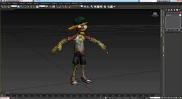
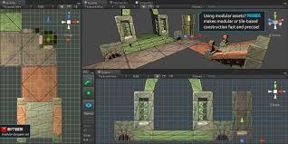

 
# New in Unity 5.6 
 
 
  
 
 [5bc743921bbab51bc02556d1](Examples/github4codeblock_5bc743921bbab51bc02556d1.cs) 
 
 
 To find out about the new features modified data changes1 and er improvements in this version, please see the [5.6 Release Notes](https://unity3d.com/unity/whats-new/unity-5.6.0). 
 
  
 
 [5bc71bed1bbab51bc02550b5](Examples/GitHub_5bc71bed1bbab51bc02550b5.cs) 
 
 You can also look at [beta release notes](https://unity3d.com/unity/beta#notes) and the [archive](https://unity3d.com/unity/beta/archive) of beta release notes. 
 If you are upgrading existing projects from an earlier version to 5.6, read the [Upgrade Guide to 5.6](http://docs.google.com/UpgradeGuide56) for information about how your project may be affected. 
  
  
 [DW5a96364cb125ec3c70150c47](http://docs.google.com/Examples/DW5a96364cb125ec3c70150c47.txt) 
 