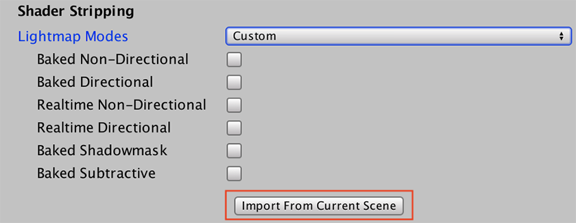

# Using Shaders in AssetBundles

## Shader variants

To use [Shader variants](SL-MultipleProgramVariants) in AssetBundles, use the [ShaderVariantCollection](ScriptRef:ShaderVariantCollection.html) class. This class enables you to avoid shader compilation issues by preloading Shaders at Player startup or Scene load.

To get started:

1. Create your ShaderVariantCollection.

2. Add the shader to the collection.

3. Add the variant tags you require to the collection.

4. Assign both the ShaderVariantCollection and the Shader to the same AssetBundle.

## Shader stripping

When you include shaders in your AssetBundle, the Unity Editor looks at the current Scene and lightmapping settings to determine which lightmap modes to use. This means that you need to have a configured Scene open when building the AssetBundle.

However, you can also manually specify which Scene to calculate lightmap modes from. This is necessary when building AssetBundles from the [command line](CommandLineArguments).

1. Open the Scene in the Editor.

2. Open the [Graphics](class-GraphicsSettings) window (__Edit > Project Settings__, then select the Graphics category), and go to the __Shader stripping__ section.

3. Change the __Lightmap modes__ to __Custom__, then select __Import From Current Scene__.

---
* 2018-06-27 <!-- include IncludeTextNewPageYesEdit -->

* Updated functionality in 2017.1