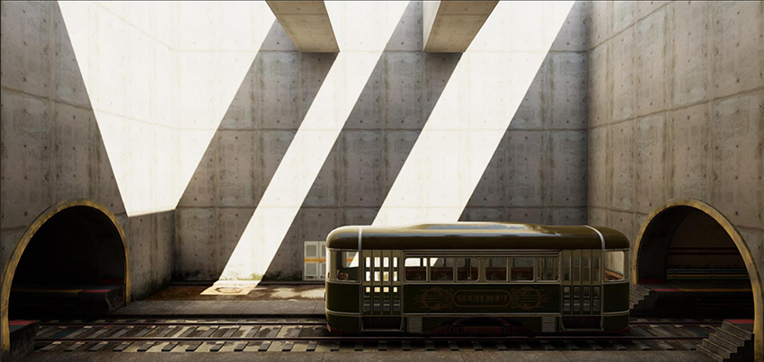
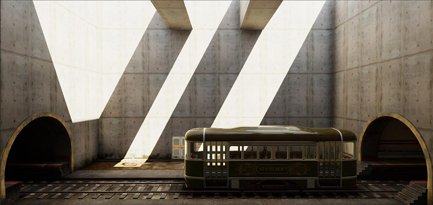

# Outdoor lighting and Scene setup

At this stage, you should have meshes that are properly textured and an assembled Scene with proper tonemapped Unity render settings. But the Scene still needs a proper lighting setup. The advice in this section assumes you have set the Scene with a __Realtime GI__ strategy and then lit with Realtime lights for instant feedback. The same advice and lighting principles also apply when baking. 

For outdoor lighting and Scene setup, consider the following:

* [Environment lighting](#environment)
* [Global Illumination](#directional)
* [Light Probes and Reflection Probes](#gi)
* [HDR Lighting Value](#probes)
* [Screen Space Ambient Occlusion and Screen Space Reflection](#hdr)
* [Fog](#fog)

## Environment lighting

One of the main components in outdoor lighting is Environment lighting, which is also referred to as hemisphere lighting or skylight. Night sky has minimal contribution, while daytime sky has very bright contribution. Environment lighting settings can be found under the Lighting tab (__Window__ > __Rendering__ > __Lighting Settings__).

A procedural Skybox material is better than a HDRI cubemap, for its simplicity and ease of use. 

To create a procedural Skybox material:

1. Add a new material in the project and name it __SkyMaterial__. 

1. In the Inspector, set the material’s __Shader__ to Skybox/Procedural

1. In the Lighting window, on the __Scene__ tab, assign __SkyMaterial__ to __Environment__ > __Skybox Material__:

The Scene is now slightly lit. It has ambient lighting, but not proper environment lighting:

## Directional Light

Typical sunlight or moonlight is usually represented by a directional light. This is due to the parallel nature of its light and shadow direction mimicking the light source at close to infinity distance.

## Global Illumination (GI)

Directional and ambient light alone don’t create believable lighting. Proper environment lighting requires occlusion of the skylight lighting, and sunlight requires indirect lighting bounce. In our example, the sky currently renders a single color value to the Scene, making it flat. This is where you need Realtime GI or Baked lighting to calculate occlusion and indirect bounce lighting. To achieve that, follow these steps:

1. To make sure all the relevant meshes contribute to the Realtime GI or baking, select the GameObjects in your Scene and, in the Inspector window in the __Static__ drop-down menu, enable __Lightmap Static__ and __Reflection Probes__:

    

    **Note**: You should generally apply this to all large static meshes.

1. Ensure that your Scene is set to use __Realtime Global Illumination__ on the Lighting window > __Scene__ > __Realtime Lighting__ > __Realtime Global Illumination__. 

1. At the bottom of the Lighting window, make sure __Auto Generate__ is checked.

At this stage, the example Scene is now dark, and some elements of the Scene look out of place, such as the tram and the door on the background:

The static GameObjects in the Scene currently have proper occlusion for environment lighting (hemisphere lighting) and indirect bounce response from the directional light, but the rest of the GameObjects need a proper lighting setup.

#### Light Probes and Reflection Probes

For dynamic GameObjects and non-lightmap GameObjects to receive Realtime or Baked GI, you need to have Light Probes distributed in the Scene. Distribute Light Probe groups in the Scene efficiently, such as near dynamically-lit GameObjects or in areas where the player passes by. For more information on Light Probes group, see [Light Probes](LightProbes).

Because __Auto Generate__ is checked in the Lighting window, the lighting refreshes whenever you make a change. With Light Probes now in the example Scene, the tram and the background door are grounded better, but reflections look out of place. Sky reflection is all over the place and shows up inside the tunnel:

Reflection Probes help resolve this issue. Place Reflection Probes efficiently, with proper coverage in the Scene as needed. In the Scene image above, one Reflection Probe for the entire room is sufficient. A 128 pixels Cubemap Resolution using box projection is a good baseline for most cases, and is also useful for memory and reflection bake times. 

The example Scene now looks properly grounded and cohesive, which is an important part of a believable Scene. However, everything is even darker than before, and nowhere near believable quality:

For more information on Reflection Probes, see [Reflection Probes](https://docs.unity3d.com/Manual/class-ReflectionProbe.html).

## HDR Lighting Value

In reality, environment lighting and sunlights are very bright light sources. They’re much brighter than pixel value 1. This is where HDR lighting comes into play, because it can accommodate pixel values outside the 0-1 range. To give you a good idea of what environment lighting does to a Scene, let’s turn off the directional sunlight in our example Scene, and set the __SkyMaterial__ > __Exposure__ to 16:

The Scene starts to look believable, as if it is a cloudy day when sunlight is completely diffused in the sky and directional light doesn’t show up. Now, let’s reintroduce sunlight back into the Scene at a much higher value by setting the __Intensity__ to 5. Despite the sun looking nearly white, it is important that you choose color properly, because the impact of indirect color from a strong sun can dramatically change the look of the Scene. 

Now the sun (directional light) looks like a high energy light, as expected from real life, and the Scene looks quite believable:

## Screen Space Ambient Occlusion and Screen Space Reflection

While the Scene lighting looks pretty good at this point, you can add more details to make the Scene more believable. Baking detailed occlusion usually isn’t possible because of the limited resolution set in the Realtime GI for reasonable performance. This is where Screen Space Ambient Occlusion can help. Enable SSAO in the Post-Process Profile by checking __Ambient Occlusion__. The sample Scene contains a post-processing profile called _Rin_Post_Basic.asset_, set to the following __Ambient Occlusion __settings:

* __Intensity__ 0.5
* __Radius__ 1
* __Sample Count__ Medium
* __Downsampling__ and __Ambient Only__ checked

While SSAO takes care of extra ambient lighting occlusion, Screen Space Reflection improves the accuracy. When you enable the __Screen Space Reflection__ in the post-processing profile, the left side of the wet track no longer renders bright reflections, because SSR gives the Scene more accurate reflections for on-screen GameObjects:

Both of these post-processing options incur performance impacts at run time, so enable them wisely. Adjust the values so that they have a reasonable performance impact that fits your run-time requirements.

## Fog

At this stage, our sample Scene has believable outdoor and indoor value separation on a fixed exposure. Reflection is visible in the dark indoor areas as strong highlights and not dim muddy values. However, the Scene foreground and background elements are not showing up, despite being strong perspective elements:

Adding a subtle fog to the Scene creates a massive difference in giving the Scene another dimension:

With fog added, the foreground railing is defined better compared to the zero fog Scene above.
To enable fog, open the Lighting window and go to __Scene__ > __Other Settings > Fog__. In the provided Scene, __Fog__ is set to use __Color__ #6D6B4EFF, and it’s in __Exponential__ mode with __Density__ set to 0.025. In deferred rendering, you might need to enable fog in the post-processing profile if it is not activated automatically.

---

* 2018-08-21  <!-- include IncludeTextNewPageSomeEdit -->
* Making believable visuals Best Practice Guide added in Unity 2017.3
