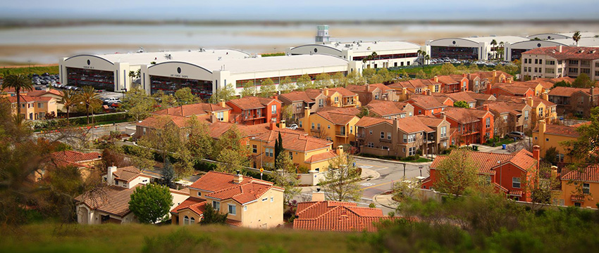

# Understanding post-processing

Post-processes are rendering effects that are based on an existing rendered Scene. Effects in post-processing are usually dependent on the Scene view, or layered on top of the rendered Scene before generating the final render. The clear advantage of this feature is the instant visual feedback and dramatic improvement to the Scene, without the need to alter existing content.

You don’t need to use all of the post-processing features to create believable Scenes. However, its capability to enhance a Scene further is certainly worth the time it takes to understand the system. This section helps you decide which post-processing effects are right for your situation, and helps you avoid the pitfalls that can come with these advanced features:

* [Anti-aliasing](#aa)
* [Ambient occlusion (AO)n](#ao)
* [Screen Space Reflection](#ssr)
* [Depth of Field](#dof)
* [Motion blur](#motionBlur)
* [High intensity color](#highIntensityColor)
* [Chromatic Aberration, Grain and Vignette](#artifacts)

For an in-depth overview on post-processing, see the [Post-processing documentation](PostProcessingOverview).

## Anti-aliasing

When rasterizing a 3D polygon into a 2D screen with limited resolution, the final pixels show an aliasing effect (like steps on the edges of objects). There are different solutions for anti-aliasing techniques in real-time 3D, such as supersampling, multisample anti-aliasing (MSAA), fast approximate anti-aliasing (FXAA), spatial anti-aliasing (SMAA) and temporal anti-aliasing (TXAA). Currently, the most popular techniques are FXAA and TXAA, due to their effectiveness and relatively high performance. For example, the following image from the sample Scene compares FXAA and TXAA:

FXAA does a good job of fixing some of the glaring aliasing effects, but TXAA takes it a step further and performs a much better job in the tram rails.

FXAA is pure post-processing anti-aliasing. In simple terms, It captures the rasterized Scene, analyzes the edges, and runs an algorithm on top of the existing image to smooth it out. It is straightforward, doesn’t have any complex dependencies, and it’s fast.

TXAA is a lot more complex. It uses jittering and the previous frame as additional data to blend into the current frame. It also uses motion vectors to predict which pixels to reject or accept to render the final frame. The idea is to increase the effective resolution of a frame with more data, without the need to render the Scene larger than its final resolution (as is usually the case in supersampling). The benefit is clearly a much smoother anti-aliasing, similar to the quality given by supersampling, but without the major performance impact.

Like everything in real-time rendering, there’s always a trade-off. TXAA requires motion vectors to function, and has a larger performance impact when compared to FXAA. TXAA’s complex nature of predicting the final image can cause some unintended artifacts for fast-moving GameObjects, and texture blurriness across the Scene, which might not be suitable for some applications.

## Ambient occlusion (AO)

Ambient occlusion post-processing is an approximation of ambient occlusion based on screen space data, mainly depth. For this reason, it is usually called Screen Space Ambient Occlusion (SSAO). As explained in [Enable post-processing](BestPracticeMakingBelievableVisuals2.html#enablePP), SSAO can give better fidelity when shading ambient lighting, especially for dynamic GameObjects that often don’t have any occlusion interaction between static Scenes and dynamic Scenes.

While in general SSAO helps a Scene’s ambient shading, it can cause too much occlusion. Using per-object baked ambient occlusion from an offline 3D modelling application with additional ambient occlusion from light baking makes SSAO a third layer of ambient occlusion. 

Make sure you keep the final output in mind when setting up SSAO, and try to find a balance with the other ambient occlusion solutions.

## Screen Space Reflection

Like SSAO, Screen Space Reflection uses the current Scene view to approximate reflections via ray tracing. To get believable results, it is almost always a good idea to enable this feature. It adds a highly accurate reflection that complements the normal cube map captured reflection. However, enabling this feature does restrict rendering to deferred rendering only, and has a performance impact. Another downside of SSR is that anything not on the screen does not generate reflection hits, and therefore can cause a missing reflection effect at the edges of the screen.

## Depth of Field

The Depth of Field effect can give the cinematic feel of a large sensor camera. It can also be used to change the scale perception of a Scene (much like how a tilt-shift camera lens gives a miniature effect). For example, the following image is a real-life photograph, made to look like a miniature by applying a Depth of Field effect:

## Motion blur

A subtle motion blur can make blending the transition of one frame to another more believable. However, you need to take care in your application to reduce the risk of motion sickness. This is especially true if there is a massive difference in Scene translation, which is typically found in first-person or third-person cameras. For example, a wide-angle view where the player can swing their camera really fast from left to right looks jittery and give a stop motion look without motion blur, even if it is rendering at 60FPS. The following image shows a running motion blur at a Shutter angle of 180 degrees:

A full 360-degree shutter angle gives you a full frame duration trail. Anything less means less trail. With that in mind, if you are aiming for a stop-motion look, then disable motion blur.

## Bloom and emissive

In real life, bloom is a lens artifact where light beams aren’t focused properly. It usually occurs on lower-quality camera lenses, or some special effects glow camera filter. Bloom gives a hazy soft image, as shown here (__Threshold Gamma__ set to 0):

Or you can use Bloom to differentiate elements of high intensity or bright light, as shown here:

Over-using these features can backfire. You can see this happen in the first sample in the above image; there are lots of high intensity pixels, and the threshold of the intensity starts to bloom very early.

When you select the value of the threshold, consider the specific values of your emissive surfaces, the lighting setup for the Scene, and whether you have enabled eye adaptation.

## High intensity color

You can handle high intensity color values using a tonemapper, which processes a linear HDR buffer of input data and renders it back out to the designated color space for final output. This is similar to how a camera works. In Unity post-processing, there are two types of tonemapper: __Neutral__ and __ACES__ ([Academy Color Encoding System (Wikipedia)](https://en.wikipedia.org/wiki/Academy_Color_Encoding_System)). At first glance, the difference between the two is in the default contrast of the tonemapper. However, the main difference between the two is that you can adjust __Neutral__ to be similar in contrast to __ACES__. In the image below, the two examples are almost identical (where the __Neutral__ settings are: __Black__ In 0.02, __White__ In 10, __Black Out__ -0.04, __White Out__ 10, __White Level__ 5.3 and __White Clip__ 10):

The main difference you need to take into account is how the two tonemappers handle high intensity color values, such as colored light or emissive effects from explosion effects or fire. The following image shows how an __ACES__ tonemapper normalizes high intensity color differently to the __Neutral__ tonemapper:

## Chromatic Aberration, Grain and Vignette

Chromatic Aberration, Grain and Vignette are post-process effects that simulate artifacts from real-life camera systems. To use them properly, it is good to understand how each of these occur in real cameras:

* __Chromatic Aberration (CA)__ is a dispersion of color that appears on an image if the lens of a camera fails to focus all color to the same convergent point. This is usually found in a poorly calibrated or lower quality lens. While this can sometimes add a sense of realism to a digital Scene, this also means your virtual camera is directed to convey a low quality lens.

* __Grain__ seen in the final image of a real photograph or cinema is usually a sign of an insufficient quantity of useful light entering the sensor, such as a dark scene or a high ISO camera sensor/film translating to noise. You can use this effect to simulate camera limitations, to make a pristine 3D-rendered Scene feel more believable. However, too much noise in a Scene can distract the viewer with a false sense of motion, and affect the contrast of the final rendered image.

* __Vignette__ is similar to the CA effect; it adds artifacts where a lens could not give consistent light coverage from the center to the edge of the sensor/film of a camera. You can use this effect to give some sense of focus for a central point of a Scene. However, if you use this effect too much, you can make a Scene look like it was processed by an amateur post-editor.

The key takeaway from these post-processing fundamentals is that you should practice and develop an understanding of each effect, so that you can effectively use the features with a sense of purpose, and weigh the visual benefit of each additional effect against overall Scene performance.

For advice on additional post-processing features, see documentation on:

* [Eye Adaptation](PostProcessing-EyeAdaptation)
* [Color Grading (other than tonemapper)](PostProcessing-ColorGrading)
* [User Lut (Lookup Table)](PostProcessing-UserLut)

---

* 2018-03-21  <!-- include IncludeTextNewPageSomeEdit -->
* Making believable visuals Best Practice Guide added in Unity 2017.3