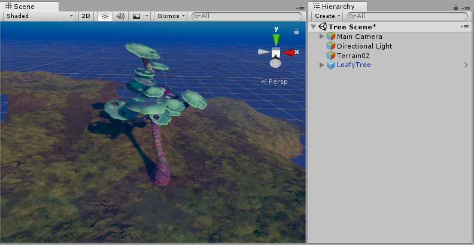

# Creating Prefabs

In Unity's Prefab system, __Prefab Assets__ act as templates. You create Prefab Assets in the Editor, and they are saved as an Asset in the Project window. From __Prefab Assets__, you can create any number of __Prefab instances__. Prefab instances can either be created in the editor and saved as part of your Scenes, or instantiated at runtime.

## Creating Prefab Assets

To create a Prefab Asset, drag a GameObject from the Hierarchy window into the Project window. The GameObject, and all its components and child GameObjects, becomes a new Asset in your Project window. Prefabs Assets in the Project window are shown with a thumbnail view of the GameObject, or the blue cube Prefab icon, depending on how you have set up your Project window.

This process of creating the Prefab Asset also turns the original GameObject into a Prefab instance. It is now an instance of the newly created Prefab Asset. Prefab instances are shown in the Hierarchy in blue text, and the root GameObject of the Prefab is shown with the blue cube Prefab icon, instead of the red, green and blue GameObject icon.

## Creating Prefab instances

You can create instances of the Prefab Asset in the Editor by dragging the Prefab Asset from the Project view to the Hierarchy or Scene view.

You can also create instances of Prefabs at runtime using scripting. For more information, see [Instantiating Prefabs](https://docs.unity3d.com/Manual/InstantiatingPrefabs.html).

--------------------

* 2018-07-31  <!-- include IncludeTextNewPageSomeEdit -->

* Nested Prefabs and Prefab Variants added in 2018.3