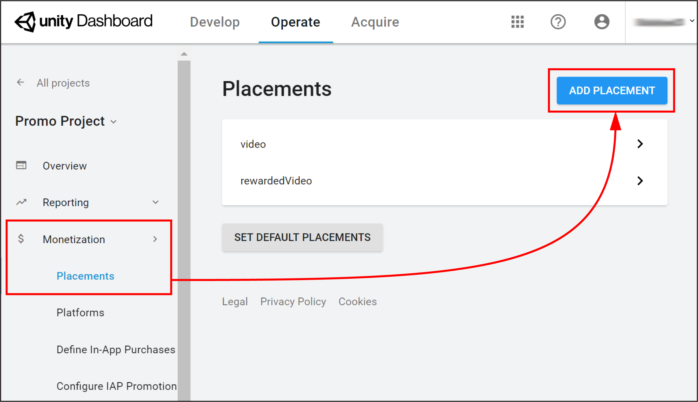

# IAP Promo Placements

Use __Placements__ to control when and how your __Promotions__ display in-game. You create __Placements__ on the Developer Dashboard, then call them via code in the Unity Editor, similar to normal [Unity Ads Placements](https://unityads.unity3d.com/help/monetization/placements-and-filters). 

## Creating Placements
Create Promo __Placements__ on the [Operate page of the Developer Dashboard](https://operate.dashboard.unity3d.com/). Your active Project appears in the top-left corner. To create a Promo __Placement__:

1. Select __Monetization__ &gt; __Placements__ from the left navigation bar.
2. Click the __ADD PLACEMENT__ button in the top-right corner.  

3. Enter a __Placement Name__, then select whether the Placement is **Rewarded** or __Non-rewarded__ (for more information on rewarded and non-rewarded ad Placements, see documentation on [monetization best practices](https://unityads.unity3d.com/help/monetization/best-practices)).   **Note**: The dashboard auto-populates __Placement IDs__ based on the Placement's name. You cannot edit __Placement IDs__ after the __Placement__ is created, even if you updated the name. Use them to call __Placements__ in your code using the Unity Ads API (see Unity Ads documentation on [Placements and filters](https://unityads.unity3d.com/help/monetization/placements-and-filters) for more information).  
4. Select __CREATE NEW PLACEMENT__ to save the new Placement and return to your Project's Placements list.
5. Select the Placement you created for IAP Promo to open its __General Settings__ menu.
6. Expand the __Ad Types__ setting, then check __IAP__ and click the __SAVE__ button.  

Your Placement is now configured for use with IAP [Promotions](#IAPPromoPromotions).

 
 

-----
* 2018-09-10  <!-- include IncludeTextAmendPageYesEdit -->

