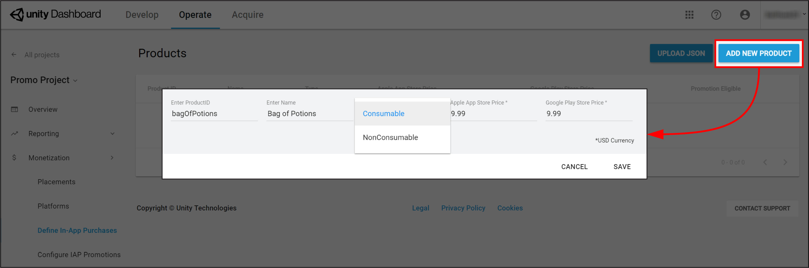

# IAP Promo Product Catalogs

Unity IAP provides quick and easy tools to create and export __Product Catalogs__. Use the Unity Editor’s __IAP Catalog__ window to populate __Product__ metadata, then export the catalog to the [Developer Dashboard](https://iap.unityads.unity3d.com) to configure each Product's creative assets. Note that you must use the IAP Catalog function to export Products to the dashboard.  

## Creating a Product Catalog
<a name="CatalogWindow"></a>
### Adding Products in the IAP Catalog window
In the Editor, select __Window &gt; UnityIAP &gt; IAP Catalog__ to open the __IAP Catalog__ window. This GUI lists all of your previously configured __Products__, and allows you to define the following attributes for each:

* __Name__
* __Product ID__
* __Type__ (IAP Promo now supports both __Consumable__ and __Non-consumable__ Product Types)
* __Price__ (Unity recommends specifying price points for Google and Apple stores independently if your app supports both)

**Note**: A __Product Catalog__ must have at least one __Product__ configured to export. For a complete walkthrough on setting up __Products__, see documentation on [Codeless IAP](https://docs.unity3d.com/Manual/UnityIAPCodelessIAP.html).
    
You may already use a builder script to populate your __Product Catalog__ for Unity IAP. For example:

```
var builder = ConfigurationBuilder.Instance(StandardPurchasingModule.Instance());
builder.AddProduct(product_coins, ProductType.Consumable);
builder.AddProduct(product_hat, ProductType.NonConsumable);
builder.AddProduct(product_elite, ProductType.Subscription);
```

Because IAP Promo only supports JSON exports from the Editor __IAP Catalog__ GUI, we recommend modifying your approach as follows: 

1. Copy-paste your __Products__ into the __IAP Catalog__ GUI.
2. Remove or comment out existing `builder.AddProduct()` code from your purchasing script.
3. Add the following code before initializing IAP to fetch your Product list from the __IAP Catalog__ GUI:
	
```
StandardPurchasingModule module 	= StandardPurchasingModule.Instance();
ProductCatalog catalog = ProductCatalog.LoadDefaultCatalog();
ConfigurationBuilder builder = ConfigurationBuilder.Instance(module);
IAPConfigurationHelper.PopulateConfigurationBuilder(ref builder, catalog);

UnityPurchasing.Initialize(this, builder);
```

### Exporting a Product Catalog
In the __IAP Catalog__ window, select __App Store Export &gt; Cloud JSON__ to export a local copy of the __Product Catalog__.


 
### Configuring creative assets in the Developer Dashboard
Manage your Product Catalog on the [Operate page of the Developer Dashboard](https://operate.dashboard.unity3d.com/). Your active Project appears in the top-left corner. To manage Products, select __Monetization &gt; Define In-App Purchases__ from the left navigation bar.

You can populate your Products manually, or bulk-populate them by importing a JSON file.

#### Creating a Product manually
Click the __ADD NEW PRODUCT__ button in the top-right corner to view the Product configuration window, then enter the following details:

* __Product ID__ (for reference in your IAP code)
* __Name__
* __Consumable__ or __Non-Consumable__
* __Apple App Store Price__ (USD)
* __Google Play Store Price__ (USD)



Click the **SAVE** button to store the Product in your catalog.

#### Importing a Product Catalog
To set up a new __Product Catalog__ or update existing __Products__ in the catalog:

1. Select __UPLOAD JSON__.
2. Select the JSON file [you exported from the Unity Editor](#CatalogWindow). A diff log then prompts you to approve changes. Check the contents of the file, then select __APPROVE CHANGES__.


The imported __Products__ appear in the __Product Catalog__ list. However, in order to be eligible for __Promotions__, each __Product__ must have an associated creative asset (otherwise there is nothing for the __Placement__ to display). 


#### Assigning creative assets
To add creative assets, follow these steps:

1. Select a __Product__ from the __Product Catalog__ list, then scroll down to the __Creative Uploads__ section. <br/><br/> **Note**: While each Product’s __Product ID__, __Name__, __Price__, and __Type__ appear in the dashboard, you can only edit these attributes from the Editor’s __IAP Catalog__ window.<br/><br/>

2. To specify unique creative assets for different regions, select __ADD LANGUAGE__, then check the languages to include. <br/><br/> <br/><br/> <br/>**Note**: The drop-down indicates the current language you are editing. If an included language has no creative assets, it defaults to using its __English (United States)__ creative assets. <br/><br/> 

3. Upload __Portrait__ or __Landscape__ creative assets for phone and tablet devices, with the following guidelines: <br/><br/> 
    * PNG or JPG file format.
    * Each __Product__ requires a creative asset for at least one configuration to be eligible for __Promotions__. For a better consumer experience, provide optimized creative assets for each device and orientation.
    * __Phone__ creative asset dimensions are 580 x 1035 pixels for portrait orientation, and 1035 x 580 pixels for landscape orientation.
    * __Tablet__ creative asset dimensions are 900 x 1200 pixels for portrait orientation, and 1200 x 900 pixels for landscape orientation. 

4. Select __UPLOAD CREATIVE__ to upload a creative asset. A preview appears on the left.

5. Select __UPLOAD PURCHASE BUTTON__ to place an interactive button on the creative asset, with the following guidelines: <br/><br/>
    * You must upload a purchase button to proceed.
    * Minimum file size for the button asset is 60 x 60 pixels.
    * You can click and drag the purchase button on the preview window to place it.
    * You can format the font, color, and size of the button text. <br/><br/>  

6. Select __SAVE__ to proceed. Upon returning to the __Product Catalog__ page, your __Product__ is now __Promotion Eligible__. <br/><br/> 

**Note**: You must export and submit your __Product Catalog__ to the appropriate Google Play or iTunes store for the purchase flow to work. Please see the __Export__ section in the documentation on [Codeless IAP](https://docs.unity3d.com/Manual/UnityIAPCodelessIAP.html). 


-----
* <span class="page-edit">2018-09-10  <!-- include IncludeTextAmendPageYesEdit --></span>
