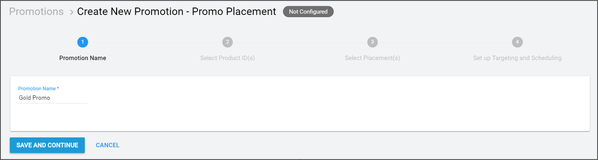
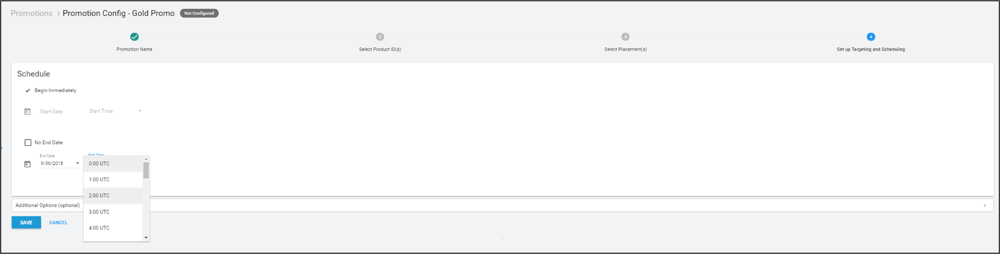
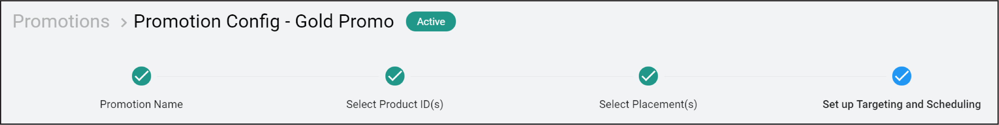
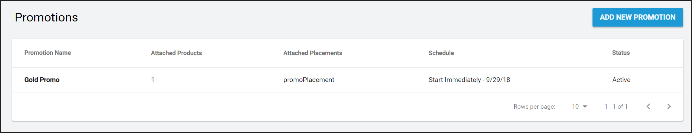

# Promotions

IAP __Promotions__ work in confluence with __Placements__ to target players with precise purchase opportunities tailored to their unique situations. There are three components of a __Promotion__:

* Included __Products__ (see documentation on [IAP Promo Product Catalogs](https://docs.unity3d.com/Manual/IAPPromoProducts))
* Associated __Placements__ (see documentation on [IAP Promo Placements](https://docs.unity3d.com/Manual/IAPPromoPlacements))
* Business logic ([detailed below](#BusinessLogic))    

Create and manage __Promotions__ exclusively from the Developer Dashboard. 

## Creating Promotions
Create IAP __Promotions__ from the [Operate page of the Developer Dashboard](https://operate.dashboard.unity3d.com/). Your active Project appears in the top-left corner. To create a __Promotion__: 

1. Select __Monetization &gt; Configure IAP Promotions__ from the left navigation bar. Any existing __Promotions__ appear here.
2. Click the __ADD NEW PROMOTION__ button in the top-right corner.    
3. Enter a __Promotion Name__, then select __SAVE AND CONTINUE__ to configure it.   

## Configuring Promotions
At any time during the configuration process, you can use the creation timeline to select the step you wish to configure.

### Including Products
Click __2 Select Product ID(s)__ on the creation timeline to include __Products__ for your __Promotion__. Your Project's Product Catalog appears here. To include a __Product__, it must have an associated creative asset. Select the eligible __Product__(s) you wish to include, then click __SAVE AND CONTINUE__ to confirm your selections. 

For more information on configuring Products, see the [IAP Promo Products](https://docs.unity3d.com/Manual/IAPPromoProducts) documentation. 

**Note**: __Placement__ requests return a list of all potential __Products__ to show. Selected __Products__ that lack creative assets are ineligible for promotion, and get filtered out. See the __Machine learning__ section of the [IAP Promo overview](https://docs.unity3d.com/Manual/IAPPromo) for more information.

### Including Placements
Click __3 Select Placement(s)__ on the creation timeline to choose which __Placements__ can show your __Promotion__. Your Project's __Placements__ appear here. To include a __Placement__, it must be [configured to show IAP](https://docs.unity3d.com/Manual/IAPPromoPlacements). Select the eligible __Placement__(s) you wish to include, then click __SAVE AND CONTINUE__ to confirm your selections.

**Note**: Multiple __Placements__ can target the same __Promotion__, and vice versa.

### Defining business logic
Click __4 Set up Targeting and Scheduling__ on the creation timeline to define the logic your __Promotion__ uses to target customers.

Specify an active period for the __Promotion__ to run. Check __Begin Immediately__ and __No End Date__ for an indefinite duration, or select the calendar icons to specify a start and end date. 

#### Additional Options
Expand the __Additional Options__ menu for more targeted promotional strategies.

1. __Operating System__ filters targeted players by iOS or Android devices.
2. __Territory__ filters targeted players by country or region.
3. __Life-to-Date Revenue__ filters targeted players by the amount they have spent on in-app purchases for their life-to-date in the game (for example, a __Promotion__ can target non-payers, or players who have spent in excess of $100). 

Select __SAVE__ to finish configuring the __Promotion__.

You can view each Promotion’s number of __Attached Products__, __Attached Placements__, __Schedule__, and __Status__ from the __Configure IAP Promotions__ page. Edit a __Promotion__ at any time by clicking on it. 

-----
* 2018-09-10  <!-- include IncludeTextAmendPageYesEdit -->