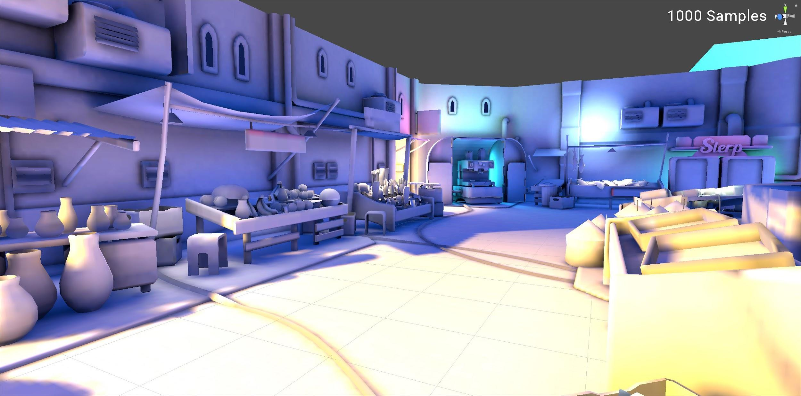

# Lightmapping: Getting started

This page provides an introduction to lightmapping in Unity. Lightmapping is the process of pre-calculating the brightness of surfaces in a Scene, and storing the result in a chart or "light map" for later use.

Unity uses a system called the [Progressive Lightmapper](ProgressiveLightmapper), which bakes lightmaps for your Scene based on how your Scene is set up within Unity, taking into account Meshes, Materials, Textures, and Lights. Lightmapping is an integral part of the rendering engine; when your lightmaps are created, GameObjects automatically use them.

For information about specific lightmapping-related settings, see documentation on [Global Illumination](GlobalIllumination).

## Preparing the Scene and baking the lightmaps

Select __Window__ &gt; __Lighting__ &gt; __Settings__ from the Unity Editor menu to open the Lighting window. Make sure any Mesh you want to apply a light map to has proper UVs for lightmapping. The easiest way to do this is to open the [Mesh import settings](FBXImporter-Model) and enable the __Generate Lightmap UVs__ setting.

Next, to control the resolution of the lightmaps, go to the __Lightmapping Settings__ section and adjust the __Lightmap Resolution__ value. 

__Note:__ To have a better understanding of how you spend your lightmap texels, look at the small __Shaded [debug scene visualization mode](GIVis) within the __Scene View__, switch to __Baked Lightmap__ and tick the __Show Resolution__ checkbox.

In the __Mesh Renderer__ and __Terrain__ components of your GameObjects, enable the __Lightmap Static__ property. This tells Unity that those GameObjects don’t move or change, so Unity can add them to a lightmap. In the __Mesh Renderer__ component, you can also use the __Scale In Lightmap__ parameter to adjust the resolution of your lightmap’s static __Mesh__ or __Terrain__.

You can also adjust settings for Lights in the [Light Explorer](LightingExplorer). 

To generate lightmaps for your Scene:

1. At the bottom of the __Scene__ tab on the [Lighting window](GlobalIllumination), click __Generate Lighting__ (or ensure that __Auto Generate__ is ticked).

2. A progress bar appears in Unity Editor’s status bar, in the bottom-right corner.

3. When baking is complete, you can see all the baked lightmaps in the __Global Maps__ and __Object Maps__ tabs of the Lighting window.

When lightmapping is complete, Unity’s Scene and Game views update automatically.

To see the UV chart of the Mesh, click on a GameObject that has __Lightmap Static__ enabled, then navigate to the Inspector window and select the __Object Maps __tab. Here, you can switch between different light map visualization modes. When you manually generate lighting, Unity adds [Lighting Data Assets](LightmapSnapshot), [baked lightmaps](GlobalIllumination) and [Reflection Probes](ReflectionProbes) to the [Assets](SpecialFolders) folder.

## Tweaking bake settings

The final look of your Scene depends on your lighting set-up and bake settings. Let’s take a look at an example of some basic settings that can improve lighting quality.

Sample count
Progressive Lightmapper generates color values resulting from a single ray in order to remove noise. These color values are called samples. There are two settings that control the number of samples the Progressive Lightmapper uses for direct and indirect lighting calculations: __Direct Samples__ and __Indirect Samples__. To find these, open the Lighting window (__Window__ &gt; __Lighting__ &gt; __Settings__), and go to __Lightmapping Settings__ &gt; __Lightmapper__.

Higher sample values reduce noise and can improve the quality of the lightmaps, but they also increase the bake time. The images below shows how a higher number of samples increases the quality of lightmaps without using filtering, and produces results that are less noisy.

### Environment Lighting

In addition to all [Light sources](LightSources), [Environment Lighting](GlobalIllumination.html#Environment) can also contribute to Global Illumination. You can assign a custom Skybox Material instead of default __Procedural Skybox__ and adjust intensity. The following image shows how lighting can change in the Scene with and without __Environment Lighting__, and provide softer results. The settings for light sources are the same in both Scenes. Unity provides several custom HDRI assets in the [Asset Store](https://assetstore.unity.com/packages/essentials/beta-projects/unity-hdri-pack-72511).

### Filtering 

Filtering allows you to blur noisy results. The Progressive Lightmapper offers two different types of filtering: __Gaussian__ and __A-Trous__. When you enable __Advanced__ settings, you can apply these filters for __Direct__, __Indirect __and __Ambient Occlusion__ separately. For more information, see documentation on [Progressive Lightmapper](ProgressiveLightmapper).

---

 2018-03-28  <!-- include IncludeTextAmendPageSomeEdit -->

Progressive Lightmapper added in [2018.1](https://docs.unity3d.com/2018.1/Documentation/Manual/30_search.html?q=newin20181) NewIn20181