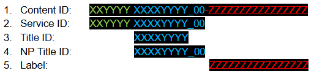

#Creating submittable packages

##PS4 package files overview

There are different types of PS4 Packages (.PKG files):

* Applications
* Patches
* Day one patches
* Remasters
* Additional content (DLC)

You can use Unity to build everything except the **remaster package**.

You can install all packages on a PS4 via PS4 Neighbourhood (go to **Target Operations** &gt; **Install Package**).

You can also install packages via the command line, using the *orbis-run.exe* tool. For more information, see [Controlling DevKits using the command line](https://ps4.siedev.net/resources/documents/SDK/latest/Neighborhood_and_Utilities-Users_Guide/0004.html)

Full information regarding each format is in the official SDK documentation, under **Production and Distribution Guide** &gt; **Package Types**.

To create any type of package other than **additional content (DLC)** from within Unity, go to **File** &gt; **Build Settings** and set **Build Type** to **PS4 Package**.

## Application package

An **application package** contains everything that should be within the released title.

If future patching or DLC (downloadable dontent) is expected, it is important to consider the implications of doing so at the earliest stage. For example, using AssetBundles would allow for DLC content to be created and installed within a title at a future date.

### Creating application package files

Use the following steps to build an **application package**:

1.  Go to __Edit__ &gt; __Project Settings__, then select the __Player__ category, and open the __Publishing Settings__ panel. Set **Category** to *PS4 Application*, and set **Application Type** to *Paid Standalone Full App (full)*.

2.  Set the **Master Version**. Although the application version ("APP_VER") for the initial release is always 1.00, the master version (“VERSION”) might be a number greater than this. For example, if you submit a title to QA for testing but it fails, the second version you send to QA might use a different master version value to ensure that there is no confusion about which is the latest version prior to release. For valid values see the **Master Version** section in SIE's [About the TRC](https://ps4.siedev.net/resources/documents/TRC/2018.07/TRC/rem.html) documentation.

3.  Set the **Content ID** (see next section).

### Content ID

The **Content ID** is split into multiple parts. See the Sony [Publishing Tools Overview: Packages](https://ps4.siedev.net/resources/documents/Misc/current/Publishing_Tools-Overview/0003.html) document (**Service ID** section) for full details.



All packages of any type for a single application must have the same Service ID. To get a Service ID, you need to make a request to Sony on the PlayStation®4 DevNet website.

## Patch package

You might release patches for your game for a number of reasons; usually to overwrite existing files (for example, when fixing bugs or updating textures) or to add new files (for example, to add new audio or graphics). To release a patch, you need to release a **patch package**.

### changeinfo.xml

**Patch packages** require a *changeinfo.xml* file (and potentially *changeinfo_nn.xml* files). These files contain update information which users can access and view in the PS4 Update History screen.

The build process also handles optional multilingual *changeinfo* files (for example, you can use *changeinfo_00.xml* for Japanese content). For more information, see [Sony's Content Information Specifications](https://ps4.siedev.net/resources/documents/SDK/latest/Content_Information-Specifications/0010.html).

The *changeinfo* files have strict requirements:

* XML format text file
* UTF-8
* No BOM (Byte Order Mark)
* The linefeed code must be LF
* The file must be in a folder that contains nothing else

**Patch packages** with incorrect *changeinfo* files (such not following the strict formatting or folder requirements), are likely to fail the package build, or fail to generate the correct .xml and .txt files. A package build fail usually results in very little output log information as to why the package failed. However, verifying the package the orbis-pub-chk.exe tool (see* Verifying packages* section), can be used to highlight the problematic area.

### Creating Patch packages

The process for creating **patch packages** is very similar to the process for creating **application packages**. Go to __Build Settings &gt; Player Settings &gt; Publishing Settings__ and set the following:
​    
1. **Category**: Select **PS4 Application Patch**.
2. **Application Type**: Select **Paid Standalone Full App (full)**
3. **Application PKG**: Select the Application .pkg file that was initially created.
4. **Patch ChangeInfo Folder**: Select the folder that contains the changeinfo.xml file(s)
5. **Latest QA Passed PKG**: Leave blank if this is the first patch. Otherwise, select the last released patch .pkg file.
6. **Application Version**: must be incremented for each patch. For valid values see "Application Version" section in [About the TRC](https://ps4.siedev.net/resources/documents/TRC/2018.07/TRC/rem.html)
7. **Content ID**: This must be the Application .pkg content ID. See *Content Restrictions*

#### Tips & troubleshooting

* Selecting an Application .pkg as the "Latest QA Passed PKG", causes an error during the build process. The error reads: `[Error] The following combination of Volume Type/Storage Type is not allowed or not supported. (app:digital50, patch:unknown, patch:digital25)`
* When the **Publishing Settings** &gt; **Category** is set to **PS4 Application Patch**, the **Build Settings** &gt; **Build & Run** button is disabled.
* **Content ID Restrictions** For **patch packages** and **remaster packages**, Content ID labels must exactly match the corresponding **application package** Content ID label. For **additional content (DLC)**, Content ID labels of **additional content packages** must be different from the corresponding **application package** Content ID label. In addition, the Content ID labels of **additional content packages** for the same **application package** must be different from each other.
* **Compress with PSArc check box**: To prevent crashes, the __Compress with PSArc__ setting (located in **Build Settings**) in the original package and all patches must be the same. For smaller **patch package** sizes, you should always leave it disabled.
* **Patch destination folder**: When selecting a folder for the patch detination, always use a empty folder. Selecting a folder with existing contents results in an error.

## Remaster patch

**Remaster packages** are not a common package type, so you cannot use Unity to create them. You need to use Sony tools to make a **remaster package**. For more information, see the Sony documentation on [remaster patches](https://ps4.siedev.net/resources/documents/SDK/latest/Patch_Remaster-Overview/__toc.html).

## Additional content (DLC)

The standard method of creating additional content (DLC) is to use [AssetBundles](AssetBundlesIntro). This method allows you to easily include the data from the DLC within the Unity framework. However, you cannot place script data within AssetBundles, so if you also need extra script data, you might also need to release a patch before the DLC becomes publically available.

### Creating DLC

You cannot create DLC via the [Player](PS4ProjectSettings) settings within the Unity Editor. There is a sample package included as part of the Unity PS4Player add-on (**Assets &gt; Import Package &gt; PS4 Samples &gt;** *AdditionalContentPackages*) that adds Editor scripts to access **Player** settings and create DLC through custom menu commands.

### Modifying the "AdditionalContentPackages” for your own needs

Once you have installed the AdditionalContentPackages sample, open the *Editor &gt; ExportPS4DRMPackages.cs* file.

1. Set the *Service ID* and *passcode* correctly to match those you have set on the [Publisher Settings](PS4PlayerSettings#Publishing) panel.
2. Take a look at the example packages that will be created (the line that contains "static DRMPackageDesc []packages ="). Make the relevant changes so that this now contains your own files, etc. (see the comments for the *DRMPPackageDesc* structure within that file).
3. Icon0.png is also required! The current version of the sample does not allow you to specify the DLC package icon. However, making the following changes to the code will allow you to then select the icon0.png file when the editor script is finally run. The following code should be placed in ExportPS4DRMPackages.cs, before the line `foreach (DRMPackageDesc desc in packages)` (approx. line 80):


```
string stagingAreaSceSys = stagingArea + "/sce_sys";

    Directory.CreateDirectory(stagingAreaSceSys);

    string filePath = EditorUtility.OpenFilePanel("Select icon0.png", "", "png");

    if (filePath.Length == 0)

    {

        return;

    }

    File.Copy(filePath, stagingAreaSceSys + "/icon0.png", true);
```

You should also add the following piece of code after `fileNames/Add(paramSfo)` (around line 147):

```
fileNames.Add(stagingAreaSceSys+"/icon0.png");
```

### Building the DLC package

To create a package, select **PS4Tools** from the Unity Editor menu, then select **ExportDRMContentPackages**.

### Verifying packages

Use the *orbis-pub-chk.exe* tool to verify packages have no errors before submission. You can use this tool to verify any package. The default location of *orbis-pub-chk.exe* is *C:\Program Files (x86)\SCE\ORBIS\Tools\Publishing Tools\bin\.*

Run the tool, then drag-and-drop the DLC package onto the opened window. This displays the package information, and highlights any errors.

## Package file names

To create packages, Unity calls the tool *orbis-pub-cmd.exe* using the *img_create* parameter. All packages have the file extension *.pkg*.

This tool also generates the package final filename:

 *Content ID-Application Version – Master Version.pkg*

For example, the **Content ID** might be:

 *JP0000-CABCD00000_00-ExampleName*

The first **application** release would be:

 *JP0000-CABCD00000_00-ExampleName-***_A0100-V0100_***.pkg*

Its first **patch package** would be:

 *JP0000-CABCD00000_00-ExampleName-***_A0101-V0100_***.pkg*

The master version may not always be V1.00 (0100). If, for example, a title initially failed QA, the next version that may have passed might be set to V1.01. Therefore, the first application release would be:

 *UP0000-CUSA00000_00-ExampleName-***_A0100-V0101_***.pkg*

---
*  <span class="page-edit">2018-07-30  <!-- include IncludeTextAmendPageSomeEdit --></span>

*  <span class="page-edit">2018-07-17  <!-- include IncludeTextAmendPageNoEdit --></span>
  
* <span class="page-history">Updated in 5.6</span>


