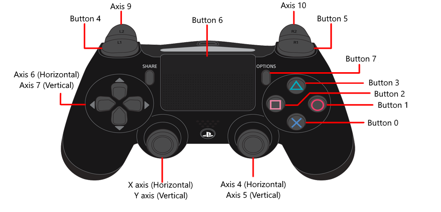
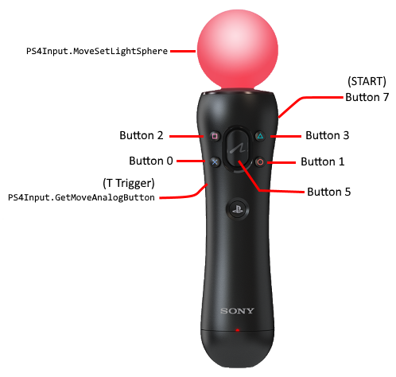

PS4 input
======

To handle input for PlayStation 4 in Unity:

* Read axes and buttons in the same way as on other platforms.
    * To read an axis, use [Input.GetAxis](ScriptRef:Input.GetAxis.html). See [Getting axis input](#axis).
    * To read a button, use [Input.GetButton](ScriptRef:Input.GetButton.html) or the lower-level [Input.GetKey](ScriptRef:Input.GetKey.html). See [Getting button input](#button).
* Read PS4-specific functionality via functions in the `UnityEngine.PS4` namespace, mostly in [UnityEngine.PS4.PS4Input](ScriptRef:PS4.PS4Input.html).

Sample projects are available for download from DevNet, alongside the release notes.

## Dualshock 4

The button and axis controls on the DUALSHOCK 4 have the following names:

 

### Getting button input

When calling `Input.GetButton()`, use with the name of a logical button that you have defined in the [Input](class-InputManager) settings (for example, `"Player 1 Jump"`).  To identify the button names to place in the **Input** settings's `Positive Button` and `Negative Button` fields, see the following table:

| Button | Name |
| :--    | :--  |
| Cross  | joystick _n_ button 0 |
| Circle | joystick _n_ button 1 |
| Square | joystick _n_ button 2 |
| Triangle | joystick _n_ button 3 |
| L1     | joystick _n_ button 4 |
| R1     | joystick _n_ button 5 |
| Touch Pad | joystick _n_ button 6 |
| OPTIONS | joystick _n_ button 7 |
| L3 (Click left stick) | joystick _n_ button 8 |
| R3 (Click right stick) | joystick _n_ button 9 |

For the value of _n_, use the numbers 1-4 to read from the first, second, third and fourth DualShock 4 controllers. For example, to specify the triangle button of the second DualShock 4 controller, use `joystick 2 button 3`. The string is case sensitive and must appear in lower case.

#### Combined input 

On any platform, you can specify `joystick 0` to read a combined value from all attached joysticks, or omit the number entirely to achieve the same effect (for example, `joystick button 3`). This might be useful to combine, say, steering wheel and mouse input on Windows or macOS but this is less useful on PS4 DualShock 4 controllers because they are assigned to different users.

#### Button states example

Here is an example of a button named `Player 1 Jump` that is mapped to the cross button of the first DualShock 4:

To read this button in code, call `Input.GetButton("Player 1 Jump");`.

The [Input](class-InputManager) settings ignores the `Joy Num` field when the input type is `Key or Mouse Button`.

### Getting buttons using a key code 

As an alternative to `Input.GetButton`, you can read buttons using `Input.GetKey` with a [KeyCode](ScriptRef:KeyCode.html) value. You can also use the `Input.GetKeyDown` and `Input.GetKeyUp` variants in the same way. Use values as shown in the table above.  For example, to read the circle button on the third DualShock 4 controller, use `KeyCode.Joystick3Button1`.

In a similar way to `Input.GetButton`, you can specify `Joystick0Button2` to read button two (square) on all connected controllers, for example. Again, on PS4 it is difficult to imagine a use case where this would be a suitable approach.

### Getting axes input

To read an axis, call `Input.GetAxis()` and pass in a logical axis name that you have previously set in the [Input](class-InputManager) settings.  To identify the correct value for the `Axis` field in the **Input** settings, see the following table:

| Axis | Name | Range |
| :--  | :-- | :-- |
| Left Stick X | X Axis | [-1.0, 1.0] |
| Left Stick Y | Y Axis | [-1.0, 1.0] |
| (see note)  | Axis 3 | (see note) |
| Right Stick X | Axis 4 | [-1.0, 1.0] |
| Right Stick Y | Axis 5| [-1.0, 1.0] |
| Left / Right buttons | Axis 6 | [-1.0, 1.0] |
| Up / Down buttons | Axis 7 | [-1.0, 1.0] |
| (see note)  | Axis 8 | (see note) |
| L2     | Axis 9 | [0, 1.0] |
| R2     | Axis 10 |  [0, 1.0] |

#### Note: 3rd and 8th axes

For backwards compatibility with previous Unity versions, in addition to the axes shown above, L2 is mapped to the 8th axis and R2 is mapped to the 3rd axis. For the 3rd axis _only_ the input is inverted; the returned value will be -1.0 when the trigger is fully held. For the 8th, 9th, and 10th axes the returned value will be 1.0 when the trigger is fully held.

#### Axis states example

Here is an example of an axis named `Player 2 Walk` that is mapped to the horizontal axis on the left stick of the second DualShock 4.  To read this axis in code, call ``Input.GetAxis ("Player 2 Walk");``.

## Move Controller ##

The cross, circle, square, and triangle buttons on the Move controller have the same button numbers as on DualShock 4 and you can read them in the same way, by using either `Input.GetButton` or `Input.GetKey`.  For the joystick number to use, refer to the table below.

| Move Controller | Joystick Number |
| :- | :-: |
| Player 1 Primary Move | 5 |
| Player 1 Secondary Move | 6 |
| Player 2 Primary Move | 7 |
| Player 2 Secondary Move | 8 |
| Player 3 Primary Move | 9 |
| Player 3 Secondary Move | 10 |
| Player 4 Primary Move | 11 |
| Player 4 Secondary Move | 12 |

### Notes ###

* The SELECT button behaves like the SHARE button on the Dualshock 4. It is only used by the system software, not the game, so it’s unavailable to application developers.

## Aim controller ##

The buttons and axes on the Aim controller correspond exactly to a DualShock 4.

To specify the joystick number for Aim controllers, see the table below:

| Player | Joystick Number |
| :-- | :--: |
| Player 1 | 13 |
| Player 2 | 14 |
| Player 3 | 15 |
| Player 4 | 16 |

## Extra Features ##

### Pad User Details
Information about the user/pad is available via `PS4Input.PadGetUsersDetails(padIndex)`.

### Touch Pad
The touch pad is implemented through the PS4Input class with `PS4Input.GetLastTouchData()`. Two simultaneous touches are supported.

### Last Gyro
Use `PS4Input.GetLastGyro(padIndex)` to get Gyro information about a given controller.

### Last Orientation
Use `PS4Input.GetLastOrientation(padIndex)` to get the controller orientation. To reset the currently read orientation use `PS4Input.PadResetOrientation(padIndex)`.

### Accelerometer
Use [PS4Input.GetLastAcceleration(padIndex)](ScriptRef:PS4.PS4Input.GetLastAcceleration) to get the controller accelerometer information.

### Lightbar / Light Sphere ###

| Controller Type | Function |
| -: | :- |
| DualShock 4 | [PS4Input.PadSetLightBar](ScriptRef:PS4.PS4Input.PadSetLightBar.html)|
| Move | [PS4Input.MoveSetLightSphere](ScriptRef:PS4.PS4Input.MoveSetLightSphere.html)|
| Aim | [PS4Input.AimSetLightSphere](ScriptRef:PS4.PS4Input.AimSetLightSphere.html)|

Pass in the ID of the controller (0-3) to change along with Red, Green and Blue values ranging from 0-255. Note that the lights cannot be turned off and have a 5% lower limit of illumination (13/255).

Camera tracking of the controllers is also not guaranteed if you vary from the default colours assigned to each controller, to reset the lightbar to its default color use [PS4Input.PadResetLightBar](ScriptRef:PS4.PS4Input.PadResetLightBar) and [PS4Input.AimResetLightSphere](ScriptRef:PS4.PS4Input.AimResetLightSphere).

### DualShock 4 Speaker
To play an [AudioSource](ScriptRef:AudioSource.html) through the speaker on a user's controller, use either of the following functions:

* `AudioSource.PlayOnDualShock4PadIndex(padIndex)` to play audio on a specific controller
* `AudioSource.PlayOnDualShock4(userId)` to play audio for a specific logged-in user

To find the user ID of the player currently using a controller, use `PS4Input.PadGetUsersDetails(padIndex)` to return a `PS4Input.LoggedInUser` and retrieve the user ID from within that.

The setting on the audio source adjusts the audio output, including filters and effects, but the audio source cannot play through both the world and the controller simultaneously.

### Vibration ###

| Controller Type | Function |
| :-- | :-- |
|DualShock 4 | [`PS4Input.PadSetVibration`](ScriptRef:PS4.PS4Input.PadSetVibration.html) |
| Move       | [`PS4Input.MoveSetVibration`](ScriptRef:PS4.PS4Input.MoveSetVibration.html) |
| Aim | [`PS4Input.AimSetVibration`](ScriptRef:PS4.PS4Input.AimSetVibration.html) |

----
* 2018-06-29 <!-- include IncludeTextAmendPageSomeEdit -->
