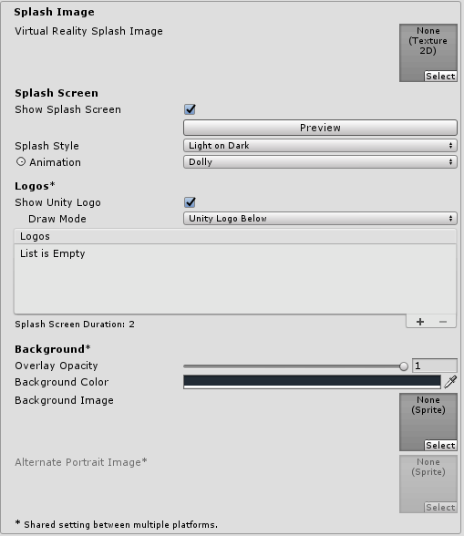
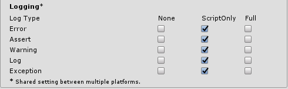
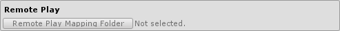
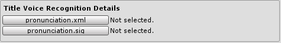

# PS4 Player Settings 

This page details the **Player** settings specific to PlayStation 4. For a description of the general Unity Player settings, see the [Player](class-PlayerSettings) settings documentation. You can also use the [UnityEditor.PlayerSettings.PS4](ScriptRef:PS4PlayerSettings.html) class to access these settings from Editor scripts.

## Icon

| **Property:**| **Function:** |
|:---|:---|
| __Override for PS4__| Check this to be able to set your application icon. Alternatively, you can set your application Icon in the __Multi-language icon Images__ property of the [Publishing Settings](#Publishing) section. Having an icon is one of Sony Interactive Entertainment (SIE)’s Technical Requirements. |
| __Icon slot__| This property sets the default icon (_icon0.png_) as described in Sony's [Still Image Icon](https://ps4.siedev.net/resources/documents/SDK/latest/Content_Information-Specifications/0004.html) documentation. This value is ignored if you set another _icon0.png_ file in the __Multi-language Icon Images__ property of the [Publishing Settings](#Publishing) section.  This icon is the image displayed in numerous locations within the PlayStation 4 operating system, including the application icon displayed on the home screen. The format of the image must be: - 512 x 512 pixels - PNG 24-bit - Non-interlaced format|

## Resolution and Presentation

| **Property:**|| **Function:** |
|:---|:---|:---|
| __Color Depth__ || The number of bits Unity uses to represent color output to the main screen. |
| __Base mode Resolution__||  The resolution that the PS4 outputs to the main screen when running in Base mode (when not running in Pro/Boost mode). In VR mode, this value is ignored and 1920 x 1080 is forced instead, as [required by PS VR](https://ps4.siedev.net/resources/documents/SDK/latest/VideoOut-Overview/0002.html#__document_toc_00000008).  |
| __Pro mode Resolution__|| The resolution that the PS4 outputs to the main screen when running in PS4 Pro’s Boost mode. In VR mode, this value is ignored and 1920 x 1080 is forced instead, as [required by PS VR](https://ps4.siedev.net/resources/documents/SDK/latest/VideoOut-Overview/0002.html#__document_toc_00000008). In non-VR mode, PS VR might still downscale the final resolution to 1080p, due to a [limitation in PS VR](https://www.playstation.com/en-gb/get-help/help-library/system---hardware/sound---screen/how-to-get-4k-and-hdr-when-ps-vr-is-connected-to-a-ps4-pro-syste/). |
| __1080p fallback__|| Reduces the resolution to 1080p when running in PS4 Pro mode and the TV or monitor doesn’t support higher resolutions. The resolution also drops to 1080p if a PS VR headset is attached to the PS4 and turned on, due to a [limitation in PS VR](https://www.playstation.com/en-gb/get-help/help-library/system---hardware/sound---screen/how-to-get-4k-and-hdr-when-ps-vr-is-connected-to-a-ps4-pro-syste/). If this option is disabled, the PS4 system automatically downscales the final image when needed.|
| __PlayStation VR Framerate__|| Only necessary when targeting PS VR. This is the desired frame rate cap of your game, which also defines the VR reprojection mode that is used by PS VR. As stated on SIE’s Technical Requirements Checklist (TRC), your title must reach this frame rate consistently. During VR mode, this property overrides the __V Sync Count__ value in Unity’s [Quality](class-QualitySettings) settings (menu: __Edit__ &gt; __Project Settings__, then select the  __Quality__ category). |
||*Disabled* | No reprojection. This is not TRC compliant and is intended only for testing. |
||*60Hz* | Application runs at 60 frames per seconds, while VR display refreshes at 120Hz with reprojection.|
||*90Hz* | Application runs at 90 frames per seconds, while VR display refreshes at 90Hz with reprojection.|
||*120Hz* | Application runs at 120 frames per seconds, while VR display refreshes at 120Hz with reprojection.|

## Splash Image

| **Property:**| **Function:** |
|:---|:---|
| __Virtual Reality Splash Image__| Do not use this property on the PS4 platform. Instead, you should set up the Virtual Reality SDKs. This makes the VR splash screen redundant. |

For all other properties, please see the general [Splash Screen](class-PlayerSettingsSplashScreen) documentation.

## Other Settings

### Rendering

| **Property:**|| **Function:** |
|:---|:---|:---|
| __Color Space__|| Choose which color space should be used for rendering. The options are Gamma and Linear. See the Unity Manual page on [Linear Rendering](LinearLighting) for a guide to the difference between the two. |
| __Static Batching__|| Static batching allows the engine to reduce draw calls on static (non-moving) geometry. Refer to [Draw Call Batching](DrawCallBatching) documentation for more info. |
| __Dynamic Batching__|| Check this box to use [Dynamic Batching](DrawCallBatching) on your build (enabled by default). Note: Dynamic batching has no effect when a [Scriptable Render Pipeline](ScriptableRenderPipeline) is active. This setting is only visible when there is no Scriptable Render Pipeline Asset set in the [Graphics Settings](class-GraphicsSettings). |
| __Compute Skinning__|| Uses GPU Compute skinning, freeing CPU resources. |
| __Graphics Jobs (Experimental)__|| Graphics Jobs distribute CPU rendering activity over generic Worker Threads. This usually translates in overall better (lower) frame times for applications bound by CPU.  Forward Rendering path has been parallelised more in Unity and can take better advantage of Graphic Jobs compared to the Deferred path. |
| __Graphics Jobs Mode__|||
|| *Legacy* |Rendering work that would normally be done in the Main Thread is instead divided across Worker Threads. The output of this work is render commands that the Render Thread (called UnityGfxDeviceWorker and runs exclusively on CPU core 1)  then translates into native (GNM) render commands. |
|| *Native* |  Rendering work that would normally be done in the Main Thread is instead divided across Worker Threads. These Worker Threads generate the native (GNM) render commands directly, in parallel, and doesn’t require a Render Thread like the one used in Legacy mode. However, there is still a Render Thread in charge of picking (from the main thread) the remaining graphics work that was not parallelized in Worker Threads. This Render Thread is also in charge of scheduling the Worker Threads jobs. This mode is particularly beneficial for applications that otherwise would be bound by the Render Thread.|
| __Lightmap Encoding__|| Select your preferred lightmap encoding. For more details see the Lightmaps: Technical information. |
| __Lightmap Streaming Enabled__|| Enable lightmap streaming.  |
| __Use display in HDR mode__|| Enable HDR output in your PS4 application. See the [PS4 HDR Output](Manual/PS4HDROutput.html) documentation for details. |

### Configuration

| **Property:**|| **Function:** |
|:---|:---|:---|
|__Scripting Runtime Version__ ||Choose which .NET runtime to use in your project. For more details, see Microsoft's [.NET documentation](https://docs.microsoft.com/en-us/dotnet/).|
||*.NET 3.5 Equivalent*|A .NET runtime which implements the .NET 3.5 API. This functionality is deprecated, and should no longer be used. Please use .NET 4.|
||*.NET 4.x Equivalent*|A .NET runtime which implements the .NET 4 API. This API is newer than .NET 3.5, and as such, it offers access to more APIs, is compatible with more external libraries, and supports C# 6. This is the default scripting runtime.|
| __Scripting Backend__|| Use this to to select between IL2CPP and Mono2x scripting backends. IL2CPP often offers better runtime performance, while Mono2x allows faster iteration times during development. Script debugging is only available with Mono2x. |
|__Api Compatibility Level__|| Indicates which APIs are available for your scripting code to compile against. Use the default option, which is smaller and more compatible between platforms. |
| __C++ Compiler Configuration__|| Choose whether to compile your IL2CPP generated code in Debug or Release mode. |
||*Debug*| Use Debug mode for debugging because it turns off all optimizations, making the code quicker to build but slower to run. |
||*Release*| Use Release mode for testing and delivery to users because it enables optimizations making the compiled code run faster and the binary size smaller. This takes longer to compile however. |
| __Disable HW Statistics__|| Disables sending statistics on the hardware your title is being ran on back to Unity. Note that this is always disabled on PS4, to comply with SIE’s technical requirements. |
|__IL2CPP Optimization Level__|| Optimization levels used during build time for IL2CPP code (both engine code and your script code). The available options are ordered from less optimization (and faster build times) to more optimization (and significantly slower build times). Use the highest optimization level for your master submissions. Choose No Optimization during development, for faster build times. |
| __Mono environment variables__|| Allows you to set additional environment variables for the mono runtime. Write it in the format `key=value` (for example `MONO_LOG_LEVEL=debug`). You can retrieve environment variables at runtime by calling `System.Environment.GetEnvironmentVariable`. Note that using `System.Environment.SetEnvironmentVariable` at runtime is not supported on PS4. If you leave this field empty, the application will run with the following variables:  MONO_XMLSERIALIZER_THS=no MONO_REFLECTION_SERIALIZER=yes XDG_CONFIG_HOME=/app0/media/StreamingAssets |
| __PlayerPrefs support__|| Enables [PlayerPrefs](ScriptRef:PlayerPrefs.html) support in your title, using the Save Data Memory API. Disable this to avoid Unity performing any initialization or other operations with the Save Data Memory api (needed in case you have custom code using the API).  For more info on saving data, check the [PS4 Saving Data and DLC](PS4SavingDataAndDLC) documentation. |
| __Save Data Image__|| Unity displays this mandatory image to users when managing game saves in the PS4 operating system that are created using the Save Data Memory API (for example, when saving PlayerPrefs).  The format of the image must be: 228 x 128 pixels 24-bit PNG Non-interlaced |
| __Base Mode/Pro Mode Garlic Heap Size__|| These sliders let you control the ratio between the PS4’s two memory types, called Garlic and Onion. Size of Garlic memory is fixed at the value specified here, while Onion memory will progressively grow and shrink as needed by the title, using the memory available after Garlic memory reservation. Note that extreme values may have undesirable consequences on your project, so please use this with caution, and constantly assess what is appropriate in the context of your specific title. Refer to the [PS4 Memory](PS4Memory.html) documentation for more details. |
| __PS4 SDK Override__|| Allows you to specify an SDK path different to the one currently active in your system environment variables. |
| __Audio Backend__|| Choose between using Unity’s default AudioOut, or the more resource intensive AudioOut3d backend. AudioOut3d is only available for PS VR applications. It enables 3d sound through the headphones connected to the PS VR device. |
| __Restricted audio usage rights__|| Enable audio output restrictions regarding usage rights. This checkbox enables the sdk `SCE_AUDIO_OUT_PARAM_ATTR_RESTRICTED` flag, which stops all title audio from being included in systems with a possibility of being distributed to the general public (for example PS4 shared videos). |
| __Social Screen Support__|| In PS VR, allows you to show a view on the main screen attached to the PS4, different than the view currently being rendered in the HMD. [UnityEngine.VR.VRSettings.showDeviceView](ScriptRef:XR.XRSettings-showDeviceView.html) is used to toggle this view at runtime. When unchecked, or when `UnityEngine.VR.VRSettings.showDeviceView` is true, the HMD view (without lens distortion) is displayed on the main screen. Note that video recording via the PS4 sharing system is disabled if you select this option. This is due a [limitation on the SDK’s SocialScreen library.](https://ps4.siedev.net/resources/documents/SDK/latest/SocialScreen-Overview/0003.html)|
| __Scripting Define Symbols__|| Use this to set custom compilation flags (see the [platform dependent compilation](PlatformDependentCompilation) page for more details). |
| __Allow unsafe Code__|| Enables support for compiling unsafe C# code in a pre-defined assembly (for example, Assembly-CSharp.dll). For Assembly Definition Files (.asmdef), click on one of your .asmdef files and enable the option in the Inspector window that appears. |
| __Active Input Handling__|| Choose to handle input using the [Input](class-InputManager) window, the [Input](ScriptRef:Input.html) system (Preview), or Both. If you change this setting, you must restart Unity for the change to take effect. |

### Optimization

| **Property:**| **Function:** |
|:---|:---|
| **Prebake Collision Meshes** | Indicates whether collision data should be added to meshes at build time. |
| **Keep Loaded Shaders Alive** | Check this box to prevent shaders from being unloaded.|
| __Preload Shaders__| Should shaders be loaded when the player starts up? |
| __Preloaded Assets__| An array of assets to be loaded when the player starts up. |
| __AOT Compilation Options__| Allows you to set compilation options for the mono Ahead Of Time compiler. |
| __Stripping Level__| Options to strip out scripting features to reduce built player size (This setting is only available with the Mono2x scripting backend.) |
| __Strip Engine Code__| Enable code stripping. (This setting is only available with the IL2CPP scripting backend.) |
| __Vertex Compression__| Select which vertex channels should be compressed. Compression can save memory and bandwidth but precision will be lower. |
| __Optimize Mesh Data__| Remove any data from meshes that is not required by the material applied to them (tangents, normals, colors, UV). |

### Logging

| **Property:**| **Function:** |
|:---|:---|
| __Logging__| Enable different logging types (see the [StackTraceLogType](ScriptRef:StackTraceLogType.html) page for details). |

## Publishing Settings

### Param File

This section allows you to set the most commonly used fields of the [Param File](https://ps4.siedev.net/resources/documents/Misc/current/Param_File_Editor-Users_Guide/0001.html#__document_toc_00000000) within Unity.  For more documentation on individual Param File properties please refer to the [Param Description File (*.sfx) Specifications](https://ps4.siedev.net/resources/documents/Misc/current/Param_File_Editor-Users_Guide/0004.html) and the [Param File Editor Features](https://ps4.siedev.net/resources/documents/Misc/current/Param_File_Editor-Users_Guide/0003.html).

You can specify a full, custom Param File for your project. See the Select Param File property below.

| **Property:**| **Function:** |
|:---|:---|
| __Category__| Select whether you want to build a regular PS4 application, a patch to an already-released PS4 application, or a Remaster version of an application. Refer to the [Patch and Remaster Overview](https://ps4.siedev.net/resources/documents/SDK/latest/Patch_Remaster-Overview/__document_toc.html) for details on these categories. |
| __Application Version__| Application Version is always 01.00 for first release. For patch releases it must be incremented, i.e. 01.01, 01.02, etc. For more information, see the [Application Version Numbering Rules](https://ps4.siedev.net/resources/documents/SDK/latest/Patch_Remaster-Overview/0002.html#__document_toc_00000006). |
| __Master Version__| Master Version is the submission version of a product. It should be initially set to 01.00. Then, if for example, the title fails QA, the Master Version should be incremented for a re-submission. |
| __Content ID__| Packages are identified by IDs called Content IDs. See the [Content ID](https://ps4.siedev.net/resources/documents/Misc/current/Publishing_Tools-Overview/0003.html) documentation for details. |
| __User-defined parameter (1-4)__| User-defined application specific data, accessed from scripts by UnityEngine.PS4.Utility.GetApplicationParameter(*). Refer to USER_DEFINED_PARAM_X in [Param Description File (*.sfx) Specifications](https://ps4.siedev.net/resources/documents/Misc/current/Param_File_Editor-Users_Guide/0004.html) for more details. |
| __Parental Lock Level (0 - 10)__|Set the parental lock level (0 - 10). The lower the number, the tighter the restriction. Refer to the related [R4005 Technical Requirement](https://ps4.siedev.net/resources/documents/TRC/latest/TRC/R4005.html) for details.|
| __RemotePlay Key Assign__| This represents the key assign pattern used for remote play with PlayStation®Vita systems. For details on key assign patterns, refer to the [Remoteplay Library Overview](https://ps4.siedev.net/resources/documents/SDK/latest/Remoteplay-Overview/__document_toc.html) document. |
| __RemotePlay Mapping Folder__| The folder that contains the replacement key mapping images for Remoteplay. The contents of this folder must match the structure of the keymap_rp folder as described in the [Remoteplay Library Overview](https://ps4.siedev.net/resources/documents/SDK/latest/Remoteplay-Overview/__document_toc.html) documentation. |
| __Enter Button Assignment__| Choice of controller button to be used as enter (Circle button or Cross button). Used for user input on the the OS common dialogs. Find more info at the [Programming Start-up Guide](https://ps4.siedev.net/resources/documents/SDK/latest/Programming-Startup_Guide/0007.html). |
| __User Management__| Leaving this flag unchecked activates the InitialUserAlwaysLoggedIn mode, as described in the [User Management documentation](https://ps4.siedev.net/resources/documents/SDK/latest/User_Management-Overview/0001.html). |
| __PlayStation®Move Support__| This indicates whether "PlayStation®Move Safety Notice" is displayed in the option menu or not. |
| __Stereoscopic 3D Support__| Enable Stereoscopic 3D support. See the [Stereoscopic 3D Parameter](https://ps4.siedev.net/resources/documents/Misc/current/Param_File_Editor-Users_Guide/0003.html) documentation for more info. |
| __Share Menu__| Check to enable the custom Share Menu feature. See the [Share Menu Parameter](https://ps4.siedev.net/resources/documents/Misc/current/Param_File_Editor-Users_Guide/0003.html) documentation for more info. |
| __Exclusive VR__| Select this when the Application runs exclusively on VR mode. This property is related to the Exclusive VR flag in the ATTRIBUTE section of the Param file. Note that the Virtual Reality Supported checkbox, also found in **Player** settings, is used to set the other two possible values of said Param file attribute (VR not supported and non-exclusive VR). |
| __CPU mode__| Set the CPU mode. The default and recommended value is [7CPU mode](https://ps4.siedev.net/resources/documents/SDK/latest/Kernel-Overview/0005.html). 6CPU usually has no advantages and may cause problems. |
| __Persistent Data Size__| The size in MB of the _download0_ mountpoint (this is the location of the __Persistent Data Path__ and accessible via [Application.persistentDataPath](ScriptRef:Application-persistentDataPath.html) on PS4). Specify the required amount of HDD space to allocate during installation for persistent data (download data). You cannot set this  property higher than 1024, to comply with SIE’s Technical Requirements Checklist (TRC). |
| __Enable Play Together__| Enable [Play Together](https://ps4.siedev.net/resources/documents/SDK/latest/Play_Together_System-Overview/__document_toc.html). |
| __Max Player Count__| Enter the maximum number of users for joining [Play Together](https://ps4.siedev.net/resources/documents/SDK/latest/Play_Together_System-Overview/__document_toc.html) (2 to 8). |
| __Video Recording Used__| Check to enable VideoRecording library. See the [VideoRecording Parameter](https://ps4.siedev.net/resources/documents/Misc/current/Param_File_Editor-Users_Guide/0003.html) documentation for more info. |
| __Content Search Used__| Check to enable ContentSearch library. See the [Content Search Parameter](https://ps4.siedev.net/resources/documents/Misc/current/Param_File_Editor-Users_Guide/0003.html) documentation for more info. |
| __PS VR IPD distance__| For PS VR, indicate what eye to eye distance setting should be used: per user, system default, or to allow both. System default value is 63mm. |
| __Select Param File__| The location of your self-made param.sfx file. If a file is specified here, then its contents will override all of the above Param File settings. This can be useful if you plan to submit your application in multiple territories which require slightly different parameters. More information about creating parameter files at the [Param File Editor User’s Guide](https://ps4.siedev.net/resources/documents/Misc/current/Param_File_Editor-Users_Guide/0002.html) and the [Publishing Tools Overview](https://ps4.siedev.net/resources/documents/Misc/current/Publishing_Tools-Overview/__document_toc.html). |

### Patch And Remaster Params

| **Property:**| **Function:** |
|:---|:---|
| __Application PKG__| The path of the original (without patches) application .pkg file that was approved by SIE’s QA. |
| __Latest QA passed PKG__|  Leave blank if this is the first patch. Otherwise, select the last released patch .pkg file approved by SIE’s QA. |
| __Patch Changeinfo Folder__| Select the folder that contains the changeinfo.xml file(s), where you can describe for your users the changes included in the patch. For details on these files see the Update Information documentation. |

For more information on patches refer to the [Creating submittable packages](Manual/PS4CreatingSubmittablePackages.html) and the [Patch and Remaster](https://ps4.siedev.net/resources/documents/SDK/latest/Patch_Remaster-Overview/__toc.html) documentations. 

### Remote Play

| Property:| Function: |
|:---|:---|
| __RemotePlay Mapping Folder__ | The folder that contains the replacement key mapping images for Remoteplay. The contents of this folder must match the structure of the keymap_rp folder as described in the Remoteplay Library Overview documentation. |

### Modules

| **Property:**| **Function:** |
|:---|:---|
| __Modules__| List of PS4 SDK PRX modules to include in the build. Removing required modules from this list will stop the title from working, whilst removing non-required modules will make the final package smaller. When updating to a new SDK version you might require to use the Restore button to keep the list of PRX files up to date. |

### Package

| **Property:**| **Function:** |
|:---|:---|
| __Application Type__| The application type, set in submission materials. See [Product and Package](https://ps4.siedev.net/resources/documents/SDK/latest/Production_and_Distribution_Guide/0002.html) documentation for more info. |
| __Pass-code (32 chars)__| A pass-code used for packaging your project. A random pass-code is generated if none is entered. You can use this pass-code along with the SDK Publishing Tools to unpackage an installable build file, as documented [here](https://ps4.siedev.net/resources/documents/Misc/current/Publishing_Tools_CL-Users_Guide/0003.html). |
| __Background Image__| This optional file is an image file that displays as the background for the Content Info Screen of the application. Refer to Background Image documentation for details.  The format of this image must be: 1920 x 1080 pixels 24bit PNG Non-interlaced format|
|__Default Start-up Image__| This mandatory splash image is displayed by the PlayStation 4 when the title is first launched. It continues to display until Unity has loaded scene 0. This property sets the default image (pic1.png) as described in the Start-Up Image documentation.  The format of this image must be: 1920 x 1080 pixels 24bit PNG Non-interlaced format|
|__Multi-language Start-Up Images__| A folder containing start-up images for your title. See Start-Up Image documentation for details. |
| __Disable Start-up Auto-Hide__| Prevent the runtime from automatically hiding the start-up image. Enable this checkbox if you want fine control on when the image should be hidden, rather than letting Unity hide it automatically. Use PS4.Utility.HideStartupImage() method to hide the image manually. |
| __Background Audio__| This optional ATRAC9 audio resource starts playback when the focus in the home screen is on the application and the down button is pressed to display the screen labeled "Overview".  |
| __Share parameter file__| Mandatory JSON file that configures how the SHARE button operates. It should be created with the [Share File Editor](https://ps4.siedev.net/resources/documents/Misc/current/Share_File_Editor-Users_Guide/__document_toc.html). |
| __Share overlay Image__| This optional png image is overlayed on top of any shared video. For details see the [Share File Editor](https://ps4.siedev.net/resources/documents/Misc/current/Share_File_Editor-Users_Guide/__document_toc.html) documentation. |
| __Share privacy guard Image__| When sharing gameplay videos from the PlayStation 4, certain system events (such as messages, invites, etc.) are automatically hidden by the operating system with a black box, or an image specified here. Requires GameLiveStreaming native plugin. See GameLiveStreaming System Overview for details.  The format of this image must be: 64x16 pixels 24bit PNG|

### Title Voice Recognition Details

| **Property:**| **Function:** |
|:---|:---|
| __pronunciation.xml__| This mandatory file allows your title to be selected by voice recognition. Use the [Voice Recognition Title Name Tool](https://ps4.siedev.net/resources/documents/Misc/current/Voice_Recognition_Title_Name_Tool-Users_Guide/__document_toc.html) (provided with the PS4 SDK) to create it. |
| __pronunciation.sig__| This mandatory file allows your title to be selected by voice recognition. Use the [Voice Recognition Title Name Tool](https://ps4.siedev.net/resources/documents/Misc/current/Voice_Recognition_Title_Name_Tool-Users_Guide/__document_toc.html) (provided with the PS4 SDK) to create it. |

### PlayStation Network

| **Property:**| **Function:** |
|:---|:---|
| __Trophy Pack (trophy.trp)__| Specify the location of your trophy pack file. This stores trophy pack configuration data for your game, including trophy images, names, and trophy attribute data. You must set the NP Communications ID in the Unity Editor **Player** settings, and that must match the NP Communications ID specified in the PS4’s Trophy Pack. To create and modify your trophy pack, use the [Trophy Pack File Utility](https://ps4.siedev.net/resources/documents/Misc/current/Trophy_Pack_File_Utility-Users_Guide/__document_toc.html). |
| __NP Title ID (nptitle.dat)__| The identifying file unique and specific to your title. This file is mandatory if you intend to publish a title using NP features. You can only get this file through [DevNet](https://ps4.siedev.net). |
| __NP Age Rating (1-99) or 0 for no Age Rating__\*| The age rating required to use network features. See related documentation on [R4109 Technical Requirement](https://ps4.siedev.net/resources/documents/TRC/latest/TRC/R4109.html) for more information. You can override this value from script when initializing the [NpToolkit2 plug-in](https://oc.unity3d.com/index.php/s/6diVG9Aaf0c0m7j).  \* **Note**: This API has been marked as obsolete in code, and will soon be removed. Use the [NpToolkit2 plug-in](https://oc.unity3d.com/index.php/s/6diVG9Aaf0c0m7j) instead. |
| __Session__\*| Enable Sessions Push Notifications. Not used by the NpToolkit2 plugin.   \* **Note**: This API has been marked as obsolete in code, and will soon be removed. Use the [NpToolkit2 plug-in](https://oc.unity3d.com/index.php/s/6diVG9Aaf0c0m7j) instead. |
| __Presences__\*| Enable Presence Push Notifications. Not used by the NpToolkit2 plugin.   \* **Note**: This API has been marked as obsolete in code, and will soon be removed. Use the [NpToolkit2 plug-in](https://oc.unity3d.com/index.php/s/6diVG9Aaf0c0m7j) instead. |
| __Friends__\*| Enable Friends Push Notifications. Not used by the NpToolkit2 plugin.   \* **Note**: This API has been marked as obsolete in code, and will soon be removed. Use the [NpToolkit2 plug-in](https://oc.unity3d.com/index.php/s/6diVG9Aaf0c0m7j) instead. |
| __Game Custom Data__\*| Enable Game Custom Data Push Notifications. Not used by the NpToolkit2 plugin.   \* **Note**: This API has been marked as obsolete in code, and will soon be removed. Use the [NpToolkit2 plug-in](https://oc.unity3d.com/index.php/s/6diVG9Aaf0c0m7j) instead.|

### XR Settings

| **Property:**| **Function:** |
|:---|:---|
| __Virtual Reality Supported__| Controls whether or not this title should be able to function in VR mode, either entirely or in part.  |
| __Virtual Reality SDKs__| Specify which VR devices can be loaded for PS4. This list must contain PlayStation VR to allow VR mode. At application start-up, Unity will try to automatically initialize the first SDK in the list, using default parameters. Therefore, it’s required to add None as the first element in the list, so actual PS VR initialization can be handled from application scripts and can comply with SIE’s technical requirements. See VR Overview for more information on VR in Unity.|
| __Stereo Rendering Method__| Choose the desired stereo rendering method for PS VR. For a detailed explanation refer to the Stereo Rendering Modes blog post.|
| __- Multi Pass__| Draws the left eye first and then the right eye.|
| __- Single Pass__| Draws both eyes at the same time. This option changes the number of messages Unity sends during VR rendering and may affect Image Effects that make some assumptions on the order of events. Rendering both eyes at the same time reduces the CPU cost of VR rendering on the  Main Thread and slightly reduces it on the Render Thread. It can also save GPU resources.|
| __- Single Pass Instanced (Preview)__| Similar to Single Pass, but using render target arrays and GPU Instancing. |

---

* 2018-08-16  <!-- include IncludeTextAmendPageSomeEdit -->

* .NET 4.x runtime added in 2018.1

*  2017-05-15 - Sony's 'PSVR Dictionary Tool' renamed 'Voice Recognition Title Name Tool' in line with Sony's name change - documentation update in Unity User Manual 5.6 and 2017.1

*  New content in Unity 2018.2 (https://docs.unity3d.com/2018.2/Documentation/Manual/30_search.html?q=newin20182) NewIn20182

* .Net 3.5 scripting runtime deprecated in Unity [2018.3](../Manual/30_search.html?q=newin20183) NewIn20183

