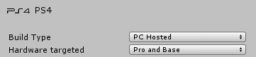
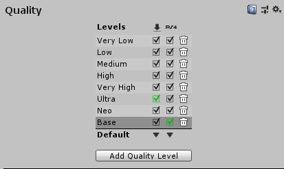

#PS4 Pro
PS4 Pro is an upgraded version of the PS4 with improved hardware.
##Adding support for PS4 Pro to your Unity Project
All PS4 applications need to support both the standard PlayStation 4 hardware and the newer PS4 Pro hardware, with a single application package. This is a [technical requirement by Sony](https://ps4.siedev.net/resources/documents/TRC/latest/TRC/R4205.html) for publishing on the platform.

To fulfill this requirement in Unity, open the [Build Settings](PS4BuildSettings) window (menu: __File &gt; Build Settings__) and set the __Hardware Targeted__ to __Pro And Base__ .


 

__Pro And Base__ is the default value. The other available value is __Base Only__, but you should only use this value for testing purposes when developing for PS4 Pro. 

You can also set this property from a script, using the [UnityEditor.EditorUserBuildSettings.ps4HardwareTarget](ScritpRef:EditorUserBuildSettings-ps4HardwareTarget.html) property. This is useful when you build your Unity Project from an Editor script.

<a name="OperationModes"></a>
##PS4 application operation modes
There are two operation modes: 
**Base** mode: Corresponds to the original PS4 hardware
 **NEO** mode : Corresponds to the Pro hardware (although, in [some cases](https://ps4.siedev.net/resources/documents/SDK/6.000/Programming-Startup_Guide/0004.html), like when the PS4 Pro runs a game that does not support Pro mode, the PS4 Pro uses Base mode). The original PS4 hardware only supports Base mode, but the PS4 Pro hardware supports both NEO mode and Base mode. For more details, refer to the [PS4 Hardware Overview](https://ps4.siedev.net/resources/documents/SDK/latest/Hardware-Overview/0001.html) documentation.

To check if your application is running in NEO mode, create, and then run, a development build of your Unity Project. In Build Settings (menu: __File &gt; Build Settings__), set your prefered build options and then check the __Development Build__ option. If you __Build And Run__ now, and your application is running in NEO mode, you should see a watermark with the word “NEO” in the bottom right corner of the screen.

 

Test your application in both Base and NEO modes to make sure that it performs correctly on both hardware settings. You can test NEO mode directly on a PS4 Pro DevKit, and you can emulate Base mode. To emulate Base mode, set the __Debug Settings &gt; Boot Parameters &gt; Standard PS4 Emulation__ option to __On__ in the PS4 System Software.
##Enhancing your Unity application for PS4 Pro
Unity provides a number of ways in which you can enhance your application to take advantage of the [upgraded PS4 Pro hardware](https://www.playstation.com/en-gb/explore/ps4/tech-specs/). The best configuration will vary depending on the application, so it is up to you to determine which improvements to include in your application.
Increasing screen resolution on PS4 Pro
The properties to control the screen resolution are located In Player Settings (menu: __Edit &gt; Settings &gt; Player__). There are separate resolution properties for Base mode and Pro mode (NEO). __Base Mode Resolution__ and __Pro Mode Resolution__ respectively. Unity automatically chooses the correct resolution according to which operation mode the PS4 is running on.


These drop-down menus only show the valid resolutions accepted by Sony. Base can be set up to 1920x1080 and Pro (NEO) can be set up to 3840x2160 (4K). 

Increasing the resolution can be very intensive on the GPU and may adversely affect the frame rate. The [technical requirement R4199](https://ps4.siedev.net/resources/documents/TRC/latest/TRC/R4199.html) is relevant here: “When NEO mode is enabled, the frame rate must be equal to or greater than Base mode performance.”. Test your Unity application to make sure that it adheres to this requirement on the correct hardware.

If you set a high resolution for NEO mode, 4K for example, and the user’s monitor does not support this resolution, the PS4 system will automatically downsample the image to make it work on the monitor. However, Unity will still use 4K buffers internally. 

Alternatively, you can enable the __1080p fallback__ option in Unity Player Settings. This way, if the high resolution is not supported, Unity uses 1920x1080 buffers internally and there is no need to downsample the image.

###Configuring PS4 Pro Quality Settings 
You can define discrete levels of graphics quality for your application in the [Quality Settings](class-QualitySettings) (Menu: __Edit &gt; Settings &gt; Quality__) for both PS4 hardware models. There are two unique quality levels that you must use for your Base and NEO custom levels, called __Base__ and __Neo__ respectively. Unity automatically activates these levels on application startup, depending to the [operation mode](#OperationModes) you use to run the application.

To create these levels, click __Add Quality Level__ and set appropriate values for a variety of graphics properties on a per quality level basis. These properties include: refresh rate, anti-aliasing, shadow parameters, and [many more](class-QualitySettings).



###Using specific Shaders on PS4 Pro
You can mark Shaders to only run in __NEO__ mode. If a user is using the original hardware, your NEO Shader can also reference a fall back Shader to use in __Base__ mode. For Unity to automatically choose the appropriate Shader, you must write your Pro Shader like this:

```
Shader "MyShaderForPro"
{
    SubShader
    {
        Pass
        {
            CGPROGRAM
	
            #pragma argument(target=neo)   // Only compatible with PS4 Pro (NEO mode)
	
            …

            ENDCG
        }
    }
    Fallback "MyShaderForBase"
}
```

If you run a development build of a Unity Project that uses this kind of Shader in Base mode, Unity will print a message in the application log with the name of the rejected PS4 Pro Shader.

For details on what features you can use in PS4 Pro Shaders, see the [PS4 Wave Shader Compiler User Guide](https://ps4.siedev.net/resources/documents/SDK/6.000/Wave_Shader_Compiler-Users_Guide/0005.html).

###Configuring the extra memory available on PS4 Pro
PS4 Pro hardware has an extra 512MB of RAM available for applications compared to regular PS4 hardware. To distribute the extra memory between Onion (CPU) and Garlic (GPU) memory, use the __Pro Mode Garlic Heap Size__ slider, in the PS4 Player Settings. This allocates extra memory to the Garlic Heap, the Onion Heap takes the memory that isn’t allocated to Garlic. For more information, see the [PlayStation 4 Memory](PS4Memory) documentation.


###Writing mode-dependant scripts
You can use the __UnityEngine.PS4.Utility.neoMode__ property in your custom scripts to determine whether the application is running in NEO mode (returns `true`) or Base mode (returns `false`). This enables you to create NEO-dependent code. For example, use UnityEngine.PS4.VR.PlayStationVR.SetOutputModeHMD to set a higher refresh rate for VR mode.

```
if(UnityEngine.PS4.Utility.neoMode)
{
	// If the application is running in NEO mode, the following code will execute.
    UnityEngine.PS4.VR.PlayStationVR.SetOutputModeHMD(true, true, 90);
}
else
{
	// If the application is not running in NEO mode, this code will execute instead.
	UnityEngine.PS4.VR.PlayStationVR.SetOutputModeHMD(true, true, 60);
}
```
---

* <span class="page-edit">2018-10-29  <!-- include IncludeTextNewPageYesEdit --></span>
