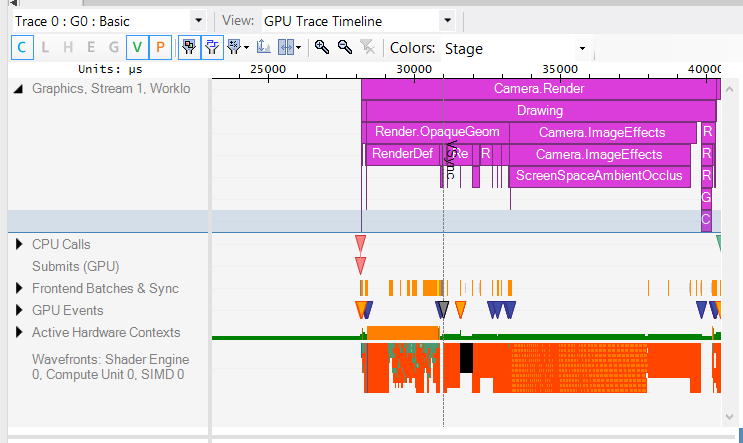

#Razor: GPU Profiling

__Razor for PS4__ is a profiling and debugging tool that is part of the PS4 SDK. It exists in two forms: __Razor CPU__ for overview and CPU-related profiling, and __Razor GPU__ for detailed GPU profiling. These tools are invaluable for investigating performance issues. This document covers __Razor GPU__. See the [Razor User’s Guide](https://ps4.siedev.net/resources/documents/SDK/latest/Razor_GPU-Users_Guide/__document_toc.html) for a much more complete description of the product.

## When to use Razor GPU

### Performance/Optimisation

When a title is limited by CPU performance, it is what is known as "CPU bound". In these scenarios, developers looking for higher frame rates should focus on optimizing CPU operations such as script code, physics, draw call batching, and so on.

When a title is limited by GPU performance, it is what is known as "GPU bound". In these cases, developers should focus on optimizations on the GPU side such as shader code, screen resolution, and so on.

Razor GPU is an essential tool for profiling and directing optimizations for GPU bound titles.

The first step in performance investigation is to determine if your application is CPU or GPU bound using another tool from the PS4 SDK: Razor CPU. If you detect that GPU performance is an issue, you can then move to Razor GPU.

Please refer to our Basic Profiling with Razor CPU guide for an introduction to Razor CPU.

### Debugging Rendering Issues

In addition to profiling, Razor GPU is also a debugging tool. Use it whenever you are obtaining unexpected rendering results, for example, when creating your own shaders or trying new post process image effects. At times, you may want to use Razor GPU just to make sure everything is in order under the hood.

## Capture Types

Razor GPU works by taking data from a running application on a connected Devkit. There are two methods for getting this data: Captures and Traces. Both are accessible from the "Capture" menu and offer different sets of information.

### GPU Captures

This method captures information from a single frame of your game and allows to examine the operations performed during the frame. You can see it as an extended version of Unity’s integrated [Frame Debugger](FrameDebugger).

There is a huge amount of information in a capture. Razor GPU separates and shows it in a series of panels. Some examples of these panels are:

#### Workload Navigator view

You can inspect Unity’s GPU user markers and render batches here. Also, optionally, you can visualize GPU durations corresponding to each marker.

#### The Various Views For Examining Resources

You can examine the graphic resources utilized during the rendering of the captured frame. Inspect all intermediate render targets, shaders, textures, and so on.

#### Replays

From any GPU capture you can connect a Replay, which allows you step through the frame, much like [Unity’s Frame Debugger](FrameDebugger). To start a Replay use the ‘Connect Replay’ option from the Capture menu. Refer to the [Replaying GPU Captures document](https://ps4.siedev.net/resources/documents/SDK/latest/Razor_GPU-Users_Guide/0009.html) for more information.

### GPU Traces

In addition to GPU Captures, Razor GPU offers GPU Traces, a more in-depth method of collecting data. Use it to get low level hardware information not available in GPU Captures. 

Start by selecting the information you want to gather, choosing one of the presented presets, called Trace Groups. Unlike the GPU Capture, you can choose to capture from several frames and are not limited to just one. 

Traces also include the Worldload Navigator you find in GPU Capture, but with added extra profiling data.

#### Trace Overview

Shows a convenient way to easily identify the GPU operations that are taking more time and require your attention. For example, in the image above you would want to tweak the Screen Space Ambient Occlusion image effect (bigger rectangle in the graph) so it takes less GPU time.

Note that the GPU timing of some Unity makers like Camera.Render or RenderDeferred.GBuffer is not 100% accurate as the marker only covers the frontend of the GPU and [wavefronts](https://en.wikipedia.org/wiki/Graphics_Core_Next#CU_Scheduler) can run past the end of the marker. How accurate they are depends on what Unity does around them. Sometimes they are very accurate as Unity forces a wait, other times they are not accurate at all as most of the work flows out of them. You can use the Trace Timeline, shown in the next section, to tell where each Wavefront comes from.

#### Trace Timeline view

Here you can visualize the GPU user markers in a timeline format (the purple rectangles in the above image). 

You can also see a representation of all the [Wavefronts](https://en.wikipedia.org/wiki/Graphics_Core_Next#CU_Scheduler) (the small colored rectangles forming blocks near the bottom of the image) going through the GPU and get information for each individual one using mouse over. The tool shows the Wavefronts for all the available kinds of shaders. Use this view to validate that the wavefronts are executing at the expected times and have the expected distribution, to find shaders expending more time than expected, and so on.

## Unity Shader Cache

Razor GPU needs to be supplied with extra shader debug information to show shader’s source code and enable the [GPU Debugger](https://ps4.siedev.net/resources/documents/SDK/latest/GPU_Debugger-Users_Guide/__document_toc.html). Here is an example of a Unity shader with its source code available in the tool:

The required debug information is contained in *.sdb files. During shader compilation, Unity can generate and store the corresponding *.sdb files in a folder specified by you. You just need to add the path of your desired folder as an Environment Variable in Windows using the UNITYSHADERCACHE variable name, as shown in the following image:

Setting the new environment variable requires a restart of the Unity Editor. Also you are required to recompile the shaders in your project. If shaders are already compiled and cached, you need to delete the project’s shader cache at *(your project folder)\Library\ShaderCache* to force a full recompilation. Finally, the next time you open a capture in Razor GPU it will ask for this folder, you just need to point to it.

---

 2018-05-18  <!-- include IncludeTextAmendPageSomeEdit -->