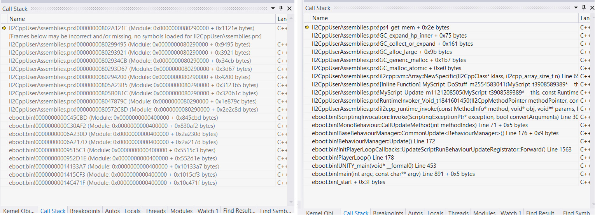
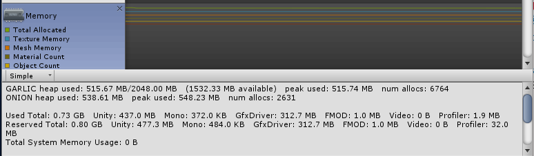
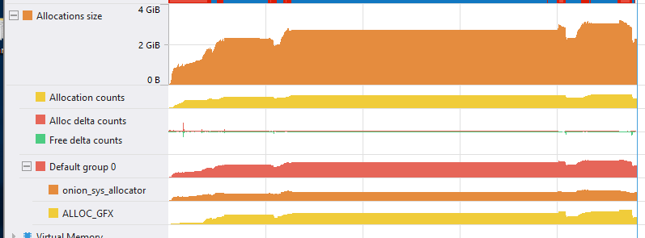

# PS4 Troubleshooting

This page provides advice on:

* [Resolving Unity Profiler and debugger connection issues](#profiler)
* [Reading log files](#log)
* [Examining core dumps](#dumps)
* [Handling out-of-memory crashes](#memory)
* [Reporting a crash issue to Unity](#reporting)

<a name="profiler"></a>
## Resolving Unity Profiler and debugger connection issues

If you’re having problems connecting to a PlayStation 4 device from the Unity Profiler, or from an Integrated Development Environment (IDE) when script debugging, make sure your network is set up correctly. Use the advice below to check and resolve issues. 

**Note**: For more details on the device settings and terminology used below, see [Sony PS4 documentation on the development hardware](https://ps4.siedev.net/resources/documents/SDK/latest/DevKit-Setup_Guide/__document_toc.html).

### Ensure a wired connection

Although the services you need (such as the internet, PSN, Unity Profiler and Unity script debugging) are available over WiFi, the volume of information might be too much for your wireless connection. Make sure the PlayStation 4 development machine (either Development Kit or Testing Kit) is connected to the internet via a wired connection:

* Ensure an ethernet cable is connected to the LAN port.
* Verify the connection in your PS4 system settings. To do this, go to __Settings__ > __Network__ > __View Connection Status__. 

### Use the same subnetwork

Make sure the host PC and PS4 are on the same subnet. If you’re not familiar with subnets, see [Wikipedia: Subnetworks](https://en.wikipedia.org/wiki/Subnetwork) to get started.

For Development Kits, make sure the DEV LAN port is also connected to the internet, and on the subnet as the host PC. The Unity Profiler and your IDE for script debugging do not use this connection, but they might not work properly without it.

### Check firewall settings

The Unity Profiler runs in the Unity Editor, so check any firewall software on your computer to make sure it is not blocking internet access to the Editor. You also need to check your firewall software to make sure it is not blocking your IDE for script debugging. 

For example, in a typical set-up on Windows 10 using Visual Studio 2015, you might need to navigate to your computer’s __Control Panel__, go to __System and Security__ &gt; __Windows Defender Firewall__ &gt; __Allowed applications__, and add _[Program Files (x86)]\Microsoft Visual Studio 14.0\Common7\IDE\devenv.exe_ to the list of allowed applications.

Firewall configuration is not always straightforward. As a first step in troubleshooting, you might want to completely disable your firewall, and then, in case that solves the issue, re-enable it and proceed with a proper configuration.

### Check Unity application build settings

Make sure you have a Unity application running on the PS4 device. This must be a development build, meaning that in [Build Settings](PS4BuildSettings) you must tick the __Development Build__ checkbox before building the application.

### Check debug settings

Check that __Network Emulation__ is not set in the PlayStation 4 system settings. To do this, go to __Debug Settings__ > __Network__ and make sure __Network Emulation__ is disabled (the box is not checked). If __Network Emulation__ is enabled, disable it.

### Try connecting manually

If the PlayStation 4 you are trying to connect to is not in the list when trying to connect the Unity Profiler (__Profiler Window__ &gt; __Connected Player__), use __Enter IP__ to manually enter the PlayStation 4’s IP address.

If the PlayStation 4 device you are trying to connect to is not in the list when trying to connect Visual Studio for debugging (__Debug__ &gt; __Attach Unity Debugger__), use Input IP to manually enter the PlayStation 4’s IP address.

**Note**: When manually entering the IP address, you need to use the regular network connection IP address as shown in your PS4 system settings (__Settings__ &gt; __Network__ > __View Connection Status__), rather than the DEV LAN. Try connecting without specifying a port, or add port 4601 if this does not work.

### Verify a connection

Verify that the host PC can reach the IP address. For example, use [ping](https://technet.microsoft.com/en-us/library/bb490968.aspx) in the command line to check the connection. 

### Allow multicast packets

Check your router or access point settings to ensure that your connection allows multicast packets between networked devices (no WiFi peer isolation enabled). If you don’t know how to do this, check the documentation for your router or access point.

### Check console output

Run your build on the PS4 and check the [Console Output](https://ps4.scedev.net/resources/documents/SDK/latest/Console_Output-Users_Guide/0002.html) for any output regarding the player connection.

### Analyze your network protocol

If you still can’t make a connection, try installing and running [Wireshark](https://www.wireshark.org/), a third-party network protocol analyzer. To configure Wireshark to display the announcement packets being sent from the PS4, run it on your PC with a filter of `ip.addr eq 225.0.0.222`. See [Wireshark’s documentation](https://www.wireshark.org/docs/) for more information on how to do this.


<a name="log"></a>
## Reading log files

If your PS4 application is crashing, the first thing you need to do is to check your application log. You can read the log while your application is running using the Console Output application from the PS4 SDK. 

Running out of memory is one of the most common causes of crashes. To diagnose it, you can search the log for messages about failed memory allocations. Here’s an example of how it could look in your log:

```
fps 52.152 (19.175 ms), objects: 263, coroutines: 0
sceKernelAllocateDirectMemory failed with 0x80020023
sceKernelAllocateDirectMemory failed with 0x80020023
DynamicHeapAllocator allocation probe 1 failed - Could not get memory for large allocation 4016779264.
sceKernelAllocateDirectMemory failed with 0x80020023
sceKernelAllocateDirectMemory failed with 0x80020023
DynamicHeapAllocator allocation probe 2 failed - Could not get memory for large allocation 4016779264.
sceKernelAllocateDirectMemory failed with 0x80020023
sceKernelAllocateDirectMemory failed with 0x80020023
DynamicHeapAllocator allocation probe 3 failed - Could not get memory for large allocation 4016779264.
sceKernelAllocateDirectMemory failed with 0x80020023
sceKernelAllocateDirectMemory failed with 0x80020023
DynamicHeapAllocator allocation probe 4 failed - Could not get memory for large allocation 4016779264.
sceKernelAllocateDirectMemory failed with 0x80020023
sceKernelAllocateDirectMemory failed with 0x80020023
DynamicHeapAllocator out of memory - Could not get memory for large allocation 4016779264!
Could not allocate memory: System out of memory!
Trying to allocate: 4016779264B with 4096 alignment. MemoryLabel: Mono
Allocation happend at: Line:407 in C:/buildslave/unity/build/PlatformDependent/PS4/Source/Allocator/PS4Memory.cpp
Memory overview

[ ALLOC_DEFAULT ] used: 8100027132B | peak: 0B | reserved: 8108553212B 
[ ALLOC_TEMP_JOB ] used: 0B | peak: 0B | reserved: 2097152B 
[ ALLOC_PROFILER ] used: 628000B | peak: 628000B | reserved: 33554432B 
[ ALLOC_GFX ] used: 0B | peak: 149626568B | reserved: 0B 
[ ALLOC_TEMP_THREAD ] used: 32768B | peak: 0B | reserved: 3670016B 
Could not allocate memory: System out of memory!
Trying to allocate: 4016779264B with 4096 alignment. MemoryLabel: Mono
Allocation happend at: Line:407 in C:/buildslave/unity/build/PlatformDependent/PS4/Source/Allocator/PS4Memory.cpp
```

For more information on PS4 memory allocation, refer to [PlayStation 4 memory](PS4Memory).

<a name="dumps"></a>
## Examing core dumps

If the log doesn’t give you enough clues, you can examine the PS4 core dump. Core dumps are a feature of the PS4 system that are available in DevKits and TestKits, even in Release Mode. They are used during development, but can also be retrieved from Sony’s servers after a title has been released. Make sure to read the [Core Dump Documentation](https://ps4.siedev.net/resources/documents/SDK/4.500/Core_Dump_System-Overview/0003.html#__document_toc_00000002) for all the details.

### Generating core dumps
First, you need to set up your DevKit to generate a core dump in case of a crash. To do this, select Debug Settings > Core Dump > Core Dump Mode and set it to coredump. After setting this option, the system will automatically generate a core dump the next time your application crashes.

### Accessing core dump files
The generated files are stored in the DevKit HDD, in a folder for each generated dump. The folder will have the following naming convention:

```
/data/sce_coredumps/<title ID>_<timestamp>
```

If you connect to the DevKit using the Neighborhood for PlayStation 4 application, you should be able to see the files in a file explorer, in a folder similar to:

```
O:\192.168.1.192\data\sce_coredumps\CUSA05885_1486154714
```

### Loading the core dump
Within the core dump generated files, you should find one with the extension .orbisdmp. You can use Visual Studio to load this file and examine its contents. You will need to install the respective Visual Studio Integration provided by SIE, via the SDK Manager. 

If you are unable to load the dump file in Visual Studio, try the following:

* If you have multiple versions of Visual Studio installed, make sure the Integration tools are installed in the one you are using to open the dump file. 
* Run your SDK Manager and check that __SDK Development Tools__ > __Tools for Development__ > __Debugger X.XX and Visual Studio 20XX Integration__ are installed. 
* You can also check __Help__ > __About__ in Visual Studio to see which products are installed.

After loading the file, use the __Start debugging__ option in the __Actions__ section of the loaded page to see the crashed Call Stack, Thread information, Kernel Objects, Output Window (log) and more.

### Adding debug symbols to the Call Stack

The Call Stack window in Visual Studio doesn’t have [debug symbols](https://en.wikipedia.org/wiki/Debug_symbol) loaded by default. You’ll see memory addresses instead of function names, which makes it hard to find clues. To add symbols to your Call Stack and be able to see function names, you can use the __Set Symbol Path__ option in Visual Studio, located in the __Actions__ section of the loaded dump page.

The following image shows an example of a Call Stack without symbols (left) and the same Call Stack after loading symbols (right). 



The Call Stack also shows the names of the PS4 modules containing the called code. The following modules produced by Unity contain debug symbols in the .bin/.prx file itself. You need to add the folder containing the files to the symbol path list in Visual Studio:

|:---|:---|:---|
|Module Name| Used with scripting backend|Project specific|
|eboot.bin|Both|No|
|mono-ps4.prx|Mono2x|No|
|MonoAssembliesPS4.prx|Mono2x|Yes|
|PS4Util.prx|IL2CPP|No|
|Il2CppUserAssemblies.prx|IL2CPP|Yes|


Project-specific modules contain your script code. They change every time you build your project. For that reason, you need to get the exact version of the file that was included in the build that crashed, to be able to add symbols.

Non-project specific modules are included in your Unity installation and don’t change between builds or between projects, they only change between Unity versions.

#### Symbol folders for a PC-hosted build
* The __eboot.bin__ module is placed in the selected build folder. 
* Other modules are placed in (build folder)\Media\Modules.

#### Symbol folders for a package/ISO build
* The __eboot.bin__ module is placed in the (project folder)\Temp\StagingArea folder. 
* Other modules are placed in (project folder)\Temp\StagingArea\Data\Modules.

Be aware that the complete (project folder)\Temp\ folder is always deleted as soon as you close the Unity Editor.

#### Alternative symbol folders for non-project specific modules
Alternatively, find non-project specific modules (eboot.bin, PS4Util.prx, mono-ps4.prx) in your Unity installation folder. This is handy when you’ve lost the files used in your crashed build (but note that your project-specific symbols will be still missing). You need to use the files from the correct version of Unity for this to work. 

The location of the modules depends on the PS4 SDK version that you are using:

* For PS4 SDK 5.0: 
```
(Unity Install Folder)\Editor\Data\PlaybackEngines\PS4Player\5_008
```
* For PS4 SDK 5.5: 
```
(Unity Install Folder)\Editor\Data\PlaybackEngines\PS4Player\5_50
```

Note that there is no __eboot.bin__ file in those folders. Instead, there are several .self files. Depending on your Project configuration, Unity chooses one of these .self files, copies it and renames it to __eboot.bin__ during build time. This renaming does not affect symbol loading, so you can load symbols for __eboot.bin__ directly from the .self files.

### Generating a core dump without a crash
Sometimes it is useful to generate a core dump even if the application has not crashed. A common case would be when the application hangs. 

You can generate a core dump while an application is running by using the “★Generate Core file” option in the [Development Support Features by Application](https://ps4.siedev.net/resources/documents/SDK/4.500/System_Software-Overview/0005.html) menu. 

Alternatively, you can use the orbis-ctrl pdump command line tool in an elevated command prompt window with the following line:

```
orbis-ctrl pdump processname pathwherethefilewillbesaved mini
```

You can get the process name via Neighborhood for PlayStation 4 in the process list displayed by selecting your DevKit and then right clicking and selecting __Kill process__. In test environments, the process name is usually project-specific symbols.

<a name="profiler"></a>
## Handling out-of-memory crashes

Running out of memory is a very common cause of crashes on PlayStation 4. Normally, when a crash occurs, you can see a message related to memory allocations in the [Console Output](https://ps4.siedev.net/resources/documents/SDK/latest/Console_Output-Users_Guide/__toc.html). For example you can find these types of log messages:

```
DynamicHeapAllocator out of memory - Could not get memory for large allocation 201677926!
Could not allocate memory: System out of memory!
Trying to allocate: 201677926B with 4096 alignment. MemoryLabel: Mono
```

### Onion and Garlic

PlayStation 4 uses two memory access paths called Onion and Garlic, each with a configurable size at build time. For more details, see the [PlayStation 4 memory](PS4Memory) documentation. 

When you get an out-of-memory crash, it means you have run out of either Onion or Garlic memory. Therefore you must first discover which of the two memory access paths ran out. You can usually figure this out from the `MemoryLabel` printed in the log for the failed memory allocation. 

Graphics resource labels like `GPUMemory` and `Texture` signal Garlic memory problems. Other labels unrelated to graphics resources, like `Mono`, `File` and `Profiler`, signal Onion memory problems.

Otherwise, if the label is not clear enough, or if you want more details about your Onion and Garlic usage:

1. Get the size of your Garlic memory from the respective slider in the Unity Editor’s [Player](class-PlayerSettings) window (menu: __Edit__ &gt; __Project Settings__, then select the __Player__ category). The size depends on the mode (Base or Pro) your application is running on.

    

2. Looking at the same sliders, calculate the size of your Onion memory. See the [PlayStation 4 memory](PS4Memory) documentation for an outline.

3. Check the [Unity Memory Profiler](ProfilerMemory) (menu: __Window__ &gt; __Analysis__ &gt; __Profiler__) to see which of the two memories is closer to running out. When you switch target to PlayStation 4 in the Editor, Unity adds two additional rows to the __Simple__ memory report, called GARLIC and ONION, which show the current load in each.

    

Alternatively, you can use Sony’s [Memory Analyzer for PS4](https://ps4.siedev.net/resources/documents/SDK/5.500/Memory_Analyzer-Users_Guide/__document_toc.html). In the timeline view, you can see the use of Garlic (ALLOC_GFX) and Onion (onion_sys_allocator) over time. 

   

If you suspect that Garlic memory is the cause of the crash, you can confirm it easily by following these steps:

1. Open the [Quality](class-QualitySettings) window (menu: __Edit__ &gt; __Project Settings__, then select the __Quality__ category).

2. From the __Texture Quality__ drop-down menu, select __Eighth Res__. This is only temporary to see if it stops the crash.

### Fixing out-of-memory problems

When you know whether the problem comes from Onion or Garlic, you can usually adjust the slider in the Player Settings to give more space to one or the other. If that is not an option (for example, if both Onion and Garlic are almost full), you’ll need to optimize the memory usage of your application. Below are some tips on how to do this. 

To reduce Garlic memory usage:

* Textures are usually more memory intensive than other graphics resources allocated in Garlic. You can use the [memory visualization tool](BestPracticeUnderstandingPerformanceInUnity2) to get an idea of which textures are consuming more memory and reduce their sizes if possible. You can also identify other resource types that might be consuming more memory than expected.

* Keep an eye on your [shader variants](SL-MultipleProgramVariants) (go to menu: __Edit__ &gt; __Project Settings__, then select the __Graphics__ category, and navigate to the __Shader Stripping__ section). You can end up with thousands of variants for your shaders without noticing it. 

To reduce Onion memory usage:

* Unload your AssetBundles ([AssetBundle.Unload(false)](ScriptRef:AssetBundle.Unload.html)) as soon as you can. This also applies to any large file loaded from disk.

* [Subdivide your scenes into smaller ones](MultiSceneEditing) and load/unload them on demand.

* Remember to call [Resources.UnloadUnusedAssets](ScriptRef:Resources.UnloadUnusedAssets.html) frequently.

* Try not to keep very large data structures in memory. If you need them, try to use smaller data types (for example, bytes instead of integers).


<a name="reporting"></a>
## Reporting a crash issue to Unity
If you can’t get enough clues to fix the problem by yourself, you can send your core dump files to us. You can [file a new bug report](https://unity3d.com/unity/qa/bug-reporting), or ask for help on the [Unity forum for PS4 in Devnet](https://ps4.siedev.net/forums/forum/29/). Please attach the complete core dump folder and tell us what version of Unity you are using.

Additionally, if the Call Stack touches your script code module (MonoAssembliesPS4.prx or Il2CppUserAssemblies.prx), please make sure to also attach that file too.

To make sure we get as much information as possible from the core dump, you can set your DevKit to generate a __Full Dump__ instead of the default __Mini Dump__. You can set it in __Debug Settings__ > __Core Dump__ > __Dump Level__.

If you prefer to post just a Call Stack (not an entire core dump) on our support channels, please make sure you add debug symbols to it first. Attaching your entire log file is also a good idea.

---
* <span class="page-edit">2018-05-31  <!-- include IncludeTextAmendPageSomeEdit --></span>

* <span class="page-history">New feature in Unity 2017.1</span>

* <span class="page-history">Advice on resolving Unity Profiler and debugger connection issues updated in Unity 2017.3</span>

* <span class="page-history">Advice on resolving out-of-memory crashes updated in Unity 2017.4</span>
