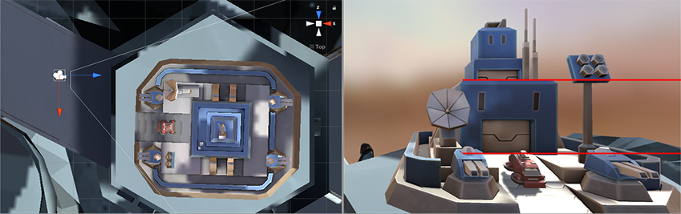

# Using Physical Cameras

The [camera component’s](class-Camera) Physical Camera properties simulate real-world camera formats on a Unity camera. This is useful for importing camera information from 3D modeling applications that also mimic real-world cameras.

 

Unity provides the same settings as those in most 3D modeling application’s physical camera settings. The two main properties that control what the camera sees are **Focal Length** and **Sensor Size**.

- **Focal Length:** The distance between the sensor and the camera lens. This determines the vertical field of view. When a Unity camera is in Physical Camera mode, changing the Focal Length also changes the field of view accordingly. Smaller focal lengths result in a larger field of view, and vice versa.

     

- **Sensor Size:** The width and height of the sensor that captures the image. These determine the physical camera’s aspect ratio. You can choose from several preset sensor sizes that correspond to real-world camera formats, or set a custom size. When the sensor aspect ratio is different to the rendered aspect ratio, as set in the Game view, you can control how Unity fits the camera image to the rendered image (see information on [Gate Fit](#GateFit), below).

## Lens Shifts

**Lens Shift** offsets the camera’s lens from its sensor horizontally and vertically. This allows you to change the focal center, and reposition a subject in the rendered frame, with little or no distortion. 

This technique is common in architectural photography. For example, if you want to capture a tall building, you could rotate the camera. But that distorts the image, making parallel lines appear to converge.

If you shift the lens up instead of rotating the camera, you can change the composition of the image to include the top of the building, but parallel lines stay straight.

Similarly, you can use a horizontal lens shift to capture wide objects without the distortion you might get by rotating the camera.

### Lens shifts and frustum obliqueness

One side effect of a lens shift is that it makes the camera’s [view frustum](UnderstandingFrustum) oblique. That means the angle between the camera’s center line and its frustum is smaller on one side than on the other. 

You can use this to create visual effects based on perspective. For example, in a racing game, you might want to keep the perspective low to the ground. A lens shift is a way of achieving an oblique frustum without scripting.

For further information, see documentation on [Using an Oblique Frustum](ObliqueFrustum).

## Gate Fit

The Camera component’s **Gate Fit** property determines what happens when the Game view and the physical camera sensor have different aspect ratios. 

In **Physical Camera** mode, a camera has two “gates.”

- The area rendered in the Game view, according to the resolution you set in the **Aspect** drop-down menu, is called the “resolution gate”.

- The area that the camera actually sees, as defined by the **Sensor Size** properties, is called the “film gate”.

When the two gates have different aspect ratios, Unity “fits” the resolution gate to the film gate. There are several fit modes, but they all yield one of three results. 

- **Cropping:** When the film gate exceeds the resolution gate after fitting, the Game view renders as much of the camera image as fits within its aspect ratio, and cuts off the rest. 
- **Overscanning:** When the film gate exceeds the resolution gate after fitting, the Game view still performs rendering calculations for parts of the Scene that fall outside the camera's field of view.
- **Stretching:** The Game view renders the full camera image, stretched either horizontally or vertically to fit its aspect ratio.

To view the gates in the Scene view, and see how they fit together, select the camera and look at its view frustum. The resolution gate is the camera’s far clipping plane. The film gate is the second rectangle at the base of the frustum.

### Gate Fit Modes

The **Gate Fit** mode you choose determines how Unity resizes the resolution gate (and consequently, the camera’s view frustum). The film gate always stays the same size.

The following sections provide more details on each Gate Fit mode.

### Vertical

When **Gate Fit** is set to **Vertical**, Unity fits the resolution gate to the height (Y axis) of the film gate. Any change you make to the sensor width (**Sensor Size > X**) has no effect on the rendered image.

If the sensor aspect ratio is larger than the game view aspect ratio, Unity crops the rendered image at the sides:

If the sensor aspect ratio is smaller than the game view aspect ratio, Unity overscans the rendered image at the sides:

### Horizontal

When **Gate Fit** is set to **Horizontal**, Unity fits the resolution gate to the width (X axis) of the film gate. Any change you make to the sensor height (Sensor Size > Y) has no effect on the rendered image.

If the sensor aspect ratio is larger than the Game view aspect ratio, Unity overscans the rendered image on the top and bottom:

If the sensor aspect ratio is smaller than the game view aspect ratio, the rendered image is cropped on the top and bottom.

### None

When Gate Fit is set to None, Unity fits the resolution gate to the width and height (X and Y axes) of the film gate. Unity stretches the rendered image to fit the Game view aspect ratio.

### Fill and Overscan
    
When **Gate Fit** is set to **Fill** or **Overscan**, Unity automatically performs either a vertical or horizontal fit, depending on the resolution gate and film gate aspect ratios.

- **Fill** fits the resolution gate to the film gate’s smaller axis, and crops the rest of the camera image.
- **Overscan** fits the resolution gate to the film gate’s larger axis and overscans the area outside of the camera image’s boundaries.

----

* 2018-10-05 <!-- include IncludeTextAmendPageSomeEdit -->

* Physical Camera options added in [2018.2] (https://docs.unity3d.com/2018.2/Documentation/Manual/30_search.html?q=newin20182) NewIn20182

* Gate Fit options added in Unity 2018.3

