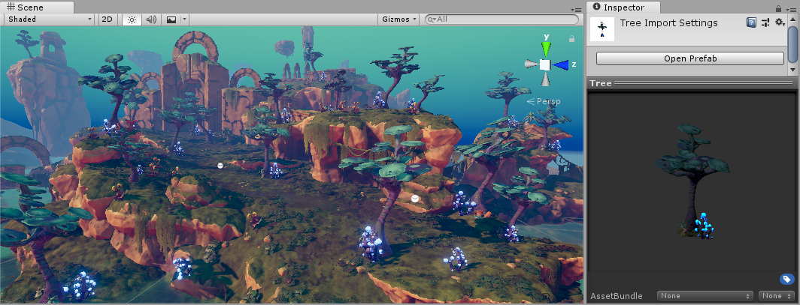

#Prefabs

Unity’s **Prefab** system allows you to create, configure, and store a GameObject complete with all its components, property values, and child GameObjects as a reusable Asset. The Prefab Asset acts as a template from which you can create new Prefab instances in the Scene. 

When you want to reuse a GameObject configured in a particular way – like a non-player character (NPC), prop or piece of scenery – in multiple places in your Scene, or across multiple Scenes in your Project, you should convert it to a Prefab. This is better than simply copying and pasting the GameObject, because the Prefab system allows you to automatically keep all the copies in sync.

Any edits that you make to a Prefab Asset are automatically reflected in the instances of that Prefab, allowing you to easily make broad changes across your whole Project without having to repeatedly make the same edit to every copy of the Asset.

You can [nest Prefabs](NestedPrefabs) inside other Prefabs to create complex hierachies of objects that are easy to edit at multiple levels.

However, this does not mean all Prefab instances have to be identical. You can [override](PrefabInstanceOverrides) settings on individual prefab instances if you want some instances of a Prefab to differ from others. You can also create [variants](PrefabVariants) of Prefabs which allow you to group a set of overrides together into a meaningful variation of a Prefab.

You should also use Prefabs when you want to [instantiate GameObjects at runtime](InstantiatingPrefabs) that did not exist in your Scene at the start - for example, to make powerups, special effects, projectiles, or NPCs appear at the right moments during gameplay.

Some common examples of Prefab use include:

* Environmental Assets - for example a certain type of tree used multiple times around a level (as seen in the screenshot above).

* Non-player characters (NPCs) - for example a certain type of robot may appear in your game multiple times, across multiple levels. They may differ (using *overrides*) in the speed they move, or the sound they make.

* Projectiles - for example a pirate’s cannon might instantiate a cannonball Prefab each time it is fired.

* The player’s main character - the player prefab might be placed at the starting point on each level (separate Scenes) of your game.

--------------------

* 2018-07-31  <!-- include IncludeTextAmendPageSomeEdit -->

* Updated to include improved prefab features - Nested Prefabs and Prefab Variants added in [2018.3] (https://docs.unity3d.com/2018.3/Documentation/Manual/30_search.html?q=newin20183) NewIn20183
