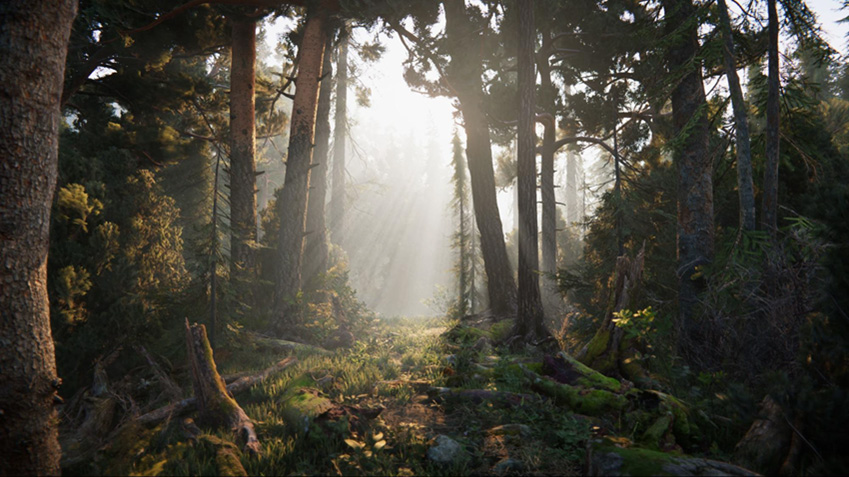

# Progressive CPU Lightmapper

Progressive Lightmapper is a fast path-tracing-based lightmapper system that provides baked lightmaps and Light Probes with progressive updates in the Editor. It requires non-overlapping UVs with small area and angle errors, and sufficient padding between the charts.

Progressive Lightmapper takes a short preparation step to process geometry and instance updates, and generates the G-buffer and chart masks. It then produces the output immediately and progressively refines it over time for a much-improved interactive lighting workflow. Additionally, baking times are much more predictable because Progressive Lightmapper provides an estimated time while it bakes.

Progressive Lightmapper also bakes global illumination (GI) at the lightmap resolution for each texel individually, without upsampling schemes or relying on any irradiance caches or other global data structures. This makes it robust and allows you to bake selected portions of lightmaps, which makes it faster for you to test and iterate on your Scene.

For an in-depth video showing the interactive workflow, see Unity’s video walkthrough: [In Development - Progressive Lightmapper (YouTube)](https://youtu.be/foMZJrwRGr0).

## Settings

To open the settings, go to __Window__ &gt; __Rendering__ &gt;__Lighting Settings__.

| __Property:__ |__Function:__ |||||
|:---|:---|
| __Lighting Mode__ | Specifies which lighting mode Unity should use for all mixed lights in the Scene. Options are [Baked Indirect](LightMode-Mixed-BakedIndirect), [Distance Shadowmask](LightMode-Mixed-DistanceShadowmask), [Shadowmask](LightMode-Mixed-Shadowmask), and [Subtractive](LightMode-Mixed-Subtractive). |||||
| __Lightmapper__ | Use this to specify which internal lighting calculation software to use to calculate lightmaps in the Scene. The options are __Progressive __and __Enlighten__. The default value is __Progressive__. If you want to use the Enlighten system, see documentation on [Enlighten](https://docs.google.com/document/d/1-Vll44vg4UX4enb98JNS3AjIP8IguWF8lhbCRQLgkJ8/edit#heading=h.dq1ep1102yb8).  |||||
| __Prioritize View__ | Enable this to make the Progressive Lightmapper apply changes to the texels that are currently visible in the Scene View, then apply changes to the out-of-view texels. |||||
| __Direct Samples__ | The number of samples (paths) shot from each texel. This setting controls the number of samples Progressive Lightmapper uses for direct lighting calculations. Increasing this value can improve the quality of lightmaps, but increases the baking time. |||||
| __Indirect Samples__ | The number of samples (paths) shot from each texel. This setting controls the number of samples Progressive Lightmapper uses for indirect lighting calculations. For some Scenes, especially outdoor Scenes, 100 samples should be enough. For indoor Scenes with emissive geometry, increase the value until you see the result you want. |||||
| __Bounces__ | Use this value to specify the number of indirect bounces to do when tracing paths. For most Scenes, two bounces is enough. For some indoor Scenes, more bounces might be necessary. |||||
| __Filtering__| Configure the post-processing of lightmaps to limit noise. You can set it to __None__, __Auto__ or __Advanced__. The Advanced option offers three additional parameters for manual configuration. In Auto mode, the default values from the Advanced mode are used. For every parameter, Gaussian or A-Trous filter can be used separately. |||||
|| __Auto__ | Uses default values for post-processing lightmaps. |||||
|| __Advanced__ | Offers three additional parameters for manual configuration. You can use the Gaussian or A-Trous filters separately for direct and indirect settings. Note that the __Gaussian__ filter values define the radius, while the __A-Trous__ filter value defines the "sigma". Sigma is a parameter that determines the threshold at which the filter acts on differences in the image. ||||
|  || __Direct Filter__ | Select a filter to use for direct light in the lightmap. |||
|  ||| __Gaussian__ | Select this to use a Gaussian filter for direct light in the lightmap. ||
|  |||| __Direct Radius__ | The radius of the Gaussian filter in texels for direct light in the lightmap. A higher radius increases the blur strength. |
|  ||| __A-Trous__ | Select this to use an A-Trous filter for direct light in the lightmap. ||
|  |||| __Direct Sigma__ | The sigma of the A-Trous filter in texels for direct light in the lightmap. A higher sigma increases the blur strength. |
|  ||| __None__ |  Select this to use no filter for direct light in the lightmap. ||
| || __Indirect Filter__ | Select a filter to use for indirect light in the lightmap. |||
|  ||| __Gaussian__ |  Select this to use a Gaussian filter for indirect light in the lightmap. ||
| |||| __Indirect Radius__ | The radius of the Gaussian filter in texels for indirect light in the lightmap. A higher radius increases the blur strength. |
|  ||| __A-Trous__ | Select this to use an A-Trous filter for indirect light in the lightmap. ||
| |||| __Indirect Sigma__ | The sigma of the A-Trous filter in texels for indirect light in the lightmap. A higher sigma increases the blur strength. |
| || __Ambient Occlusion Filter__  | Select a filter to use for Ambient Occlusion (see below) in the lightmap. Filter only available when you enable __Ambient Occlusion__.|||
| ||| __Gaussian__ | Select this to use a Gaussian filter for Ambient Occlusion in the lightmap. ||
| |||| __Ambient Occlusion Radius__ | The radius of the Gaussian filter in texels for Ambient Occlusion in the lightmap. A higher radius increases the blur strength. |||
|  ||| __A-Trous__ |  Select this to use an A-Trous filter for Ambient Occlusion in the lightmap. ||
|  |||| __Ambient Occlusion Sigma__ |  The sigma of the A-Trous filter in texels for Ambient Occlusion in the lightmap. A higher sigma increases the blur strength. |
| | __None__ |  Select this to use no filter for indirect light in the lightmap. |||||
| | __Lightmap Resolution__ | Use this to specify the number of texels per unit to use for lightmaps. Increasing this value improves lightmap quality, but also increases bake times. Note that doubling this value causes the number of texels to quadruple (because the value refers to both the height and width of the lightmap). Check the __Occupied texels__ count in the stats, documented below this table. |||||
| | __Lightmap Padding__ | Use this to specify the separation (in texel units) between separate shapes in the baked lightmap. The default value is 2. |||||
| | __Lightmap Size__ | The size (in pixels) of the full lightmap texture, which incorporates separate regions for the individual GameObject textures. The default value is 1024. |||||
| | __Compress Lightmaps__ | A compressed lightmap requires less storage space, but the compression process can introduce unwanted visual effects into the texture. Tick this checkbox to compress lightmaps, or untick it to keep them uncompressed. The checkbox is ticked by default. ||||
| | __Ambient Occlusion__ | Tick this checkbox to open a group of settings which allow you to control the relative brightness of surfaces in [ambient occlusion](LightingBakedAmbientOcclusion). Higher values indicate a greater contrast between the occluded and fully lit areas. This only applies to the indirect lighting calculated by the GI system. This setting is enabled by default. |||||
| || __Max Distance__ | Set a value to control how far the lighting system casts rays in order to determine whether or not to apply occlusion to an object. A larger value produces longer rays and contributes more shadows to the lightmap, while a smaller value produces shorter rays that contribute shadows only when objects are very close to one another. A value of 0 casts an infinitely long ray that has no maximum distance. The default value is 1. ||||
| || __Indirect Contribution__ | Use the slider to scale the brightness of indirect light as seen in the final lightmap (that is, ambient light, or light bounced and emitted from objects) from a value between 0 and 10. The default value is 1. Values less than 1 reduce the intensity, while values greater than 1 increase it. ||||
| || __Direct Contribution__ | Use the slider to scale the brightness of direct light from a value between 0 and 10. The default value is 0. The higher this value is, the greater the contrast applied to the direct lighting. ||||
| | __Directional Mode__ | You can set the lightmap up to store information about the dominant incoming light at each point on the objects’ surfaces. See documentation on [Directional Lightmapping](LightmappingDirectional) for further details. The default mode is __Directional__. ||||
| || __Directional__ | In __Directional__ mode, Unity generates a second lightmap to store the dominant direction of incoming light. This allows diffuse normal mapped materials to work with the GI. Directional mode requires about twice as much storage space for the additional lightmap data. Directional lightmaps cannot be decoded on SM2.0 hardware or when using GLES2.0. They fall back to Non-Directional lightmaps. |||
| || __Non-directional__ |__Non-directional__ mode switches Directional option off.  |||
| | __Indirect Intensity__ | Use this slider to control the brightness of indirect light stored in realtime and baked lightmaps, from a value between 0 and 5. A value above 1 increases the intensity of indirect light while a value of less that 1 reduces indirect light intensity. The default value is 1. ||||
| | __Albedo Boost__ | Use this slider to control the amount of light Unity bounces between surfaces, from a value between 1 and 10. To do this, Unity intensifies the albedo of materials in the Scene. Increasing this draws the albedo value towards white for indirect light computation. The default value of 1 is physically accurate. ||||
| | __Lightmap Parameters__ | Unity uses a set of general parameters for the lightmapping in addition to properties of the Lighting window. A few defaults are available from the menu for this property but you can also create your own lightmap parameter file using the __Create New__ option. See the [Lightmap Parameters](class-LightmapParameters) page for further details. The default value is __Default-Medium__. ||||

## Statistics

The panel below the __Auto Generate__ and __Generate Lighting__ options shows statistics about the lightmapping, including:

* The number of lightmaps that Unity has created

* __Memory Usage:__ The amount of memory required for the current lightmapping.

* __Occupied Texels__: The number of texels that are occupied in lightmap UV space.

* __Lightmaps in view__: The number of  lightmaps in the Scene view.

* __Lightmaps not in view__: The number of lightmaps that are out of view.

    * __Converged__: All calculations for these lightmaps are complete.

    * __Not Converged__: Baking is still in progress for these lightmaps.

* __Bake Performance__: The number of mrays per second. If this is low (that is, less than 2) you should adjust your settings or your hardware to process more light rays at a time. 

In __Auto__ mode, Unity automatically calculates the lightmaps and Light Probes. If you have __Auto__ disabled, you need to press the __Build__ button to start the bake.

## During baking

Progressive Lightmapper provides options to monitor and stop the bake while it is in progress, if you need to.

### ETA

The progress bar that appears while Unity is baking the lightmap provides an "estimated time of arrival" (displayed as __ETA__). This is the estimated time in seconds for the current bake to complete. This allows for much more predictable baking times, and allows you to quickly learn how much time baking takes with your current lighting settings. 

### Force Stop

During manual baking, press __Force Stop__ at any time to halt the baking process. This allows you to stop the process as soon as you see results that look good.

---

Progressive Lightmapper added in [2018.1](https://docs.unity3d.com/2018.1/Documentation/Manual/30_search.html?q=newin20181) NewIn20181

 2018-11-27  <!-- include IncludeTextAmendPageSomeEdit -->
