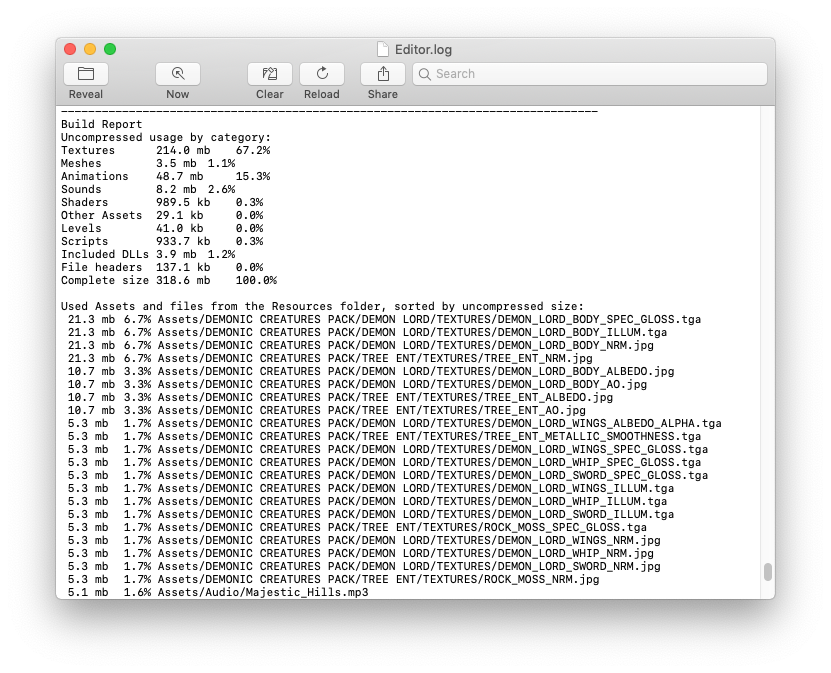

#Reducing the file size of your build

Keeping the file size of the built app to a minimum is important, especially for mobile devices or for app stores that impose a size limit. The first step in reducing the size is to determine which Assets contribute most to it, because these Assets are the most likely candidates for optimization. This information is available in the Editor Log just after you have performed the build. Go to the Console window (menu: __Window__ &gt; __General__ &gt; __Console__), click the small drop-down panel in the top right, and select __Open Editor Log__.

 

The Editor Log provides a summary of Assets broken down by type, and then lists all the individual Assets in order of size contribution. Typically, things like Textures, Sounds and Animations take up the most storage, while Scripts, Levels and Shaders usually have the smallest impact. The __File headers__ mentioned in the list are not Assets - they are actually the extra data that is added to "raw" Asset files to store references and settings. The headers normally make very little difference to Asset size, but the value might be large if you have numerous large Assets in the Resources folder.

The Editor Log helps you identify Assets that you might want to remove or optimize, but you should consider the following before you start:

* Unity re-codes imported Assets into its own internal formats, so the choice of source Asset type is not relevant. For example, if you have a multi-layer Photoshop Texture in the Project, it is flattened and compressed before building. Exporting the Texture as a .png file does not make any difference to build size, so you should stick to the format that is most convenient for you during development.

* Unity strips most unused Assets during the build, so you don’t gain anything by manually removing Assets from the Project. The only Assets that are not removed are scripts (which are generally very small anyway) and Assets in the Resources folder (because Unity can’t determine which of these are needed and which are not). With this in mind, you should make sure that the only Assets in the Resources folder are the ones you need for the game. You might be able to replace Assets in the Resources folder with [AssetBundles](AssetBundlesIntro) - this means that Unity loads Assets dynamically, thereby reducing the player size.

##Suggestions for reducing build size

###Textures

Textures usually take up the most space in the build. The first solution to this is to use compressed Texture formats. See documentation on [platform-specific Texture compression](class-TextureImporterOverride) for more information.

If that doesn’t reduce the file size enough, try to reduce the physical size (in pixels) of the Texture images. To do this without modifying the actual source content, select the Texture in the Project view, and in the Inspector window reduce the __Max Size__. To see how this looks in-game, zoom in on a GameObject that uses the Texture, then adjust the __Max Size__ until it starts looking worse in the Scene view. Changing the maximum Texture size does not affect your Texture Asset, just its resolution in the game.

By default, Unity compresses all Textures when importing. For faster workflow in the Editor, go to __Unity__ &lt; __Preferences__ and untick the checkbox for __Compress Assets on Import__. All Textures are compressed in the build, regardless of this setting.

###Meshes and Animations

You can compress [Meshes](class-Mesh) and imported Animation Clips so that they take up less space in your game file. To enable Mesh compression, select the Mesh, then in the Inspector window set the __Mesh Compression__ to __Low__, __Medium__ or __High__. Mesh and Animation compression uses quantization, which means it takes less space, but the compression can introduce some inaccuracies. Experiment with what level of compression is acceptable for your models.

Note that Mesh compression only produces smaller data files, and does not use less memory at run time. Animation keyframe reduction produces smaller data files and uses less memory at run time; generally you should always have it enabled. See documentation on [Animation Clips](class-AnimationClip) for more information about this.

### Reducing .NET library size

Unity supports two .NET API compatibility levels.: .NET 4.x and .NET Standard 2.0. The .NET Standard 2.0 restricts you to a smaller subset of the .NET API, which can help keep size down.