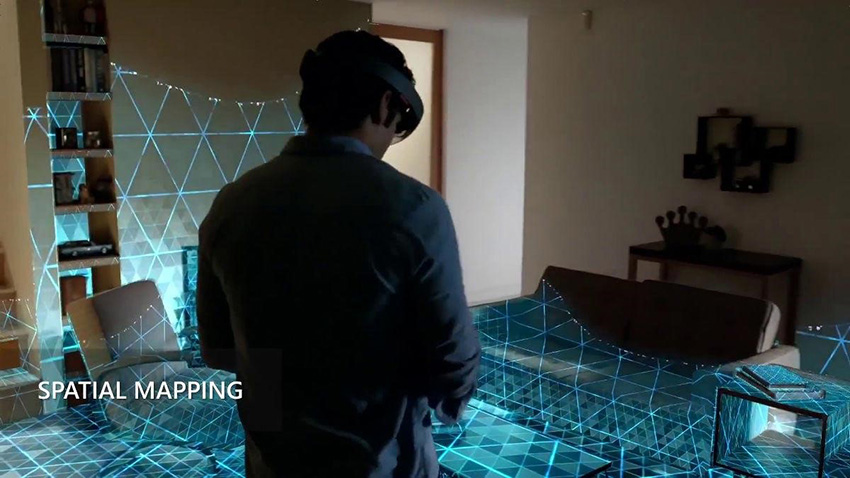
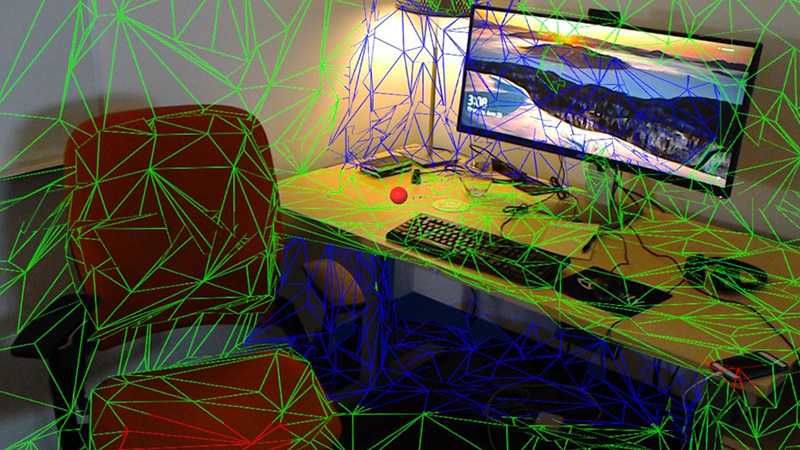

# HoloLens Spatial Mapping

HoloLens has built-in cameras that continuously scan the environment, allowing it to construct virtual world geometry for real-world objects. This ability allows HoloLens to create convincing interactions between virtual content and the real world (such as occluding and physically interacting with real-world objects). The process of mapping real-world surfaces into the virtual world is called __Spatial Mapping__.

The Unity Editor has a low-level Scripting API for gathering information about Surfaces in your project environment. This API gives you maximum control over when to query the device for Surface changes, and when to create or update the corresponding Surface game objects. Unity’s Spatial Mapping components allow you to quickly get up and running with Windows Mixed Reality, without directly using the low-level Scripting API.

## Spatial Mapping concepts

__Spatial Mapping__ is a great way to add better real-world interaction to your HoloLens application.

### Mapping

The HoloLens device constantly scans its surroundings and refines its understanding of the world based on incoming sensor data. The device frequently updates that data so that the device can pick up environmental changes, such as people moving through the room or doors opening and closing. Spatial Mapping saves the world mapping data set to the HoloLens device and this data persists across multiple applications and device restarts.

Transparent, black, and reflective Surfaces do not work well with Spatial Mapping on the HoloLens. If the device cannot detect a real-world object, an empty patch appears in the Spatial Mapping data. The same is true for parts of the world that the device has not been in or cannot see. For example, no data exists for rooms that the HoloLens has not observed.

### Data organization

The device’s world mapping is divided into uniform chunks called Surfaces. The Spatial Mapping system orients Surfaces in the world in a way convenient to the system itself. There is no guarantee that the system will arrange Surfaces in any particular orientation, and Surfaces may also improperly intersect a given real-world space (such as a room). When Spatial Mapping generates data for a Surface, the data slightly overlaps  with neighboring Surfaces.

**Note:** There is no semantic meaning or interpretation associated with any of the Surface data. Spatial Mapping does not know and cannot report on what is actually on a Surface. For example, it can’t tell that what it detects as a blob on a desk is actually a mug, or what the chair-shaped object in the middle of the room is. It only reports on the configuration of the geometry in that area based on its understanding of the world, which it constructs using its sensory input.

### Spatial Mapping important considerations

To avoid performance issues when developing applications using Spatial Mapping, consider the following:

1. The amount of Spatial Mapping data can be very large, which can cause scalability challenges.

2. Objects or people moving quickly around the room can make Spatial Mapping data very irregular, so you should avoid this where possible.

3. Holes in the data can sometimes cause issues, particularly if you need continuous data for design reasons. These holes are most commonly caused by transparent or black surfaces.

See Microsoft’s documentation on [Spatial Mapping](https://developer.microsoft.com/en-us/windows/mixed-reality/spatial_mapping) to learn more about Spatial Mapping concepts.

---

* 2018-05-01 <!-- include IncludeTextNewPageYesEdit -->

* Spatial Mapping for Hololens documentation updated in 2017.3