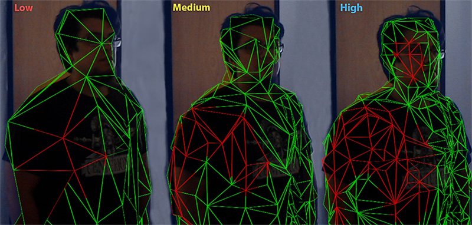

# SpatialMapping Components General Settings

The settings below are common to both __Spatial Mapping Renderer__ and __Spatial Mapping Collider__ components.

| __Setting__| __Description__ |
|:---|:---| 
| __Surface Parent__| Select the __Surface Parent__ GameObject that you want Surface GameObjects generated by Spatial Mapping components to inherit from. Leave this as __None(Game Object)__, to automatically generate a Surface Parent GameObject. |
| __Freeze Updates__| Check this box to stop the component querying the system for Surface changes.   __Note:__ Each Spatial Mapping component periodically queries the Spatial Mapping data for Surface changes in physical space. Querying and baking Surfaces costs memory, performance, and power. For environments that you expect to be mostly static, we recommend that you allow users to look around the environment for a duration of time without updating the Surface GameObjects.   If you expect the environment in your simulation to be mostly static and unchanging (like a board game), you can scan as much Surface data as you need when your application starts, and then set the __Freeze Updates__ property to __true__ to prevent further updates. This increases performance slightly and consumes less power.|
| __Time Between Updates__| The time in decimal format seconds (for example,  3.7 or 4.6) between queries for Surface changes in physical space. The default is 2.5 seconds. Note that the more regular the queries, the higher the cost in memory, performance, and power. |
| __Removal Update Count__| The number of updates before a Surface GameObject is removed by the system. You can think of an update as a frame in this case. The default is 10 updates.  __Note__: The removal update countdown begins when Spatial Mapping notifies the component that a Surface GameObject is no longer in the SurfaceObserver’s bounding volume (in that it is no longer within the defined area that the system reports on). This setting allows you to specify the number of updates that should happen after this event before Spatial Mapping removes the Surface GameObject. |
| __Level of Detail__| The quality of the Mesh that the component generates (__Low__, __Medium__, or __High__). The default quality is __Medium__. The higher the quality, the more refined and accurate the generated Collider or rendered Mesh. Using lower quality settings results in a lower cost in performance and power consumption. See the image below this table for an example of the three __Level Of Detail__ modes. |
| __Bounding Volume Type__| The component’s bounding volume area shape, in which the application receives Spatial Mapping data. This can be either a __Sphere__ or __Axis Aligned Box__. The default is __Axis Aligned Box__.  __Note: __The bounding volume is the defined area about which the system reports physical Surface changes and limits the extents of the Spatial Mapping Mesh.|
| __Size In Meters__| The size of the bounding volume used by component (in meters). Configure __Sphere__ by radius; the default radius is 2 meters. Configure __Axis Aligned Box__ by its extents; the default is a Vector3 (4,4,4).   __Note:__ The observer’s bounding volume is the defined area about which Spatial Mapping reports physical Surface changes. |

## Level of Detail

Both Spatial Mapping components allow you to specify one of three Levels of Detail for each component's generated spatial meshes (Low, Medium, or High) as depicted in the image below.

When possible, set the Level of Detail setting for __Spatial Mapping Colliders__ to Low. This increases performance and reduces power usage when calculating collision intersections. However, setting __Level of Detail__ to __Low__ can negatively affect the visual effect of your application, 
