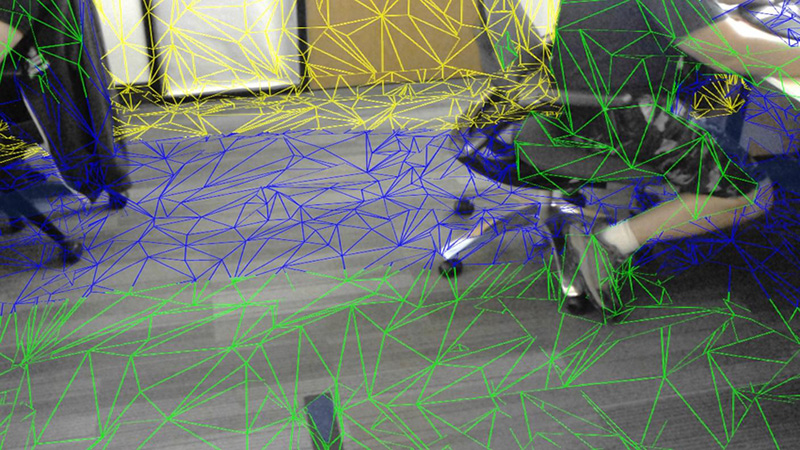

# Spatial Mapping Renderer

The __Spatial Mapping Renderer__ component provides a visual representation of Spatial Mapping Surfaces. This is useful for visually debugging Surfaces and adding visual effects to the environment.

The system periodically sends data to the __Spatial Mapping Renderer__ component about changes in physical space. Each time the component is notified of these changes by the Spatial Mapping system, it bakes the returned Surface data into GameObjects that contain both [Mesh Filter](class-MeshFilter) and [Mesh Renderer](class-MeshRenderer) components. The Spatial Mapping Renderer component manages the lifetime of these Surface GameObjects. This means that it handles creating, updating, and destroying the Surface GameObject Mesh Renderers in the Scene. 


## Render Settings

The table below lists all unique Render Settings available for the __Spatial Mapping Renderer__ component.

|__Setting__||__Description__|
|:---|:---|:---| 
|__Render State__||All Surface GameObjects take their material from the __Render State__ setting. When you change the __Render State__ setting (for example, by script during run time), all Surface GameObjects’ render Materials change to those of the chosen __Render State__ setting. This reduces the number of draw calls, which in turn improves the rendering performance. Using a shared material also reduces the amount of memory used by the application during rendering. Select one of the three options to render Surfaces. <br/><br/>See [Render State](#RenderState), below, for more information.|
| |__Occlusion__| Apply the Material defined in __Occlusion Material__. This is a transparent Material which hides GameObjects behind real world Surfaces. See [Visual and Occlusion Materials](#VisualOcclusionMaterials), below, for more information.<br/><br/>__Note:__ This enables all of a Surface’s Mesh Renderers, overriding any other setting.|
| |__Visualisation__| Apply the Material defined in __Visualization Material__ for visualizing the Spatial Mapping Surfaces (usually a wireframe Material) in your environment. See [Visual and Occlusion Materials](#VisualOcclusionMaterials), below, for more information.<br/><br/>__Note__: This enables all of a Surface’s Mesh Renderers, overriding any other setting. |
| |__None__| Choose to disable all the Mesh Renderers assigned to the Spatial Mapping Surfaces.|
|__Occlusion Material__||The material you select here applies when the Spatial Mapping Renderer’s __Render State__ is set to __Occlusion__. The default is the built-in __SpatialMappingOcclusion__ material.|
|__Visual Material__|| The material you select here is the Visual Material that applies when the Spatial Mapping Renderer __Render State__ is set to __Visualization__. The default is the built-in __SpatialMappingWireframe__ material.  |

## General Settings

<!-- include SpatialMappingComponentsGeneralSettings -->

## Using the Spatial Mapping Renderer

<a name="RenderState"></a>

### Render State 

This component provides an easy way to change the material on all generated Surfaces dynamically. Unity provides two pre-built Material types for you to use:

__Occlusion Material__

This makes the GameObject appear transparent, but holograms are not visible through the GameObject. For example, this might be useful if you require a real-world desk to conceal an in-game holographic object placed underneath it.

__Visual Material__

This is a wireframe Material that Unity applies to all Surfaces in the Spatial Mapping Renderer component. With the default Wireframe Shader, the colors of the wireframe represent real-world distances. This is usually the most useful option for debugging, but you can also use it for visual effects. The Shader uses color mapping to indicate distance; the table below shows this color mapping:

| __Distance from HoloLens__| __Color__ |
|:---|:---| 
| 0 to 1 meters| Black |
| 1 to 2 meters| Red |
| 2 to 3 meters| Green |
| 3 to 4 meters| Blue |
| 4 to 5 meters| Yellow |
| 5 to 6 meters| Cyan |
| 6 to 7 meters| Magenta |
| 7 to 8 meters| Maroon |
| 8 to 9 meters| Teal |
| 9 to 10 meters| Orange |
| 10 meters or greater| White |



When you assign a new Material to either the __Visual Material__ or __Occlusion Material, __the Material of your Surface GameObjects does not automatically change. To apply the new Material to all Surfaces, you need to set the __Render State__ to the Material you have changed (__Visual Material__ or __Occlusion Material)__.

If you only assign the __Occlusion Material__ or __Visual Material__ properties in __Render State__ from the Unity Editor (directly on the GameObject in your scene), Spatial Mapping destroys them at the same time as the __Spatial Mapping Renderer__ component. However, Spatial Mapping doesn’t destroy any __Occlusion __or __Visual Materials__ assigned or changed through script with the component, so you will need to destroy them manually.

The code snippet below changes the Material that Spatial Mapping applies to all Surface GameObjects dynamically at run time.

```

SpatialMappingRenderer renderer = spatialMappingGameObject.AddComponent<SpatialMappingRenderer>();
renderer.visualMaterial = new Material(Shader.Find("VR/SpatialMapping/Wireframe"));
renderer.renderState = SpatialMappingRenderer.RenderState.Visualization;

```

### Surface GameObjects

The __Spatial Mapping Renderer__ component creates its own separate set of Surface GameObjects during run time. These appear in your Scene parented to a Surface Parent GameObject:


When a __Spatial Mapping Renderer__ generates Surface GameObjects, they contain the following component

* [Mesh Filter](class-MeshFilter)

* [World Anchor](wmr_input_types)

* [Mesh Renderer](class-MeshRenderer)

* A shared [Material](class-Material) (this is either a Visualization or Occlusion Material, depending on the Render State setting) 


If you add multiple __Spatial Mapping Renderer __components to your Scene, each component generates its own set of Surface GameObjects. For example, if you have two GameObjects with __Spatial Mapping Renderer __components, then your Scene contains two sets of Surface GameObjects: one generated by each component at run time. This is important to keep in mind for optimization purposes.

---

* <span class="page-edit">2018-05-01 <!-- include IncludeTextNewPageYesEdit --></span>

* <span class="page-history">Spatial Mapping for Hololens documentation updated in 2017.3</span>
