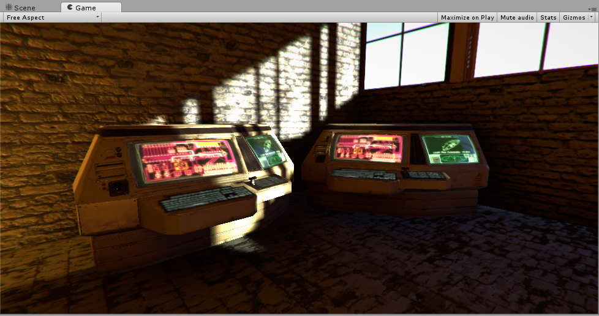

#Emission

Emission controls the color and intensity of light emitted from the surface. When you use an emissive Material in your Scene, it appears as a visible source of light. The GameObject appears to be self-illuminated.

Emissive materials are usually used on GameObjects where some part should appear to be lit up from inside, such as the screen of a monitor, the disc brakes of a car braking at high speed, glowing buttons on a control panel, or a monster's eyes which are visible in the dark.

You can define basic emissive materials with a single color and emission level. To enable the __Emission__ property, tick the __Emission__ checkbox. This enables the __Color__ and __Global Illumination__ sub-properties. Click the __Color__ box to open the __HDR Color__ panel. Here you can alter the color of the illumination and the intensity of the emission:

GameObjects that use these materials appear to remain bright even in dark areas of your Scene.

As well as simple control over emission using a flat color and brightness setting, you can assign an emission map to this parameter. As with the other texture map parameters, this gives you much finer control over which areas of your material appear to emit light.

If a texture map is assigned, the full color values of the texture are used for the emission color and brightness. You can use the emission value intensity field to boost or reduce the overall emission level of your material.

As well as the emission color and brightness, the Emission parameter has a Global Illumination setting, allowing you to specify how the apparent light emitted from this material affects the contextual lighting of other nearby GameObjects. There are two options

- **Realtime** - Unity adds the emissive light from this Material to the __Realtime__ Global Illumination calculations for the Scene. This means that this emissive light affects the illumination of nearby GameObjects, including ones that are moving.

- **Baked** - The emissive light from this material is baked into the static lightmaps for the Scene, so other nearby static GameObjects appear to be lit by this material, but dynamic GameObjects are affected.

---

*  2018-08-29  <!-- include IncludeTextAmendPageSomeEdit -->