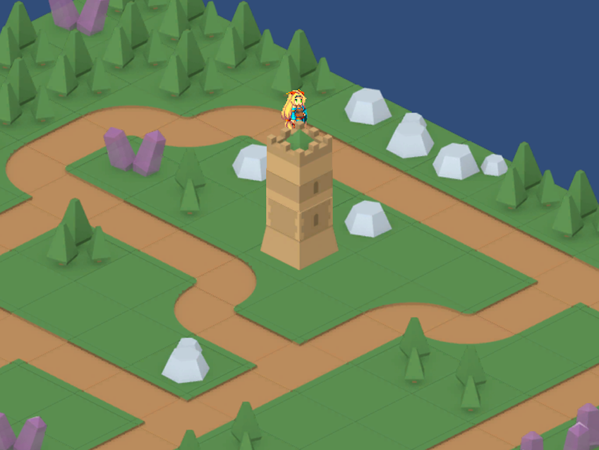

# Creating an Isometric Tilemap

To create an __Isometric Tilemap__, follow the same steps as when [creating a regular Tilemap](https://docs.unity3d.com/Manual/Tilemap-CreatingTilemaps.html). Go to __GameObject &gt; 2D Object &gt; Tilemap__. This generates a __Grid__ GameObject with a child Tilemap.

In the Grid’s Inspector window, set the __Cell Layout__ to either __Isometric__ or __Isometric Z as Y__. 

## Cell Layout properties

|**_Property:_** |**_Function:_** |
|:---|:---|
|__Isometric__|Creates an Isometric Tilemap with the default settings.
|__Isometric Z As Y__|Creates an Isometric Tilemap where a Tile’s Z-axis value is added to its Y-axis value. This causes the Tile to be visually offset along the Y-axis by that value, creating the illusion of height as the Tiles are placed on the Tilemap.|

In the __Isometric Z as Y__ layout, multiple Tiles are on the same cell position with different Z-axis coordinates, making them appear to be stacked on top of each other as each Tile is at a different Y position. This visual effect is ideal for creating tall environmental objects such as buildings or trees.

---

* Isometric Tilemaps added in [2018.3](https://docs.unity3d.com/2018.3/Documentation/Manual/30_search.html?q=newin20183) NewIn20183
