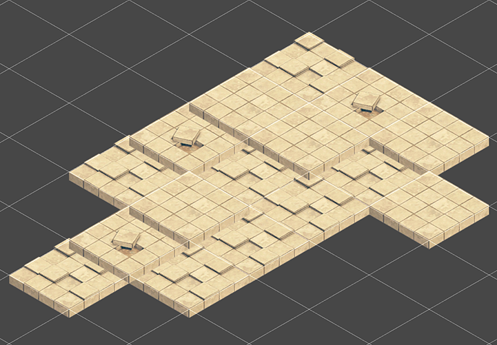
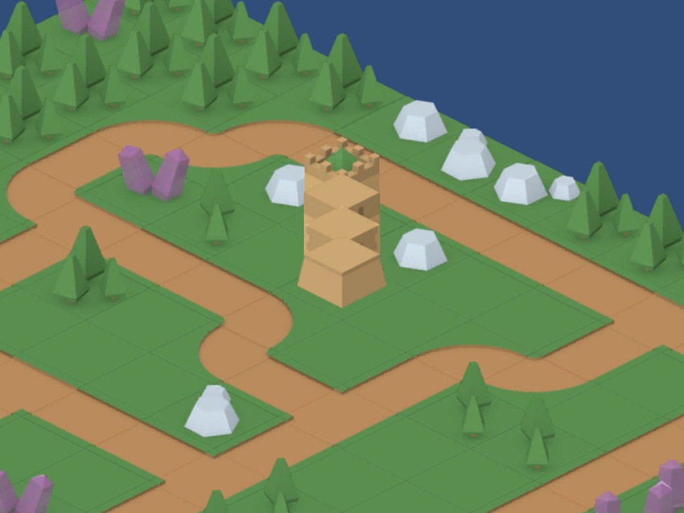

# Tilemap Renderer Modes

The __Tilemap Renderer__ component renders the [Tilemap](Tilemap) in the Scene. Unity creates Tilemaps with the Tilemap Renderer attached by default. The Tilemap Renderer can:

* [Render Tilemap Sprites in batches](#batch)
* [Render Tilemap Sprites individually](#individual)

## Rendering Tilemap Sprites in batches

__Chunk Mode__ is the default rendering mode for the Tilemap Renderer:

When set to __Chunk Mode__, the Tilemap Renderer handles Sprites on a Tilemap in batches and renders them together. This reduces the number of draw calls to improve overall performance.

### Using the Sprite Atlas for Sorting (Chunk Mode only)

In __Chunk Mode__, the Tilemap Renderer is not able to sort Tiles from multiple textures, so the renderer may sort and render Tiles inconsistently (see [example below](#chunkExample)).

Packing all the separate Sprites into a single [Sprite Atlas](https://docs.unity3d.com/Manual/SpriteAtlas.html) helps to solve this issue. To do this:

1. Create a __Sprite Atlas__ from the Assets menu (go to: __Atlas &gt; Create &gt; Sprite Atlas__).
2. Add the Sprites to the Sprite Atlas by dragging them to the __Objects for Packing__ list in the Atlas’ Inspector window.

3. Click __Pack Preview__. Unity packs the Sprites into the Sprite Atlas during Play mode, and correctly sorts and renders them. This is only visible in the Editor during Play mode.

### Rendering Tilemap Sprites individually

In __Individual Mode__, the Tilemap Renderer sorts and renders the Sprites on a Tilemap with consideration of other renderers in the Scene, such as the [SpriteRenderer](class-SpriteRenderer) and [MeshRenderer](class-MeshRenderer). Use this mode if the other renderers need to interact with other Sprites and objects on the Tilemap.

In this mode, the Tilemap Renderer sorts Sprites based on their position on the Tilemap and the sorting properties set in the Tilemap Renderer. For example, this allows a character Sprite to appear behind the tower Sprites but in front of the ground sprites:. 

Using the same example in __Chunk Mode__, character Sprites may get hidden behind ground sprites:

Using __Individual Mode__ may reduce performance because there is more overhead when rendering each Sprite on the Tilemap individually.

### Custom Axis Sorting Mode for a Z as Y Tilemap in Individual Mode

To correctly sort and display the Tiles on a Z as Y Tilemap  with the __Renderer Mode__ set to Individual Mode, go to to __Edit &gt; Settings &gt; Graphics__.

Set __Transparency Sort Mode__ to __Custom Axis__, and enter the values below for the Transparency Sort Axis. The Z-axis is set to -0.49 to give a bias to Tiles with a Z position to be drawn first, so that they are sorted correctly on the Tilemap.

---

* Isometric Tilemaps added in [2018.3](https://docs.unity3d.com/2018.3/Documentation/Manual/30_search.html?q=newin20183) NewIn20183
