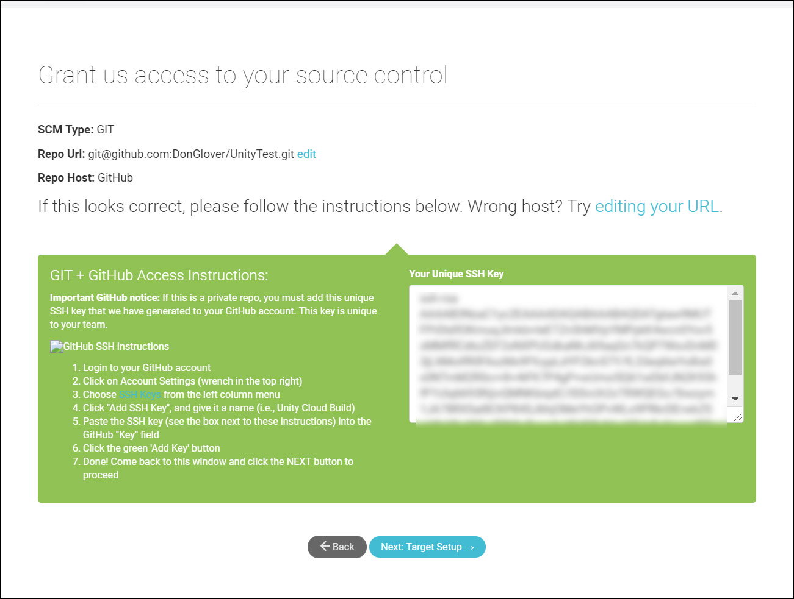

# Using the Unity Developer Dashboard to configure Unity Cloud Build for Git

Unity Cloud Build supports projects stored in Git repositories. Your repository can be hosted on [GitHub](https://github.com/), [GitLab](https://about.gitlab.com/), [Bitbucket](https://bitbucket.org/), or private servers.

**Note**: This feature requires a subscription to Unity Teams Advanced. For more information, see the [Unity Teams](https://unity3d.com/teams) page.

This topic covers:

* [Configuring GIT in the Dashboard](#configure)

* [Using private repositories](#private)

* [Setting up a target build platform](#target)

* [Using Git submodules](#submodules)

## Configuring Git on the Dashboard

To configure Cloud Build to build your Project from a GitHub repository:

1. Sign in to the [Unity Developer Dashboard](https://developer.cloud.unity3d.com/).
2. On the __Projects__ page, select your Project.
3. In the dashboard __Overview__ window, on the __Cloud Build__ tile, click __OPEN CLOUD BUILD DASHBOARD__.
4. In the __Build History__ window, click __Set up Cloud Build__.

You can configure access to your repository using the following authorization protocols:

* OAuth (default)
* SSH

To configure Cloud Build to use OAuth to access your repository:

1. In the __Source Control__ window, click the __GitHub__, __Bitbucket__, or __GitLab__ tile.
2. Authorize access to your account as appropriate for the selected source code control service.
3. In the __Select a Repository__ window, choose a repository from which to build the Project and then click the __NEXT: TARGET SETUP__ button.

**Note**: If you are currently signed into the source code management service, Cloud Build uses your current credentials to retrieve the repository list. To configure a Project that retrieves a repository from a different account, sign out of the source code management service first, then configure the Project.

For the next step, see the [Setting up a target build platform](#target) section.

To configure Cloud Build to use SSH to access your repository:

1. In the __Source Control__ window, click the __Manual__ tab.
2. In the __SCM URL__ field, enter the URL of your Git server in either of the following formats:

    * Non-SSL: host:port
    * SSL: ssl:host:port

3. To connect to your repository, you must specify the URL to your Git server. For information on the format of the URL, see the __URL syntax__ section below.
4. From the __SCM Type__ drop-down menu, select __GIT__.
5. Click the __NEXT: ACCESS__ button.

When Unity Cloud Build connects to the hosting site, it automatically detects whether your repository is public or private. If your repository is public, Cloud Build automatically connects to it and you can skip to [Setting up a target build platform](#target). If your repository is private, see the [Using private repositories](#private)section.

When Unity Cloud Build connects to the hosting site, it automatically detects whether your repository is public or private. If your repository is public, Cloud Build automatically connects to it and you can skip to [Setting up a target build platform](#target).

### URL syntax

To connect to your repository, you must specify the URL to your Git server. You can specify the URL to use the following protocols:

* HTTPS
* GIT
* SSH

The following are examples of URLs for [GitHub](https://github.com/), [bitbucket](https://bitbucket.org/), and [GitLab](https://about.gitlab.com/):

* https://github.com/youraccount/yourrepo
* git://github.com/youraccount/yourrepo.git
* git@bitbucket.org:youraccount/yourrepo.git
* git@gitlab.com:youracccount/yourrepo.git

**Note**: If you are hosting Git on a private server, you must use SSH to connect to your repository.

Use the format that is most convenient for you.; Unity Cloud Build automatically re-writes the URL into the format it needs.

## Using private repositories

If your repository is private, Cloud Build must use SSH to connect to it. When Cloud Build detects that the repository is private, it displays the __Grant us access to your source control__ screen.

### Setting your SSH key on GitHub

To add your SSH key to your project in GitHub

1. Sign in to [GitHub](https://github.com/).

2. In the upper-right corner of any GitHub page, click your profile photo, then click Your profile.

3. On your profile page, click __Repositories__, then click the name of your repository.

4. In your repository, click the __Settings__ tab.

5. In the sidebar, click __Deploy Keys__, then click the __Add deploy key__ button.

6. In the __Title__ textbox, type name to identify this key. 

7. In the __Key__ field, paste in your public key from the __Grant us access to your source control__ window, and then click the __Add key __button.

For more information on deploy keys, see [Managing Deploy Keys](https://developer.github.com/v3/guides/managing-deploy-keys/) in the GitHub documentation.

You can also add your SSH key to your GitHub account so that all repositories in your account are accessible to Cloud Build. For more information, see [Adding a new SSH key to your GitHub account](https://help.github.com/articles/adding-a-new-ssh-key-to-your-github-account/) in the GitHub documentation.

### Setting your SSH key on Bitbucket

To add your SSH key to your Bitbucket account:

1. Log in to [Bitbucket](https://bitbucket.org/).

2. Click your avatar in the lower left of the page.

3. Click __Bitbucket Settings__.

4. On the __Settings page__, in the __SECURITY__ section, click __SSH Keys__.

5. In __SSH Keys__, click the __Add key__ button.

6. In the __Label__ field, enter a recognizable name for the key (such as __Unity Cloud Build__.)

7. Paste the Unity Cloud Build SSH key from the __Grant us access to your source control__ window into the __Key__ field.

8. Click __Add Key__.

On the __Grant us access to your source control__ window, click __Next: Target Setup__.

## Setting up a target build platform

In the dashboard, on the __NEW BUILD TARGET: BASIC INFO__ window:

1. In the __Target Label__ field, enter a name for the build. 

2. If the root folder of your repository doesn't contain your Assets and Project settings, in the __Project Subfolder__ field, enter the URL of the folder that contains  your Assets and Project settings.

3. From the __Unity Version__ drop-down menu, select the version of Unity with which to build the Project.

4. If you do not want the Project to automatically build whenever your repository is updated, click the __Auto-build__ toggle to disable this feature.

If you are building for the iOS or Android platforms, your next step is to enter credentials for the build. Click __Next: Credentials__. For all other platforms, click __Next: Build__ to complete the configuration and start the initial build.

### Android credentials

In the IOS __SIGNING CREDS__ window supply the following information:

* A __Bundle ID__ to uniquely identify your app on the device and in Google Play Store. 

* Enter your Android keystore credentials or select __Auto Generated Debug Keystore__ to use a development keystore. For more information on Android keystores, see [Android Keystore System](https://developer.android.com/training/articles/keystore.html).

### iOS Credentials

In the IOS __SIGNING CREDS__ window supply the following information:

* A __Bundle ID__ to uniquely identify your app on the device.

* The Xcode version with which to build the app.

* Enter your IOS credentials. For more information on iOS credentials, see [Building for iOS](UnityCloudBuildiOS).

## Using Git submodules

If your project is using private Git submodules, make sure that the URLs present in your *.gitmodules* file are using the `git@` syntax instead of `https://` or `git://`.

For example:

* git@github.com:youraccount/yourrepo.git (for GitHub)

* git@bitbucket.org:youraccount/yourrepo.git (for Bitbucket)

* git@gitlab.com:youracccount/yourrepo.git (for GitLab)

---
2018-07-16<!-- include IncludeTextAmendPageYesEdit -->

