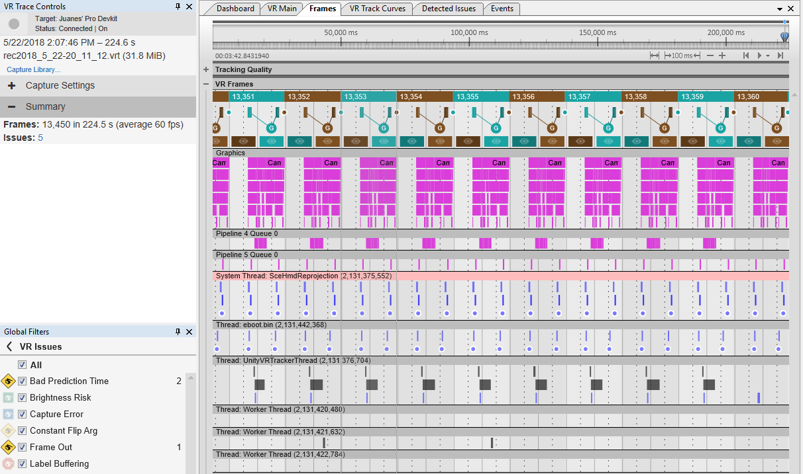
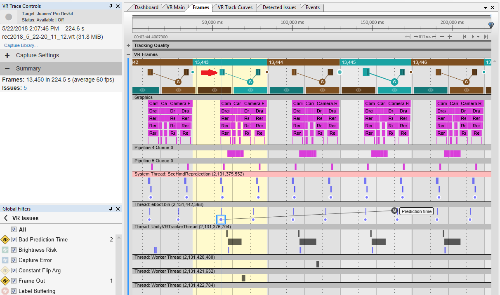
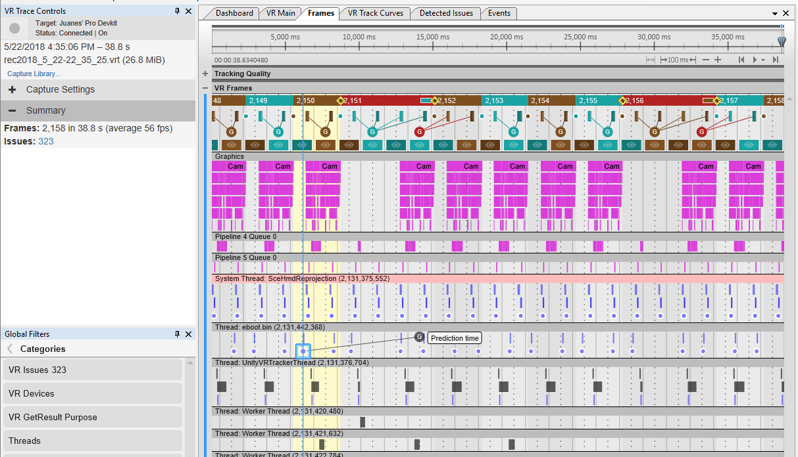
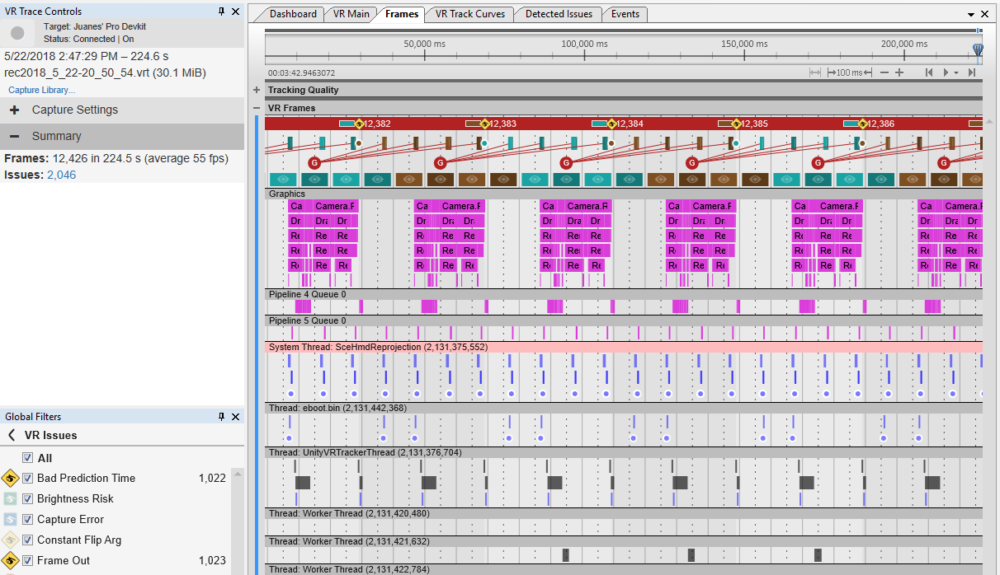
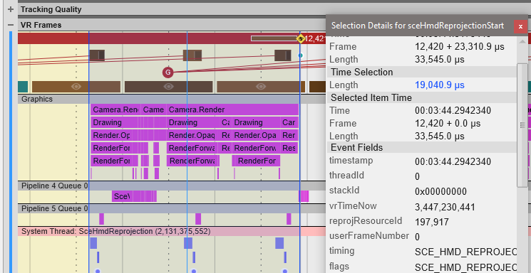

# Using VR Trace with Unity

__VR Trace__ is a tool by Sony Interactive Entertainment that is included in the PlayStation 4 SDK. It provides PlayStation VR diagnostic information that other tools (like Razor) do not provide. For more information, see Sony’s [VR Trace User Guide](https://ps4.siedev.net/resources/documents/SDK/latest/VR_Trace-Users_Guide/__document_toc.html).

This document shows you how to analyze your Unity application with VR Trace.

## Application frame rate

To get the correct reprojection behavior in your application, the frame rate of your application must consistently match the __Playstation VR Framerate__ that you set in the Unity Editor __Player__ settings (menu: __Edit__ &gt; __Project Settings__, then select the __Player__ category). 

For example, when selecting 60Hz, your application’s frame times need to be under 16.667 milliseconds. Unity caps the application to 60Hz and reprojects at 120Hz, as required by PS VR.

If your application fails to meet the required frame time, VR Trace reports issues that help you identify the problem and plan a fix.

To fix these issues, optimize your application and reduce frame times. For more information on optimization, see documentation on [Razor CPU](PS4ProfilingWithRazor) and [Razor GPU](PS4ProfilingWithRazor-GPU).

## GPU markers in VR Trace

To get GPU markers in VR Trace, use a __Development Build__ with __VR Captures__ rather than __Live Captures__.

## VR Trace examples 

This section shows examples of VR Trace captures using a Unity Project with these specifications:

* PS VR frame rate set to 60Hz (reprojected to 120Hz). 

* __Development Build __checked in __Build Settings__ (menu: __File__ &gt; __Build Settings...__).

* __VR Captures__ taken, rather than __Live Captures__.

### Example VR Trace with frame times on budget (correct behavior)

This is a VR Trace of an application that consistently meets the 60Hz frame budget:

The __Summary__ view shows almost no __Issues__ (the issues registered in this example occurred during the VR capture stop event in the timeline, so you can ignore them) and an average of 60 frames per second (fps).

The __Frames__ tab shows very uniform frames in all respects and without any red warnings in the __Game Frames__ or the __Reprojection__ rows. 

For every application frame calculated, Unity performs two updates of the VR tracking data from the main thread (*eboot.bin*). One of them happens during input update at the start of the frame. The other one estimates the reprojection time, and happens before main rendering starts. The __Thread: eboot.bin (…)__ row shows these updates as blue points in the __Frames__ tab. 

In the next screenshot, the tracking update that generates the time estimate is selected (highlighted by the blue square): 

This selected update occurs during the first reprojection process of the frame (the red arrow in the screenshot indicates the marker). This timing allows a correct prediction time generation that points to the midpoint of the scanout interval (the period of time that an image is presented in the VR display) two frames ahead. This is the expected behavior from an application running with correct timings at 60Hz.

### Example VR Trace with bad frame times caused by the CPU’s main thread

When the application is CPU-bound, the __Summary__ and __Dashboard &gt; FPS__ views look like this:

In the middle of the example VR Trace capture, the frame rate drops from the expected 60 fps to around 50 (the __Game FPS__ graph goes from green to yellow and then red). The __Summary__ also shows an average frame rate below 60 (in this case, 56).

Unity reports a large number of __Issues__ in the Summary (323). This indicates synchronization problems between Unity’s main thread and the reprojection processes.

Note that the __Reprojection FPS__ remains at 120Hz despite the game frame rate drop (you can ignore the dip near the end of the capture in this example, because that is caused by the capture end event).

The __Frames __tab on this CPU-bound capture looks like this:

The __Game Frames__ row (top) displays some red frames that are longer than expected. In the __Thread: eboot.bin(...)__ row, the prediction time from the VR update fails to point two frames ahead because the next frame is longer than expected. This causes an early prediction time reprojection Issue (shown as a red circle in the __Reprojection__ row).

### Example VR Trace with bad frame times due to GPU processing

In a GPU-bound scenario, you might see a __Summary__ and __Dashboard &gt; FPS__ view like this:

Here, the application started to be GPU-bound near the end of the capture, and the frame rate dropped.

The VR Trace capture is very similar to the CPU-bound example, but the frame rate is capped at exactly 30 fps. Frame times would allow a frame rate of between 30 and 60 fps. Unity caps the frame rate when an application is GPU-bound in VR mode.

The __Frames__ tab for this example looks like this:

All frames are twice as long as they should be (30 fps instead of 60 fps). This causes all prediction times to be too early. This is indicated by the red circles in the __Reprojection__ row, which appear in the previous frame instead of the current frame.

Measuring the length of the GPU work per frame (as shown by the block of GPU markers each frame) can provide useful data. In this example, the length is 19040.9 microseconds (written in blue in the next screenshot), which is over the budget of 16666.7 microseconds (or 60Hz) per frame. 

## Troubleshooting

To avoid crashes on your PS4 application while writing captures, go to your PS4 DevKit __Debug Settings__ and set the __Graphics &gt; SubmitDone Exception__ option set to __No__.

----
* 2018-07-16 <!-- include IncludeTextNewPageYesEdit -->

* Information on using VR Trace added in 2017.4
