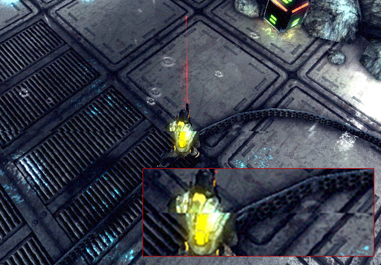

#Quality

Unity allows you to set the level of graphical quality it attempts to render. Generally speaking, quality comes at the expense of framerate and so it may be best not to aim for the highest quality on mobile devices or older hardware since it tends to have a detrimental effect on gameplay. Use the __Quality__ settings (menu: __Edit &gt; Project Settings__, then select the __Quality__ category) to select the quality level in the Editor for the chosen device. It is split into two main areas: the Quality matrix appears at the top; and below it, the settings for the selected quality level appear.

Unity lets you assign a name to a given combination of quality options for easy reference. The rows of the matrix let you choose which of the different platforms each quality level applies to. The __Default__ row at the bottom of the matrix is not a quality level in itself but rather sets the default quality level used for each platform (a green checkbox in a column denotes the level currently chosen for that platform). Unity comes with six quality levels pre-enabled but you can [add your own levels](#define). 

 

To delete an unwanted quality level, use the trashcan icon (the rightmost column).

To select a quality level for editing, click on its name in the matrix. Its definitions appear in the panel below the settings and you can modify any settings you need to:

 

To define a new Quality level, click the **Add Quality Level** button and type the name for the new level in the __Name__ property box. 

Then you can choose which of the quality options documented in the following sections you need to update or set:

* [Rendering](#Rendering)
* [Shadows](#Shadows)
* [Other](#Other)

## Rendering

|**Property** |**Function** |
|:---|:---|
|__Pixel Light Count__|Set the maximum number of pixel lights when Unity uses [Forward Rendering](RenderTech-ForwardRendering).|
|__Texture Quality__|Choose whether to display Textures at maximum resolution or at a fraction of this (lower resolution has less processing overhead). The options are *Full Res*, *Half Res*, *Quarter Res* and *Eighth Res*.|
|__Anisotropic Textures__|Choose if and how Unity uses anisotropic Textures. The options are _Disabled_, _Per Texture_ and _Forced On_ (that is, always enabled). |
|__AntiAliasing__|Choose the level of [antialiasing](#antialias) that Unity uses. The options are *Disabled*, *2x Multi Sampling*, *4x Multi Sampling* and *8x Multi Sampling*.|
|__Soft Particles__|Enable this option to use soft blending for particles? See [Soft Particles](#softicles) for more information.|
|__Realtime Reflection Probes__|Enable this option to update [reflection probes](class-ReflectionProbe) during gameplay.|
|**Billboards Face Camera Position**|Enable this option to force billboards to face the camera while rendering instead of the camera plane. This produces a better, more realistic image, but is more expensive to render.|
|__Resolution Scaling Fixed DPI Factor__|Downscales the device's screen resolution below its native resolution. For more details, see [Android Player](class-PlayerSettingsAndroid#Scaling) settings and [iOS Player](class-PlayerSettingsiOS#Scaling) settings.|
|__Texture Streaming__|Enable Texture mipmap streaming.|

### Anti-aliasing

Anti aliasing improves the appearance of polygon edges, so they are not "jagged", but smoothed out on the screen. However, it incurs a performance cost for the graphics card and uses more video memory (there's no cost on the CPU though). The level of anti-aliasing determines how smooth polygon edges are (and how much video memory it consumes).

 

 

However, built-in hardware anti-aliasing does not work with [Deferred Shading](RenderTech-DeferredShading) or [HDR](HDR) rendering. For these cases, you'll need to use [Antialiasing Image Effect](PostProcessing-Antialiasing).

### Soft Particles

Soft Particles fade out near intersections with other Scene geometry. This looks much nicer, but it's more expensive to compute (more complex pixel shaders), and only works on platforms that support [depth textures](SL-DepthTextures). Furthermore, you have to use [Deferred Shading](RenderTech-DeferredShading) or [Legacy Deferred Lighting](RenderTech-DeferredLighting) rendering path, or make the camera render [depth textures](SL-CameraDepthTexture) from scripts.

 

 

## Shadows

|**_Property:_** ||**_Function:_** |
|:---|:---|----|
| __Shadowmask Mode__ || Choose the shadowmask behavior when using the [Shadowmask](LightMode-Mixed-ShadowmaskMode) Mixed lighting mode. Use the Lighting window (menu: __Window__ &gt; __Rendering__ &gt; __Lighting Settings__) to set this up in your Scene. |
||__Distance Shadowmask__ | Unity uses real-time shadows up to the __Shadow Distance__, and baked shadows beyond it. |
||__Shadowmask__ | Static GameObjects that cast shadows always cast baked shadows. |
|__Shadows__||Choose which type of shadows to use. The available options are _Hard and Soft Shadows_, _Hard Shadows Only_ and _Disable Shadows_. |
|__Shadow Resolution__||Choose which resolution to render shadows at. The available options are _Low Resolution_, _Medium Resolution_, _High Resolution_ and _Very High Resolution_. The higher the resolution, the greater the processing overhead.|
|__Shadow Projection__||Choose which method to use for projecting shadows from a directional light. |
||__Close Fit__|Renders higher resolution shadows but they can sometimes wobble slightly if the camera moves. |
||__Stable Fit__|Renders lower resolution shadows but they don't wobble with camera movements.|
|__Shadow Distance__||Enter the maximum distance from the Camera at which shadows are visible. Unity does not render shadows that fall beyond this distance.|
|__Shadow Near Plane Offset__||Enter the offset shadow near plane to account for large triangles being distorted by shadow pancaking.|
|__Shadow Cascades__||Choose the number of shadow cascades to use. The available options are _No Cascades_, _Two Cascades_, or__Four Cascades_. A higher number of cascades gives better quality but at the expense of processing overhead (see [Directional Light Shadows](DirLightShadows) for further details).|
|__Cascade splits__||Adjust the cascade shadow split(s) by moving the vertical line between each cascade left or right. Depending on what value you chose for the __Shadow Cascades__ setting, you can see two or four different colors. If __Shadow Cascades__ is set to _No Cascades_, then this entire control is hidden.|

## Other

|**Property** |**Function** |
|:---|:---|
|__Blend Weights__|Choose the number of bones that can affect a given vertex during an animation. The available options are _1 Bone_, _2 Bones_ and _4 Bones_.|
|__V Sync Count__|Choose to synchronize rendering with vertical blanks or not to synchronize at all. Unity can synchronize rendering with the refresh rate of the display device to [avoid tearing artifacts](#tearing). The available options are _Every V Blank_, _Every Second V Blank_, or _Don't Sync_.|
|__Lod Bias__|Set the level-of-detail (LOD) bias.  LOD levels are chosen based on the onscreen size of an object. When the size is between two LOD levels, the choice can be biased toward the less detailed or more detailed of the two Models available. This is set as a fraction from 0 to +infinity.  When it is set between 0 and 1 it favors less detail.  A setting of more than 1 favors greater detail. For example, setting LOD Bias to 2 and having it change at 50% distance, LOD actually only changes on 25%. |
|**Maximum LOD Level**|Set the highest LOD that the game uses. See [Maximum LOD level](#maxLOD) for more information.|
|__Particle Raycast Budget__|Set the maximum number of raycasts to use for approximate particle system collisions (those with _Medium_ or _Low_ quality). See [Particle System Collision Module](class-ParticleSystem).|
|__Async Upload Time Slice__|Set the amount of CPU time in milliseconds per frame to spend uploading buffered textures to the GPU. See [Async Texture Upload](AsyncTextureUpload).|
|__Async Upload Buffer Size__|Set the size in MB for the Async Upload buffer. See [Async Texture Upload](AsyncTextureUpload).|

### Maximum LOD level

Unity does not use Models which have a LOD below the MaximumLOD level and omits them from the build (which saves storage and memory space). Unity uses the smallest LOD value from all the MaximumLOD values linked with the **Quality** settings for the target platform. If an LOD level is included, then Models from that LODGroup are included in the build and always loaded at runtime for that LODGroup, regardless of the Quality setting being used. As an example, if LOD level 0 is used in any Quality setting then all the LOD levels are included in the build and all the referenced Models load at runtime. 

### Tearing

The picture on the display device is not continuously updated, but rather the updates happen at regular intervals much like frame updates in Unity. However, Unity's updates are not necessarily synchronized with those of the display, so it is possible for Unity to issue a new frame while the display is still rendering the previous one. This results in a visual artifact called "tearing" at the position onscreen where the frame change occurs.

 

It is possible to get Unity to switch frames only during the period where the display device is not updating, the so-called "vertical blank". The __V Sync Count__ option in **Quality** settings synchronizes frame switches with the device's vertical blank or optionally with every other vertical blank. The latter may be useful if the game requires more than one device update to complete the rendering of a frame.

 

---

* 2017-09-18  <!-- include IncludeTextAmendPageSomeEdit -->

* __Shadowmask Mode__ added in [2017.1](https://docs.unity3d.com/2017.1/Documentation/Manual/30_search.html?q=newin20171) NewIn20171

