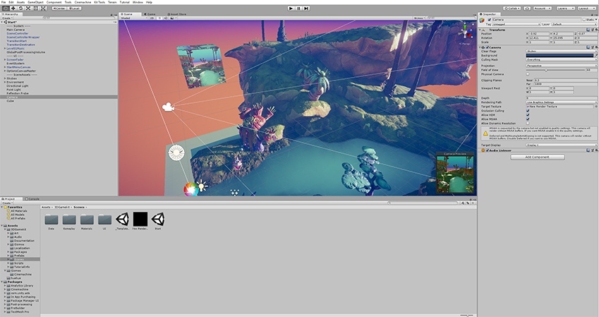

Render Texture
==============

__Render Textures__ are special types of __Textures__ that are created and updated at runtime. To use them, you first create a new Render Texture and designate one of your [Cameras](class-Camera) to render into it. Then you can use the Render Texture in a __Material__ just like a regular Texture. The [Water](HOWTO-Water) prefabs in Unity Standard Assets are an example of real-world use of Render Textures for making real-time reflections and refractions.

Properties
----------

The Render Texture __Inspector__ is different from most Inspectors, but very similar to the [Texture Inspector](class-TextureImporter).

 

The Render Texture inspector displays the current contents of Render Texture in realtime and can be an invaluable debugging tool for effects that use render textures.

|**_Property:_** ||**_Function:_** |
|:---|:---|:---|
|__Dimension__||The dimensionality (type) of the render texture. |
||__2D__ |The render texture is two-dimensional. |
||__Cube__ |The render texture is a cube map. |
||__3D__ |The render texture is three-dimensional.|
|__Size__ ||The size of the render texture in pixels. You can only enter power-of-two values, such as 128 and 256. |
|__Anti-Aliasing__ ||The number of anti-aliasing samples. You can select __None__, __2 samples__, __4 samples__, or __8 samples__. If you select __None__, Unity does not apply anti-aliasing. |
|__Color Format__||The color format of the render texture. |
|__Depth Buffer__ ||The format of the depth buffer. You can select __No depth buffer__, __At least 16 bits depth (no stencil)__, or __At least 24 bits depth (with stencil)__. The stencil buffer is a general purpose buffer that allows you to store an additional unsigned 8-bit integer (0–255) for each pixel drawn to the screen. |
|__sRGB (Color RenderTexture)__ ||Check this box to make the render texture use sRGB read/write conversions. |
|__Enable Mip Maps__ ||Check this box to make the render texture generate [mipmaps](https://docs.unity3d.com/Manual/ImportingTextures.html#Mipmaps). |
|__Auto generate Mip Maps__ ||Check this box to automatically fill the generated mipmaps with relevant data. If you don’t enable this, you'll have to use the [`GenerateMips`](https://docs.unity3d.com/ScriptReference/RenderTexture.GenerateMips.html) function to fill those mipmaps manually. Alternatively, choose which mip to render into when you call the various `SetRenderTarget` functions. For more information about the `SetRenderTarget` functions, see [`Graphics.SetRenderTarget`](https://docs.unity3d.com/ScriptReference/Graphics.SetRenderTarget.html) and [`Rendering.CommandBuffer.SetRenderTarget`](https://docs.unity3d.com/ScriptReference/Rendering.CommandBuffer.SetRenderTarget.html). |
|__Dynamic Scaling__ ||Check this box to let [dynamic resolution scaling](DynamicResolution) resize the render texture. If you don’t enable this, the render texture maintains the same size regardless of the Dynamic Resolution setting. |
|__Wrap Mode__ ||Controls how the texture is wrapped: |
||__Repeat__ |Tiles the texture to create a repeating pattern. |
||__Clamp__ |Stretches the edges of the texture. This is useful for preventing wrapping artifacts when you map an image onto an object and you don't want the texture to tile. |
||__Mirror__ |Tiles the texture to create a repeating pattern that mirrors the texture at every integer boundary. |
||__Mirror Once__ |Mirrors the texture once, and then falls back to clamping. |
||__Per-axis__ |Lets you set different wrap modes for the __U axis__ and the __V axis__. The available options are also __Repeat__, __Clamp__, __Mirror__ and __Mirror Once__. For example, when you use latitude-longitude environment maps for reflection probes, it is useful to have __Clamp__ on the vertical coordinate (__V axis__), but __Repeat__ on the horizontal coordinate (__U axis__). |
|__Filter Mode__ ||Controls how the sampling of the texture uses nearby pixels. The options are: |
||__Point__ |Uses the nearest pixel. This makes the texture appear pixelated. |
||__Bilinear__ |Uses a weighted average of the four nearest texels. This makes the texture appear blurry when you magnify it. |
||__Trilinear__ |Uses a weighted average of the two nearest mips, which are bilinearly filtered. This creates a soft transition between mips, at the cost of a slightly more blurry appearance. |
|__Aniso Level__ ||Anisotropic filtering level of the texture. This increases texture quality when you view the texture at a steep angle. Good for floor, ground, or road textures. |

Example
-------

A very quick way to make a live arena-camera in your game:

1. Create a new Render Texture asset using __Assets &gt;Create &gt;Render Texture__.
1. Create a new Camera using __GameObject &gt; Camera__.
1. Assign the Render Texture to the __Target Texture__ of the new Camera.
1. Create a wide, tall and thin box
1. Drag the Render Texture onto it to create a Material that uses the render texture.
1. Enter Play Mode, and observe that the box's texture is updated in real-time based on the new Camera's output.

 

---

* 2018-11-01  <!-- include IncludeTextNewPageYesEdit -->

* Render Texture inspector changed in Unity 2017.2
