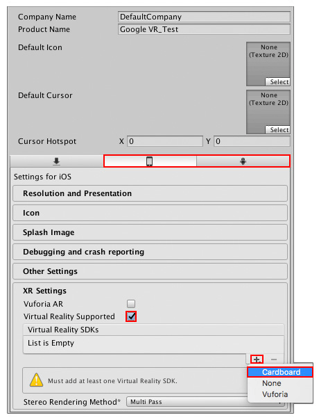
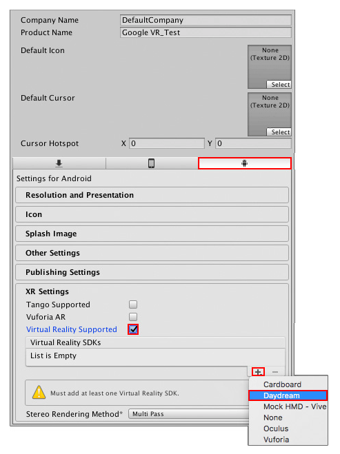

# Google VR quick start guide

This section helps you get started with developing Google VR applications using Unity. Many of the instructions for developing Google VR content are available on the [Google VR Developer website](https://developers.google.com/vr/).

Use the following guides to install Unity and the Google VR SDK:

1. See [Downloading and installing Unity](InstallingUnity) to help install the Unity Editor.

    i ) When targeting Android, make sure you install Unity Android Support through the __Unity Installer__.

    ii ) When targeting iOS, make sure you install Unity iOS support through the      __Unity Installer__ and that you have a macOS machine to compile and deploy to your device.

2. Follow the instructions on the [Google developer site for VR](https://developers.google.com/vr/) for your targeted platform(s).

## Official Google VR guides
Google provides starter guides for developing Google VR applications with Unity for both Android and iOS. Links to specific guides are given below:

* Getting started with [Google VR SDK for Unity for Android](https://developers.google.com/vr/unity/get-started).

* Getting started with [Google VR SDK for Unity for iOS](https://developers.google.com/vr/unity/get-started-ios).

## Unity Platform configuration settings

This section provides a step-by-step guide for configuring your Unity Project to build Google VR applications.

Follow the steps in the next sections to ensure your Unity project can successfully build for your target Google VR devices.

### Targeting Cardboard (Android and iOS)

Unity provides a number of platform-specific build options for building applications to Cardboard-supported devices. 

To access these settings, open the __Player__ settings in the Unity Editor (menu: __Edit__ > __Project Settings__, then select the __Player__ category) and click either the iPhone or Android icon, depending on which device you want to build to. Navigate to the __XR Settings__ panel and make sure __Virtual Reality Supported__ is checked. Next, navigate to the __Virtual Reality SDKs__ list and click the plus __(+)__ button. Select __Cardboard__ to add it to the list.

When you have added __Cardboard__ to the __Virtual Reality SDKs__ list, click the foldout arrow next to it to view additional __Cardboard__ settings.

The table below provides a list of properties available in the __Cardboard__ settings, along with a description of their functionality.

| __Property__| __Description __  |
|:---|:---|
| __Depth Format__| Use this drop-down to set the Z buffer depth. Unity uses this to sort the visible data and determine what is actually rendered to the  screen. |
| __Enable Transition View__| The transition view is the view that Google VR provides to inform the user that they must put their device in a Cardboard-compatible viewer. You can enable it to provide users some time to insert their device into a viewer. By default, this is disabled. |

The minimum platform requirement for Cardboard is Android 5.0 (Lollipop) (SDK API level 21). 

To ensure Unity uses the correct APK, and only runs on devices upgraded to the latest version of Android, you need to change the __Minimum API Level__.

To do this, go to the __Player__ settings and navigate to the __Other Settings__ panel. Under __Identification,__ use the __Minimum API Level__ drop-down to set it to the latest API in the list.

Set the __Target API Level__ to API level 21 or higher for Cardboard only. If you are targeting Daydream then this needs to be 24 or higher. By default, this property uses the highest level you have installed. For more information about API levels for Android, see the [Android Player platform](class-PlayerSettingsAndroid) settings.

You are now ready to create your Unity content for Cardboard. Follow the same workflow you would for normal Android or iOS development (see documentation on [Android development](android) or [iOS development](iphone) for more information). Make sure you build and run your game on a Cardboard-capable device (menu: __File__ > __Build & Run__).

### __Targeting Daydream (Android only)__

Unity provides a number of platform-specific build options for building applications to Daydream-supported devices. 

To access these settings, open the __Player__ settings (menu: __Edit__ > __Project Settings__, then select the __Player__ category) and navigate to the Android section (click the Android icon marked in the figure below). Navigate to __XR Settings__ and make sure the __Virtual Reality Supported__ checkbox is ticked. Next, navigate to the __Virtual Reality SDKs__ list and click the plus (+) button. Select __Daydream__ to add it to the list.

When you add __Daydream__ to the __Virtual Reality SDKs__ List, click the foldout arrow next to it to view additional Daydream settings.

The table below provides a list of properties available in the Daydream settings, along with a description of their functionality.

| __Property__| __Description __ |
|:---|:---|
| __Depth Format__| Use this drop-down to set the Z buffer depth. This is used for sorting the visible data and determining what is actually rendered to the screen. |
| __Foreground Icon__| Set the foreground icon for presentation in the Google VR Play store. |
| __Background Icon__| Set the background icon for presentation in the Google VR Play store. |
| __Use Sustained Performance Mode__| Enable __Sustained Performance Mode__ for longer XR experiences. This reduces performance to improve battery life. |
| __Enable Video Surface__| Enable Asynchronous Video Reprojection. For more information,  see the documentation about [Asynchronous Video Reprojection](VRDevices-GoogleVRVideoAsyncReprojection) for more information. |
| __Enable Protected Memory__| Enables memory protection for DRM protected content when using Asynchronous Video Reprojection. This option only appears if __Enable Video Surface__ has been selected. For more information, see [Asynchronous Video Reprojection](VRDevices-GoogleVRVideoAsyncReprojection) |

The minimum platform requirement for targeting Daydream only is Android 7.0 (Nougat) (SDK API level 24). If you are targeting Cardboard as well as Daydream, then the minimum supported API level is 21.

To ensure Unity uses the correct APK, and only runs on devices upgraded to the latest version of Android, you need to change the __Minimum API Level__.

To do this in the **Player** settings, navigate to the __Other Settings__ panel. Under __Identification,__ use the __Minimum API Level__ drop-down to set it to the latest API in the list. 

Set __Target API Level__ should be set to API level 24 if you are Daydream. By default, this property uses the highest level you have installed. For more information about API levels for Android, see documentation on [Android Player platform](class-PlayerSettingsAndroid) settings.

You are now ready to create your Unity content for Daydream. Follow the same workflow you would for normal Android development (see documentation on [Android development](android) for more information). Make sure you build and run your game on a Daydream-capable device (menu: __File__ > __Build & Run__).

---
* 2018-03-27 <!-- include IncludeTextNewPageYesEdit -->

* Google VR documentation updated for Unity XR API in 2017.3
