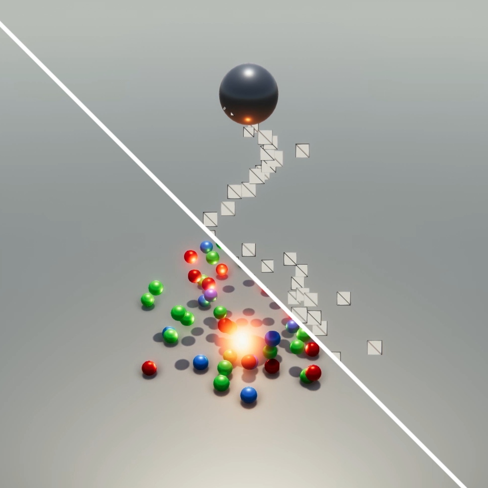

#Standard Particle Shaders

The Unity Standard Particle Shaders are built-in shaders that enable you to render a variety of Particle System effects. These shaders provide various particle-specific features that aren't available with the Standard Shader.

To use a Particle Shader:

1. Select the Material you want to apply the shader to. For example, you could apply a Flame Material to a Fire Particle System effect.

2. In the Material’s Inspector, select __Shader Particles__.

3. Choose the Particle Shader that you want to use, such as __Standard Surface__.

4. Enable and disable the various Particle Shader properties in the Inspector.

##Properties

The Standard Particle Shaders have the same set of properties as the [Standard Shader](shader-StandardShader) (or a subset of those properties, depending on the Shader). This page describes the properties and options that are additional to the Standard Shader properties. For information on the Standard Shader properties, see documentation on [Material parameters](StandardShaderMaterialParameters).

###Blending Options

All of the Standard Particle Shaders have __Blending Options__ that enable you to blend particles with the objects surrounding them in different ways. 

| Property:| Function: |
|:---|:---| 
| __Rendering Mode__| The Standard Particle Shaders can have the following additional [Rendering Mode](StandardShaderMaterialParameterRenderingMode) options:  **Additive**: Adds the background and particle colors together. This is useful for glow effects, like those you might use for fire or magic spells.  **Subtractive**: Subtracts particle colors from the background, which darkens the particles against the background. This is useful for foggy effects, like those you might use for steam, or thick black smoke.  **Modulate**: Multiplies the material pixels with the background color. This is useful for portals and light-rays. |
| __Color Mode__| Control how the albedo texture is combined with the particle color. The **Color Mode** options are:  **Multiply**: Multiplies the particle color with the particle texture.   **Additive**: Preserves a hot spot, such as a white part of the particle texture, while adding the particle color to the darker pixels of the texture.   **Subtractive**: Subtracts the particle color from the particle texture.   **Overlay**: Gives more contrast to the original color and adds the particle color to the gray values. This is similar to Additive, but preserves the original colors.  **Color**: Uses the alpha channel from the particle texture and the color from the particle itself. This is useful for overwriting particles with the same color, while keeping their original "shape".  **Difference**: Subtracts the particle color from the texture, or the texture from the color, to get a positive value. This is useful for a range of effects where you want a more dynamic color change.   See image below table for a demonstration of this effect.|

### Main Options

| Property| Function |
|:---|:---| 
| __Flip-Book Mode__| Render flip-books as individual frames or blend the frames together to give smoother animations. Set to either: **Simple** - Render frames in a flip-book as a sequence of individual frames. **Blended** - Blend the frames in a flip-book to render the flip-book as a smooth animation. |
| __Two Sided__| Render both the front and back faces of the particle. When disabled, Unity only renders the front face of the geometry, which is the face in the camera’s view. |
| __Enable Soft Particles__| Fade out particles when they get close to the surface of objects written into the depth buffer. This is useful for avoiding hard edges when particles intersect with opaque geometry. For example, by enabling soft particles, you can make the particle system emit particles close to an opaque surface without causing harsh intersections with the surface:|
| __Enable Camera Fading__ | Fade out particles when they get close to the camera. Set to: **Near fade** - The closest distance particles can get to the camera before they fade from the camera’s view. **Far fade** - The farthest distance particles can get away from the camera before they fade from the camera’s view. |
| __Enable Distortion__ | Make particles perform fake refraction with the objects drawn before them. Distortion is ideal for creating heat haze effects for fire, for example:This effect can be quite expensive because it captures the current frame to a texture. |

##Standard Particles Surface Shader

This shader comes with functionality similar to the Standard Shader, but works especially well with particles. Like the Standard Shader, it supports Physically Based Shading. It does not include features that are unsuitable for dynamic particles, such as lightmapping.

##Standard Particles Unlit Shader

This simple shader is faster than the Surface Shader. It supports all of the generic particle controls, such as flipbook blending and distortion, but does not perform any lighting calculations.

---

* 2017-10-16  <!-- include IncludeTextNewPageNoEdit -->

* Standard Particle Shaders added in [2017.3](https://docs.unity3d.com/2017.3/Documentation/Manual/30_search.html?q=newin20173) NewIn20173