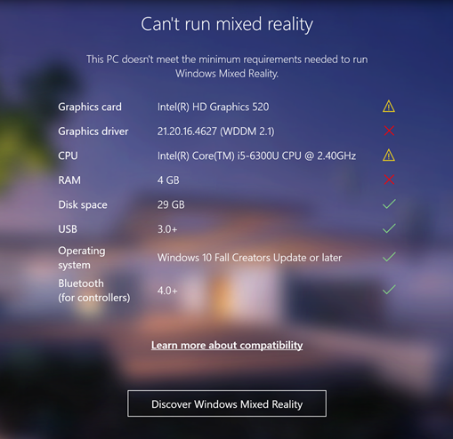

# WMR hardware and software requirements

This section discusses hardware compatibilities and software requirements for using Windows Mixed Reality devices and applications.

## Checking compatibility

You can use Microsoft's [Mixed Reality PC Check](https://www.microsoft.com/en-us/store/p/windows-mixed-reality-pc-check/9nzvl19n7cnc?rtc=1#) app to see if your PC is ready to run Windows Mixed Reality applications. The check tests your system and reports back on whether or not your PC meets the requirements.

After the check is complete, the results window displays one of the following result messages:

| __Compatibility check result__| __Description__ |
|:---|:---| 
| __You’re good to go__| Your PC matches the requirements needed to run Windows Mixed Reality  |
| __You’re nearly there__| Some functions might be limited, but Windows Mixed Reality applications can run |
| __Can’t Run Mixed Reality__| Your PC doesn’t meet the requirements needed to run Windows Mixed Reality |

The results window also displays a green tick beside any of your PC components or drivers that meet Microsoft's minimum requirements. It also displays a red ‘X’ beside the components on your PC that do not meet minimum requirements. The following image below illustrates this:

The table below lists the minimum and recommended hardware and software requirements to successfully run Windows Mixed Reality applications on a Windows desktop PC. The recommended requirements let you run Windows Mixed Reality applications on a Windows desktop PC at the highest quality settings.

|__Component__|__Minimum requirements__|__Recommended requirements__|
|:---|:---|:---| 
| __Operating System__| Windows 10 Fall Creators Update (RS3) - Home, Pro, Business, Education. |Windows 10 Fall Creators Update (RS3) - Home, Pro, Business, Education.|
| __CPU Processor__| Intel Core i5 7200U (7th generation mobile), dual-core with Intel® Hyper-Threading Technology enabled (or better). | Intel Core i5 4590 (4th generation), quad-core (or better) AMD Ryzen 5 1400 3.4Ghz (desktop), quad-core (or better).|
| __Disk Space__| At least 10 GB. | At least 10 GB. |
| __RAM__| 8GB DDR3 dual channel (or better). | 8GB DDR3 dual channel (or better). |
| __Bluetooth (for controllers)__| Bluetooth 4.0 | Bluetooth 4.0 |
| __USB connectivity __| USB 3.0 Type-A or Type-C | USB 3.0 Type-A or Type-C |
| __Graphics Driver__| Windows Display Driver Model (WDDM) 2.2 | Windows Display Driver Model (WDDM) 2.2 |
| __Graphics Card__| Integrated Intel® HD Graphics 620 (or greater) DX12-capable integrated GPU ([check if your model is greater](https://en.wikipedia.org/wiki/List-of-Intel-graphics-processing-units#Ninth-generation))  NVIDIA MX150/965M (or greater) DX12-capable discrete GPU. | NVIDIA GTX 960/1050 (or greater) DX12-capable discrete GPU. AMD RX 460/560 (or greater) DX12-capable discrete GPU. GPU must be hosted in a PCIe 3.0 x4+ Link slot. |
| __Graphics Display Port__| HDMI 1.4 or DisplayPort 1.2 | HDMI 2.0 or DisplayPort 1.2 |

For additional details and information relating to Microsoft’s Mixed Reality PC requirements, see [Microsoft’s Mixed Reality hardware compatibility guidelines](https://developer.microsoft.com/en-us/windows/mixed-reality/windows_mixed_reality_minimum_pc_hardware_compatibility_guidelines). 

---
* 2018-03-27 <!-- include IncludeTextNewPageYesEdit -->

* New content added for XR API changes in 2017.3
