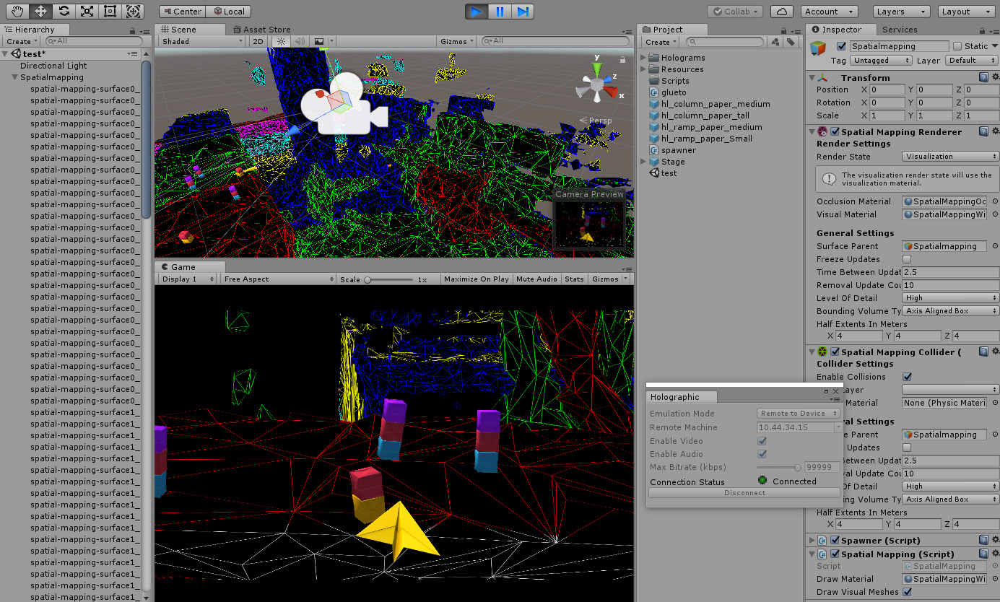

#WMR testing during development

Unity provides tools that allow you to test applications during the development process. These tools allow you to debug your application as if it was any other Unity application, as well as wirelessly pushing content to your device. Some of these tools only work with specific WMR devices, such as HoloLens.

## Play in Editor (immersive devices)

When using an immersive Windows Mixed Reality device, you can test and iterate on your application directly in the Unity Editor. Make sure the Windows Mixed Reality Portal is open and the headset is active, then press the __Play__ button in the Editor. Now your application runs within the Editor while also rendering to the headset.

###Known limitations

There are a couple of limitations to consider when using Play in the Editor with Mixed Reality devices:

* Keyboard, mouse, and spatial controllers work in the Editor, as long as they are recognized by Windows and Unity.

* Non-Windows Mixed Reality input devices only work when the game window has focus, otherwise keyboard and mouse controls may not work correctly.

## Holographic Emulation (HoloLens only)

Holographic Emulation allows you to prototype, debug, and run Microsoft HoloLens projects directly in the Unity Editor rather than building and running your application every time you wish to see the effect of an applied change. This vastly reduces the time between iterations when developing HoloLens applications in Unity.

Holographic Emulation has three different modes:

* __Remote to Device:__ Using a connection to a Windows Holographic device, your application behaves as if it were deployed to that device, while in reality it is running in the Unity Editor on your host machine. For more information, see the section [Emulation Mode: Remote to device](wmr_testing.html#RemoteToDevice), below.

* __Simulate in Editor:__ Your application runs on a simulated HoloLens device directly in the Unity Editor, with no connection to a real-world Windows Holographic device. For more information, see the section [Emulation Mode: Simulate in Editor](wmr_testing.html#SimulateInEditor), below.

* __None__: This setting allows you to still run your application in the Editor if you have a Windows Holographic device.

Holographic emulation is supported on any machine running Windows 10 (with the __Fall Creators__ update). Both __Remote to Device__ and __Simulate in Editor__ aim to mimic the current HoloLens runtime as closely as possible, so newer APIs beyond this are not present. This means that recent additions to input code don’t work in these situations, just like they wouldn’t on a HoloLens. For example, rotation, position accuracy, angular velocity, and the basis vectors for a pose of forward, up, and right, are all absent, so those APIs fail.

To enable remoting or simulation, open the Unity Editor and go to __Window__ &gt; __XR__ &gt; __Holographic Emulation__.

This opens the __Holographic__ control window, which contains the __Emulation Mode__ drop-down menu. You must keep this window visible during development, so that you can access its settings when you launch your application.

__Emulation Mode__ is set to __None__ by default, which means that if you have an immersive headset connection, your application runs in the Editor and plays on the HMD. See the __Play in Editor__ section above for more details.

Change the __Emulation Mode__ to __Remote to Device__ or __Simulate in Editor__ to enable emulation for HoloLens development. This overrides Play in Editor support for any connected immersive device.

### Emulation Mode: Remote to Device

Holographic Remoting allows your application to behave as if it were deployed to a HoloLens device, while actually running in the Unity Editor on the host machine. Even while remoting, spatial sensor data and head tracking from the connected device are still active and work correctly. The Unity Editor Game view allows you to see what is being rendered on the device, but not what the wearer of the device sees of the real-world. (See an example in the image above titled ‘The Unity Editor running with Holographic Emulation’.)

__Note:__ Holographic Remoting is a quick way to iterate over changes during development, but you should avoid using it to validate performance. Your application is running on the host machine rather than the device itself, so you might get inaccurate results. 

To enable this mode in the Unity Editor, set the __Emulation Mode__ to __Remote to Device__. The Holographic window then changes to reflect the additional settings available with this mode.

####Connecting your device

To remote to a HoloLens device, you need to install the [Holographic Remoting Player](https://www.microsoft.com/en-us/store/p/holographic-remoting-player/9nblggh4sv40?activetab=pivot:overviewtab) on your HoloLens device. 

To install the Holographic Remoting Player application and configure the Unity Editor:

1. Install and run the Holographic Remoting Player from your HoloLens store. This is available from the Windows Store app on your Hololens. When launched, the remoting player enters a waiting state and displays the IP address of the device on the HoloLens screen: 
    
    
    
    For additional information about this Player, including how to enable connection diagnostics, see the [Microsoft Windows Dev Center](https://developer.microsoft.com/en-us/windows/holographic/holographic_remoting_player).
2. Enter the IP address of your HoloLens device into the __Remote Machine__ field from the Holographic window in the Unity Editor. The drop-down button to the right of the field allows you to select recently used addresses:

    
    
3. Click the __Connect__ button. The connection status should change to a green light with a connected message.

4. Click __Play__ in the Unity Editor to run your device remotely. 

When remoting starts, you can pause, inspect GameObjects, and debug in the same way as if you were running any app in the Editor. The HoloLens device and your host machine transmit video, audio, and device input back and forth across the network.

####Known limitations

There are a couple of limitations you should consider when using __Remote to Device__ emulation with HoloLens:

* Unity does not support Speech ([PhraseRecognizer](ScriptRef:Windows.Speech.PhraseRecognizer.html)) when using __Remote to Device__ emulation mode. When in this mode, the emulator intercepts speech from the host machine running the Unity Editor. The application uses the microphone in the PC you are remoting from, instead of the Hololens microphone.

* While __Remote to Device__ is running, all audio on the host machine redirects to the device, including audio from outside your application.

### Emulation Mode: Simulate in Editor

When using this emulation mode, your application runs on a simulated Holographic device directly in the Unity Editor, with no connection to a real-world HoloLens device. This is useful when developing for Windows Holographic if you do not have access to a HoloLens device. 

__Note:__ You should test your application on a HoloLens device to ensure it works as expected. Don’t rely exclusively on emulation during development.

To enable this mode, set the __Emulation Mode__ to __Simulate in Editor__ and click the __Play__ button. Your application then starts in an emulator built into the Unity Editor.

In the Holographic Emulation control window, use the __Room__ drop-down menu to choose an available virtual room (the same as those supplied with the [XDE HoloLens Emulator](https://developer.microsoft.com/en-us/windows/mixed-reality/using_the_hololens_emulator)). Use the __Gesture Hand__ drop-down menu to specify which virtual hand performs gestures (left or right).

In __Simulate in Editor__ mode, you need to use a game controller (such as an Xbox 360 or Xbox One controller) to control the virtual human player. The simulation still works if you do not have a controller, but you cannot move the virtual human player around.

The table below lists the controller inputs and their usage during __Simulate in Editor__ mode.

| __Control__| __Usage __  |
|:---|:---| 
| __Left-stick__| Up and down move the virtual human player backward and forward. Left and right move the human player left and right. |
| __Right-stick__| Up and down rotate the virtual human player’s head up and down (rotation about the X axis - Pitch). Left and right turn the virtual human player left and right (rotation about the Y axis - Yaw). |
| __D-pad__| Move the virtual human player up and down or tilt the player’s head left and right (rotation about the Z axis - Roll ). |
| __Left and right trigger buttons or A button__| Perform a tap gesture with a virtual hand. |
| __Y button__| Reset the pitch (X rotation) and roll (Z rotation) of the virtual human player’s head. |

To use a game controller, focus the Unity Editor on the Game view. If you are currently focused on another Unity Editor window, click on the Game view window to refocus on the Game view.

#### Known limitations

There are a couple of limitations you should consider when using __Simulate in Editor__ emulation with HoloLens:

* Most game controllers work in __Simulate in Editor__ mode, as long Windows and Unity recognise them. However, unsupported controllers might cause compatibility issues.

* You can use [PhotoCapture](ScriptRef:XR.WSA.WebCam.PhotoCapture.html) during __Simulate in Editor__ mode, but you must use an externally connected camera (such as a webcam) due to the lack of a connected HoloLens device. This also prevents you from retrieving a matrix with `TryGetProjectionMatrix` or `TryGetCameraToWorldMatrix`, because a normal external camera cannot compute where it is in relation to the real world.

## Useful resources and troubleshooting

When troubleshooting development issues for Windows Mixed Reality applications, you might find these external resources useful:

* [Windows Mixed Reality development official documentation](https://developer.microsoft.com/en-us/windows/mixed-reality/development)

* [Microsoft Windows Mixed Reality Tutorials](https://developer.microsoft.com/en-us/windows/mixed-reality/academy)

* [Microsoft Windows Mixed Reality immersive headset development tutorial](https://developer.microsoft.com/en-us/windows/mixed-reality/mixed_reality_213#unity_setup)

* [Microsoft HoloLens frequently asked questions (FAQ)](https://support.microsoft.com/en-us/help/13456/hololens-and-holograms-faq)

* [Microsoft HoloLens known issues](https://developer.microsoft.com/en-us/windows/mixed-reality/hololens_known_issues)

* [Microsoft Windows Mixed Reality troubleshooting guides](https://docs.microsoft.com/en-us/windows/mixed-reality/enthusiast-guide/troubleshooting-windows-mixed-reality)

* [Unity Forum post on WMR Tech Preview](https://forum.unity.com/threads/custom-build-2017-2-rc-mrtp-windows-mixed-reality-technical-preview.498253/)

---
* 2018-03-27 <!-- include IncludeTextNewPageYesEdit -->

* New content added for XR API changes in 2017.3
